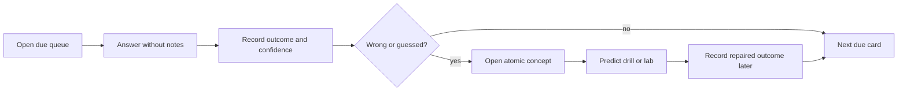

# Card Review Dashboard

> [!summary]
> Рабочий dashboard для learning state по каждому стабильному `card_id`. Source of truth — `70_PROGRESS/card-progress.json`; каталог карточек автоматически извлекается из опубликованных headings.

## Return to learning

- [[00_HOME/Java Learning Dashboard]]
- [[00_HOME/Certification 99 Percent Readiness Dashboard]]
- [[30_CERTIFICATIONS/Certification MOC]]

## First-time setup

The current progress file may be empty even when cards are published. Initialize one record per discovered `card_id`:

```bash
python .github/scripts/card_progress.py sync \
  --root . \
  --progress 70_PROGRESS/card-progress.json
```

This preserves existing records and adds only missing cards.

Then verify the catalog:

```bash
python .github/scripts/card_progress.py audit \
  --root . \
  --progress 70_PROGRESS/card-progress.json \
  --catalog-output .audit/card-catalog.json \
  --queue-output .audit/card-review-queue.md
```

Open:

```text
.audit/card-review-queue.md
```

The queue requires no Dataview plugin.

## Daily workflow



## Record Java outcomes

### Correct and confident

```bash
python .github/scripts/card_progress.py record \
  --card-id JAVA-VALUES-B01-C001 \
  --outcome correct-confident \
  --confidence 4 \
  --elapsed-seconds 35
```

### Correct but guessed

```bash
python .github/scripts/card_progress.py record \
  --card-id JAVA-PATTERN-B02-C008 \
  --outcome correct-guessed \
  --confidence 2 \
  --note "Confused default with case null"
```

### Wrong conceptual model

```bash
python .github/scripts/card_progress.py record \
  --card-id JAVA-SWITCH-B02-C014 \
  --outcome wrong-concept \
  --confidence 1 \
  --note "Forgot switch-expression exhaustiveness"
```

## Repair routes for Java

| Failure pattern | Open atomic concept |
|---|---|
| invalid literal or octal confusion | [[10_CONCEPTS/Java/Core/Java Primitive Values and Literals]] |
| promotion or cast confusion | [[10_CONCEPTS/Java/Core/Java Numeric Promotion and Casting]] |
| wrapper identity or null unboxing | [[10_CONCEPTS/Java/Core/Java Wrappers Boxing and Math]] |
| String pool or regex method | [[10_CONCEPTS/Java/Core/Java String Identity and Operations]] |
| mutable alias | [[10_CONCEPTS/Java/Core/Java StringBuilder Mutation]] |
| text-block output | [[10_CONCEPTS/Java/Core/Java Text Blocks]] |
| Period versus Duration | [[10_CONCEPTS/Java/Core/Java Period Duration and Instant]] |
| zone/DST/formatter | [[10_CONCEPTS/Java/Core/Java Zones DST and Formatting]] |
| definite assignment | [[10_CONCEPTS/Java/Core/Java Conditions and Definite Assignment]] |
| loop or label trace | [[10_CONCEPTS/Java/Core/Java Loops Transfers and Labels]] |
| reachability | [[10_CONCEPTS/Java/Core/Java Reachability Rules]] |
| classic switch | [[10_CONCEPTS/Java/Core/Java Classic Switch]] |
| `yield` or expression exhaustiveness | [[10_CONCEPTS/Java/Core/Java Switch Expressions]] |
| pattern-variable scope | [[10_CONCEPTS/Java/Core/Java Pattern Matching for instanceof]] |
| Java 21 guards/null | [[10_CONCEPTS/Java/Core/Java 21 Pattern Switch]] |
| dominance/sealed coverage | [[10_CONCEPTS/Java/Core/Java Switch Dominance and Exhaustiveness]] |

## Outcome interpretation

| Outcome | Required follow-up |
|---|---|
| `correct-confident` | continue; interval grows normally |
| `correct-guessed` | read the focused atomic note; retry soon |
| `wrong-attention` | re-read exact wording and version |
| `wrong-confusion` | open a comparison note and solve contrast cards |
| `wrong-concept` | return to mechanism, predict a drill and lab outcome |

## Mastery rule

A card is not mastered because it was answered correctly once.

Recommended minimum:

```text
repetitions >= 3
confidence >= 4
last_outcome = correct-confident
no wrong-concept or wrong-confusion in the last two events
```

Candidate readiness additionally requires mixed timed mock performance.

## Suggested session sizes

| Session | New cards | Review cards | Drills |
|---|---:|---:|---:|
| short, 20–30 min | 5 | 10 | 1 |
| normal, 45–60 min | 10 | 20 | 2–3 |
| deep, 90 min | 15 | 30 | 4–5 + lab prediction |

Do not introduce new cards when the due queue is growing faster than it is being cleared.

## Obsidian usage

The generated queue links directly to card headings. Atomic concept notes provide the repair path. Avoid duplicating progress in note frontmatter; one JSON record per `card_id` remains the authoritative state.

Optional future integrations:

- Shell Commands for `sync`, `due` and `record`;
- QuickAdd capture for outcome/confidence;
- DataviewJS read-only summaries over generated JSON.

## Related

- [[70_PROGRESS/README]]
- [[00_HOME/Java Learning Dashboard]]
- [[00_HOME/Certification 99 Percent Readiness Dashboard]]
- [[30_CERTIFICATIONS/Certification MOC]]
