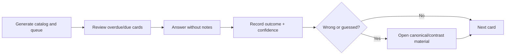

# Card Review Dashboard

> [!summary]
> Рабочий dashboard для progress model per `card_id`. Source of truth — `70_PROGRESS/card-progress.json`; каталог извлекается из опубликованных card headings.

# Daily workflow



# Generate today's queue

```bash
python .github/scripts/card_progress.py audit \
  --root . \
  --progress 70_PROGRESS/card-progress.json \
  --catalog-output .audit/card-catalog.json \
  --queue-output .audit/card-review-queue.md
```

Open:

```text
.audit/card-review-queue.md
```

The generated queue requires no Dataview plugin.

# First-time initialization

```bash
python .github/scripts/card_progress.py sync \
  --root . \
  --progress 70_PROGRESS/card-progress.json
```

This creates one progress record for every current `card_id` while preserving existing records.

# Record outcome

## Correct and confident

```bash
python .github/scripts/card_progress.py record \
  --card-id SPRING-BOOT-B01-C001 \
  --outcome correct-confident \
  --confidence 4 \
  --elapsed-seconds 45
```

## Correct but guessed

```bash
python .github/scripts/card_progress.py record \
  --card-id SPRING-BOOT-B01-C014 \
  --outcome correct-guessed \
  --confidence 2 \
  --note "Confused back-off with @Primary"
```

## Wrong conceptual model

```bash
python .github/scripts/card_progress.py record \
  --card-id TX-B01-C009 \
  --outcome wrong-concept \
  --confidence 1 \
  --note "Thought REQUIRES_NEW shares the same physical transaction"
```

# Outcome interpretation

| Outcome | Required follow-up |
|---|---|
| `correct-confident` | Continue; interval grows normally |
| `correct-guessed` | Review explanation and contrast card; short interval |
| `wrong-attention` | Re-read wording and exact API/annotation condition |
| `wrong-confusion` | Create or review an explicit comparison |
| `wrong-concept` | Return to canonical mechanism and predict a lab outcome |

# Mastery rules

A card is not mastered because it was answered correctly once.

Recommended minimum:

```text
repetitions >= 3
confidence >= 4
last_outcome = correct-confident
no wrong-concept/wrong-confusion in the last two events
```

Candidate readiness additionally requires mixed timed mock performance.

# Optional Dataview integration

Dataview is optional because JSON progress remains the source of truth. A future adapter may expose `.audit/card-catalog.json` and `70_PROGRESS/card-progress.json` to DataviewJS.

Do not store separate progress metadata in every batch Markdown file; that recreates the original problem where one frontmatter block represented 30–36 cards.

# Related materials

- [[70_PROGRESS/README]]
- [[00_HOME/Review Dashboard]]
- [[00_HOME/Certification 99 Percent Readiness Dashboard]]
- [[30_CERTIFICATIONS/Certification MOC]]
