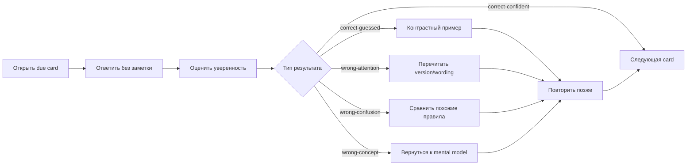

# Card Review Dashboard

> [!recall]
> Source of truth для каждой карточки — `70_PROGRESS/card-progress.json`. Review нужен не для подсчёта «хороших» и «плохих» ответов, а для выбора правильного следующего вмешательства.

## Быстрые переходы

- [[00_HOME/Java Learning Cockpit]]
- [[70_PROGRESS/Java Learning Progress Dashboard]]
- [[00_HOME/Java Weakness Repair Center]]
- [[00_HOME/Java Learning Dashboard]]

## Первый запуск

```bash
python .github/scripts/card_progress.py sync \
  --root . \
  --progress 70_PROGRESS/card-progress.json

python .github/scripts/card_progress.py audit \
  --root . \
  --progress 70_PROGRESS/card-progress.json \
  --catalog-output .audit/card-catalog.json \
  --queue-output .audit/card-review-queue.md
```

Открой `.audit/card-review-queue.md`. Dataview не требуется.

## Review loop



## Пять диагностических типов ошибок

| Тип | Что произошло | Нужное действие |
|---|---|---|
| `attention` | пропущено слово, версия, отрицание или тип selector | перечитать условие, выделить boundary |
| `retrieval` | правило знакомо, но не извлеклось вовремя | короткое отложенное повторение |
| `discrimination` | смешаны два похожих правила | сделать side-by-side contrast |
| `concept` | неверна причинная модель | atomic note → объяснение → drill → lab prediction |
| `transfer` | правило известно, но не применяется в новом коде | решить новый пример без шаблона |

> [!important]
> Не увеличивай объём повторения в ответ на концептуальную ошибку. Увеличивай точность repair: один механизм, один контраст, один доказательный пример.

## Запись результата

### Correct and confident

```bash
python .github/scripts/card_progress.py record \
  --card-id JAVA-VALUES-B01-C001 \
  --outcome correct-confident \
  --confidence 4 \
  --elapsed-seconds 35
```

### Correct but guessed

```bash
python .github/scripts/card_progress.py record \
  --card-id JAVA-PATTERN-B02-C008 \
  --outcome correct-guessed \
  --confidence 2 \
  --note "Confused default with case null"
```

### Wrong conceptual model

```bash
python .github/scripts/card_progress.py record \
  --card-id JAVA-INHERIT-B03-C014 \
  --outcome wrong-concept \
  --confidence 1 \
  --note "Mixed overload selection with runtime overriding"
```

## Когда остановить review

Перейди в repair mode, если:

```text
3 conceptual/confusion errors подряд
confidence систематически выше реальной точности
ты читаешь ответы вместо попытки вспомнить
скорость растёт, а объяснение механизма исчезает
```

## Размеры сессии

| Сессия | Due cards | New cards | Drills | Repair |
|---|---:|---:|---:|---|
| 20–30 минут | 8–12 | 0–3 | 0–1 | одна ошибка |
| 45–60 минут | 15–20 | 5–8 | 1–2 | один focused loop |
| 80–100 минут | 20–30 | 8–12 | 3–4 | repair + lab prediction |

Не добавляй новые карточки, если due queue растёт быстрее, чем очищается.

## Mastery gate

```text
repetitions >= 3
confidence >= 4
last_outcome = correct-confident
нет wrong-concept/wrong-confusion в двух последних событиях
механизм объясняется без текста
решается новый contrast example
```

Один правильный ответ не равен mastery. Candidate readiness дополнительно требует mixed timed performance.

## Дальше

- Ошибка по конкретной теме: [[00_HOME/Java Weakness Repair Center]]
- Итоги недели: [[70_PROGRESS/Java Learning Progress Dashboard]]
- Следующая учебная сессия: [[90_TEMPLATES/Learning Session Template]]
