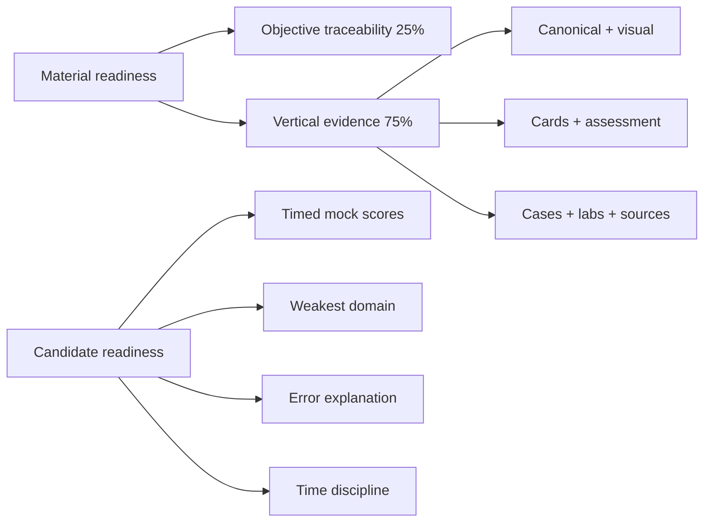
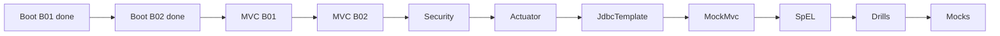

# Certification 99 Percent Readiness Dashboard

> [!summary]
> Material readiness measures objective-linked learning evidence. Candidate readiness measures stable timed performance. A large note or high card count in one domain cannot compensate for an unmapped objective.

- Visual map: [[01_MAPS/Certification 99 Percent Map.canvas]]
- Card progress: [[00_HOME/Card Review Dashboard]]
- Route registry: [[00_HOME/Knowledge Route Registry]]

# Readiness dimensions



# Corrected learning system status

- [x] Per-card progress registry.
- [x] SM-2-inspired scheduler using project outcome taxonomy.
- [x] Static due/new queue without Dataview.
- [x] Spring official-objective matrix.
- [x] Java 1Z0-829 capability matrix.
- [x] Java Concurrency objective matrix.
- [x] Objective overrides for incremental routes.
- [x] 148 legacy Spring cards normalized.
- [x] Strict CI contract for normalized batches.
- [x] `SPRING-BOOT-B02` built with pre/post assessment.
- [ ] Timed mock engine and results.

# Material-readiness formula

```text
Objective traceability          25%
Vertical artifact/card evidence 75%
-----------------------------------
TOTAL                          100%
```

Objective statuses:

```text
unmapped       0%
theory-only   25%
theory-visual 40%
cards-ready   60%
lab-proven    80%
mock-covered  95%
complete     100%
```

A `complete` objective requires canonical, cards, sources and transfer evidence through a visual, case or lab.

# 99% material gate

```text
[ ] all official/capability objectives mapped
[ ] no P0/P1 objective gap
[ ] every mechanism-heavy objective has visual models
[ ] all published cards pass mandatory-section audit
[ ] every card has stable ID and progress compatibility
[ ] base-card target reached
[ ] drill-card target reached
[ ] production cases cover major misconceptions
[ ] runtime-heavy objectives have executable labs
[ ] sources are version-pinned
[ ] timed mock bank exists
[ ] all quality gates pass
```

# Candidate gates

## Spring

```text
[ ] 6 full 60-question / 130-minute mocks
[ ] last 3 >= 90%
[ ] no domain below 85%
[ ] all correct-guessed outcomes reviewed
[ ] every wrong answer explained from mechanism
```

## Java 1Z0-829

```text
[ ] 6 full timed mocks
[ ] last 4 >= 90%
[ ] no domain below 85%
[ ] compile/no-compile classification stable
[ ] exact-output questions solved without IDE
```

## Java Concurrency

```text
[ ] 6 mixed 30-question mini-mocks
[ ] last 4 >= 92%
[ ] JMM/happens-before >= 90%
[ ] executors/futures >= 90%
[ ] liveness diagnosis >= 90%
```

# Current Spring evidence

```text
Published Spring cards       353
Normalized legacy cards      148
Boot B01 diagrams             31
Boot B01 cards                30
Boot B01 cases                15
Boot B01 tests                 6
Boot B02 diagrams             30
Boot B02 cards                35
Boot B02 pre-test             10
Boot B02 post-test            15
Boot B02 cases                12
Boot B02 tests                 7
```

Boot B02:

- [[30_CERTIFICATIONS/Spring/2V0-72.22/SPRING-BOOT-B02/SPRING-BOOT-B02 Roadmap]]
- [[30_CERTIFICATIONS/Spring/2V0-72.22/SPRING-BOOT-B02/SPRING-BOOT-B02 Assessment]]
- [[50_LABS/Spring/SPRING-BOOT-B02/README]]

Final numeric scores are generated by `.github/scripts/audit_certification_readiness.py` after objective overrides and will be updated only from a successful workflow report.

# Track roadmaps

- [[30_CERTIFICATIONS/Spring/2V0-72.22/Spring 99 Percent Master Roadmap]]
- [[30_CERTIFICATIONS/Java/1Z0-829/Java SE 17 99 Percent Master Roadmap]]
- [[30_CERTIFICATIONS/Java/Concurrency/Java Concurrency 99 Percent Roadmap]]

# Official baselines

## Spring

```text
2V0-72.22
60 questions
130 minutes
single and multiple choice
scaled passing score 300
Spring Framework 5.3 / Boot 2.5 / Data 2021.0 reference baseline
```

## Java

```text
Java SE 17
object-oriented programming
language constructs
Collections and Streams
I/O and Concurrency
deployment and JDK 17 features
```

# Delivery order



# Work policy

1. One objective-linked vertical slice at a time.
2. Pre-test does not change confidence.
3. Cards use stable IDs and per-card progress.
4. Wrong and guessed answers trigger targeted review.
5. Runtime PASS requires executed tests.
6. Exam baseline and current production delta remain separate.
7. Mocks are original diagnostic material, not copied exam dumps.

# Related navigation

- [[00_HOME/Card Review Dashboard]]
- [[70_PROGRESS/README]]
- [[00_HOME/Knowledge Route Registry]]
- [[30_CERTIFICATIONS/Certification MOC]]
- [[90_TEMPLATES/Cross-Linking Standard]]
- [[90_TEMPLATES/Pedagogical Visual Standard]]
