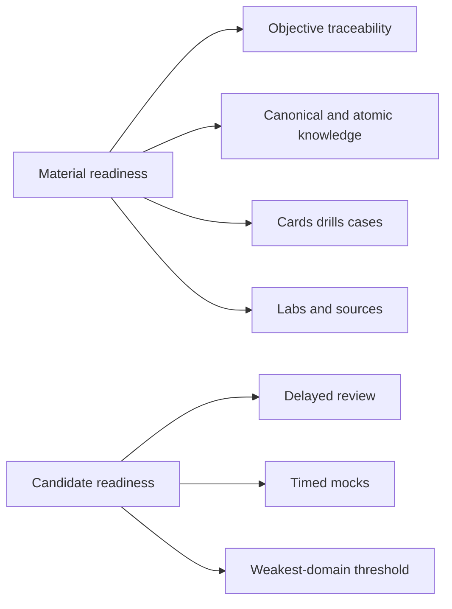

# Certification 99 Percent Readiness Dashboard

> [!summary]
> Material readiness measures objective-linked repository evidence. Candidate readiness measures retained knowledge and timed performance. These values must not be mixed: a route can be technically `lab-proven` while the learner has not yet mastered it.

## Operational entry points

- [[00_HOME/Java Learning Dashboard]]
- [[00_HOME/Card Review Dashboard]]
- [[00_HOME/Knowledge Route Registry]]
- [[30_CERTIFICATIONS/Certification MOC]]
- [[01_MAPS/Java Certification Routes.canvas]]
- [[01_MAPS/Certification 99 Percent Map.canvas]]

## Readiness model



## Status scale

```text
unmapped       0%
theory-only   25%
theory-visual 40%
cards-ready   60%
lab-proven    80%
mock-covered  95%
complete     100%
```

The status describes repository evidence, not exam pass probability.

# Java current delivery

## Published routes

| Route | Atomic notes | Base cards | Drills | Executable evidence | Status |
|---|---:|---:|---:|---|---|
| JAVA-LTS-B01 | route slice | 30 | migration cases | JDK 11/17/21 | published |
| JAVA-B01 | 9 | 75 | 15 | 3 proof classes, JDK 17/21 | lab-proven |
| JAVA-B02 | 8 | 60 | 20 | 2 positive classes + 11 negative cases, JDK 17/21 | lab-proven |
| JAVA-B03 | 12 | 115 | 35 | 4 positive classes + 17 negative cases, JDK 17/21 | lab-proven |

## Delivered Java exam inventory

```text
lab-proven exam routes             3
atomic concepts                   29
base cards                       250
compile/output drills             70
positive proof classes             9
expected compile-fail cases       28
runtime baselines             17, 21
```

## Java objective progress

### Java 21 `1Z0-830`

Lab-proven objectives:

```text
JAVA21-1.1 primitives, wrappers, promotions and boolean expressions
JAVA21-1.2 String, StringBuilder and text blocks
JAVA21-1.3 date-time, Period, Duration, Instant, zones and DST
JAVA21-2.1 program flow and final pattern switch
JAVA21-3.1..3.7 object model, initialization, overloading, inheritance, interfaces, records, enums, sealed types and record patterns
```

Other objectives remain roadmap or previously published supporting evidence.

### Java 17 `1Z0-829`

```text
JAVA-B01 values, text and date-time   lab-proven route evidence
JAVA-B02 control flow                 lab-proven route evidence
JAVA-B03 object model                  lab-proven route evidence
JAVA-B04 ... JAVA-B11                 planned or supporting evidence
```

## Next Java implementation order

```text
JAVA-B05  Collections, Generics, Sequenced Collections
JAVA-B06  Lambdas and Streams
JAVA-B04  Exceptions and Try-with-resources
JAVA-B07  Modules and Deployment
JAVA-B08  Concurrency and Virtual Threads
JAVA-B09  I/O, NIO.2 and Serialization
JAVA-B10  JDBC for 1Z0-829
JAVA-B11  Localization
JAVA-SUP-B01 Logging, Annotations and supplementary Generics
```

## Material gaps before 99%

- remaining Java routes;
- visual deep dives and production cases for B01/B02/B03;
- pre-test and post-test assessments;
- mixed mini-mock bank;
- 800-card Java 21 target and 200 drills;
- six timed full mocks;
- refreshed aggregate machine score from a fully successful workflow.

## Candidate readiness gaps

The progress registry has not yet accumulated learner history. Candidate readiness requires:

```text
card registry initialized
core cards repeated at least 3 times
confidence calibration recorded
wrong-concept events repaired through canonical notes and labs
mixed timed mocks completed
last 3 mocks above target
no weak domain below threshold
```

Use [[00_HOME/Card Review Dashboard]] to initialize and record learning state.

# Spring status

Spring has extensive published material across Core, Boot, MVC, AOP, Cache, Transactions, Data JPA and Testing.

The aggregate vault workflow currently fails at the independent `SPRING-MVC-B02 REST and RestTemplate tests`. Structural, card, objective and Java route checks pass before that regression. Do not copy a new overall percentage until the aggregate workflow succeeds completely.

Remaining major Spring domains include:

```text
Security
Actuator and custom health/metrics
JdbcTemplate and translated data-access exceptions
explicit MockMvc route
SpEL
mixed drill bank and timed mocks
```

# Java Concurrency

The advanced concurrency route has canonical and visual foundations plus labs, but still requires its dedicated full card bank, production cases, controlled labs and timed mini-mocks.

- [[30_CERTIFICATIONS/Java/Concurrency/Java Concurrency 99 Percent Roadmap]]

# Readiness governance

## Do not manually invent scores

A percentage is publishable only when it comes from a successful audit artifact using the current manifests and card catalog.

Until then, use artifact counts and objective statuses shown above.

## Route completion versus learner mastery

```text
route lab-proven
    ≠ learner mastered

learner mastered
    = repeated recall
    + repaired conceptual errors
    + successful mixed drills
    + stable timed mock performance
```

## Current action

```text
1. Use Java Learning Dashboard for B01/B02/B03.
2. Initialize per-card progress.
3. Continue with JAVA-B05 in a separate route PR.
4. Repair the unrelated Spring MVC B02 regression separately.
```
