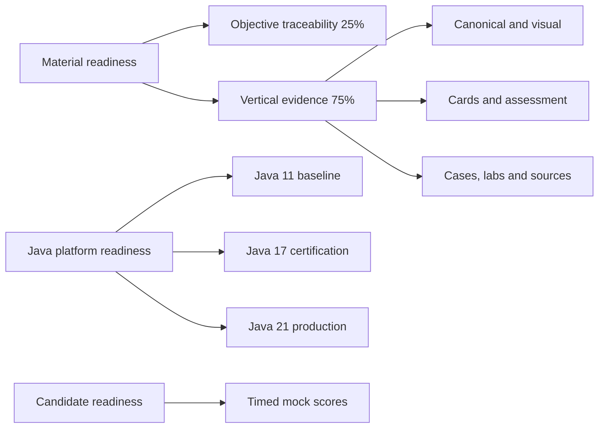
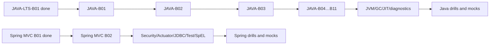

# Certification 99 Percent Readiness Dashboard

> [!summary]
> Material readiness measures objective-linked repository evidence. Candidate readiness measures stable timed performance. Java is now tracked in two complementary models: the exact Java 17 `1Z0-829` exam route and the complete Java 11/17/21 platform program.

# Entry points

- [[00_HOME/Java 11 17 21 Complete Knowledge Program]]
- [[30_CERTIFICATIONS/Java/JAVA-LTS-B01/JAVA-LTS-B01 Roadmap]]
- [[01_MAPS/Certification 99 Percent Map.canvas]]
- [[00_HOME/Card Review Dashboard]]
- [[00_HOME/Knowledge Route Registry]]
- [[99_AUDITS/Certification Coverage Assessment 2026-07-23]]

# Readiness model



# Current certification machine scores

| Track | Overall | Objective traceability | Vertical slices | Target |
|---|---:|---:|---:|---:|
| Spring Professional Develop 2V0-72.22 | **76.30%** | 62.11% | 81.03% | 99% |
| Java SE 17 Developer 1Z0-829 | **4.50%** | 4.00% | 4.67% | 99% |
| Java Concurrency | **45.70%** | 40.00% | 47.60% | 99% |

These are repository-evidence scores, not pass probabilities. They remain unchanged until a successful workflow produces a newer report.

# Java 11, 17 and 21 platform readiness

Machine controls:

```text
.github/java-version-coverage.json
.github/scripts/audit_java_version_coverage.py
.audit/java-version-coverage.json
.audit/java-version-coverage.md
```

The Java platform score is calculated separately across:

```text
18 shared Java domains
18 Java 11 baseline/delta layers
18 Java 17 baseline/delta layers
18 Java 21 baseline/delta layers
```

Published first route:

```text
JAVA-LTS-B01 — Java 11, 17 and 21 Evolution and Migration
30 stable comparison cards
10 production migration cases
JDK 11/17/21 compile-run matrix
primary OpenJDK/Oracle source index
```

- [[10_CONCEPTS/Java/Versions/Java 11 17 21 LTS Evolution]]
- [[30_CERTIFICATIONS/Java/JAVA-LTS-B01/JAVA-LTS-B01 Cards]]
- [[40_PRODUCTION_CASES/Java/Java 11 17 21 Migration Cases]]
- [[50_LABS/Java/JAVA-LTS-B01/README]]
- [[98_SOURCES/Java 11 17 21 Official Sources]]

The first Java LTS numeric score will be accepted only from a successful CI report.

# Corrected learning-system status

- [x] Per-card progress registry.
- [x] SM-2-inspired scheduler.
- [x] Spring objective matrix.
- [x] Java 17 capability matrix.
- [x] Java Concurrency objective matrix.
- [x] Java 11/17/21 domain-version manifest.
- [x] Java version-coverage audit.
- [x] 148 legacy Spring cards normalized.
- [x] `SPRING-BOOT-B01`, `SPRING-BOOT-B02`, `SPRING-MVC-B01` vertical slices.
- [x] `JAVA-LTS-B01` version/migration vertical slice.
- [ ] JDK 11/17/21 matrix verified on current head.
- [ ] Timed mock engine and results.

# Objective status scale

```text
unmapped       0%
theory-only   25%
theory-visual 40%
cards-ready   60%
lab-proven    80%
mock-covered  95%
complete     100%
```

# Spring 2V0-72.22

## Objective distribution

```text
complete        19 / 57
lab-proven      11 / 57
cards-ready     12 / 57
theory-visual    1 / 57
unmapped        14 / 57
```

## Critical remaining objectives

```text
SpEL
JdbcTemplate and result-set callbacks
translated DataAccessException handling
REST endpoints for multiple HTTP verbs
RestTemplate
explicit MockMvc objective route
Spring Security
Actuator endpoints and security
custom metrics
custom health indicators
```

## Spring registration gate

```text
[ ] SPRING-MVC-B02
[ ] SPRING-SEC-B01
[ ] SPRING-ACT-B01
[ ] SPRING-JDBC-B01
[ ] SPRING-WEBTEST-B01
[ ] SPRING-SPEL-B01
[ ] mixed exam-drill bank
[ ] 6 full 60-question / 130-minute mocks
[ ] last 3 mocks >= 90%
[ ] no domain below 85%
```

# Java 1Z0-829

```text
exact baseline             Java 17
required Java 11 context   compatibility and migration
required Java 21 context   production delta and version traps
unmapped exam domains      10 / 11
base exam cards             0 / 720
exam drills                 0 / 180
full timed mocks            0 / 6
```

Required preliminary route is now published:

- [[30_CERTIFICATIONS/Java/JAVA-LTS-B01/JAVA-LTS-B01 Roadmap]].

Next Java implementation route:

```text
JAVA-B01 — Data, Text and Date-Time across Java 11/17/21
```

Java 1Z0-829 registration remains **not recommended** until `JAVA-B01` through `JAVA-B11` and the mock bank are delivered.

# Java Concurrency

```text
objectives               8
status                    8 theory-visual
mapped dedicated cards   0
base-card target        140
drill target             40
production-case target   20
controlled-lab target    25
mini-mocks                0 / 6
```

Conceptual coverage is strong, but assessment coverage is incomplete. The Java 21 layer must additionally prove virtual-thread, pinning, context-propagation and downstream-capacity behavior.

# Complete Java platform gate

```text
[ ] 18/18 shared domains complete
[ ] every domain has Java 11 baseline/delta
[ ] every domain has Java 17 baseline/delta
[ ] every domain has Java 21 baseline/delta
[ ] complete JEP status classification
[ ] every code example declares minimum version
[ ] all JDK 11/17/21 labs pass
[ ] 120 cross-version cards
[ ] 30 migration cases
[ ] 30 multi-JDK labs
[ ] 6 migration mini-mocks
```

# General 99% material gate

```text
[ ] all official/capability objectives mapped
[ ] no P0/P1 gap
[ ] mechanism-heavy objectives have visual models
[ ] all cards pass mandatory-section audit
[ ] every card has stable ID
[ ] card and drill targets reached
[ ] production cases cover major misconceptions
[ ] runtime-heavy objectives have executable labs
[ ] sources are version-pinned
[ ] timed mock bank exists
[ ] all quality gates pass
```

# Delivery order



# Work policy

1. Identify the target version before answering.
2. One objective-linked vertical slice at a time.
3. Every Java route separates 11, 17 and 21.
4. Preview/incubator status is explicit.
5. Cards use stable IDs and per-card progress.
6. Runtime PASS requires executed tests.
7. Mocks are original diagnostic material.

# Related navigation

- [[00_HOME/Java 11 17 21 Complete Knowledge Program]]
- [[01_MAPS/Java Map]]
- [[00_HOME/Card Review Dashboard]]
- [[70_PROGRESS/README]]
- [[00_HOME/Knowledge Route Registry]]
- [[30_CERTIFICATIONS/Certification MOC]]
- [[90_TEMPLATES/Cross-Linking Standard]]
