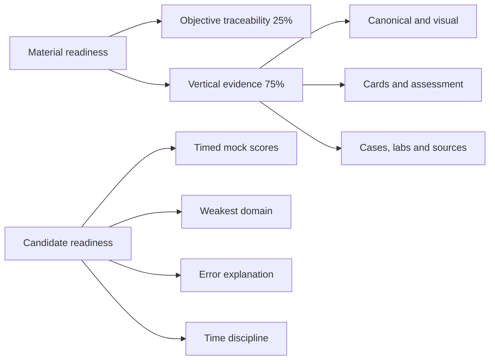

# Certification 99 Percent Readiness Dashboard

> [!summary]
> Material readiness measures objective-linked repository evidence. Candidate readiness measures stable timed performance. Current machine scores are **Spring 76.30%**, **Java 1Z0-829 4.50%**, and **Java Concurrency 45.70%**. Candidate readiness is still unmeasured because full timed mocks have not been completed.

# Entry points

- Visual map: [[01_MAPS/Certification 99 Percent Map.canvas]]
- Card progress: [[00_HOME/Card Review Dashboard]]
- Route registry: [[00_HOME/Knowledge Route Registry]]
- Current audit: [[99_AUDITS/Certification Coverage Assessment 2026-07-23]]
- Previous visual audit: [[99_AUDITS/Pedagogical Visual Enrichment Pass]]

# Readiness model



# Current machine scores

| Track | Overall | Objective traceability | Vertical slices | Target | Remaining |
|---|---:|---:|---:|---:|---:|
| Spring Professional Develop 2V0-72.22 | **76.30%** | 62.11% | 81.03% | 99% | 22.70% |
| Java SE 17 Developer 1Z0-829 | **4.50%** | 4.00% | 4.67% | 99% | 94.50% |
| Java Concurrency | **45.70%** | 40.00% | 47.60% | 99% | 53.30% |

These are material-evidence scores, not pass probabilities.

# Repository evidence snapshot

```text
Stable card IDs             418
Published Spring cards      388
Objective records            76
Published routes             10
Concept notes                52
Production-case files        14
Lab files                    79
Canvas files                 22
Mermaid diagrams            443
```

# Corrected learning-system status

- [x] Per-card progress registry.
- [x] SM-2-inspired scheduler using project outcome taxonomy.
- [x] Static due/new queue without Dataview.
- [x] Spring official-objective matrix.
- [x] Java 1Z0-829 capability matrix.
- [x] Java Concurrency objective matrix.
- [x] Objective overrides for incremental routes.
- [x] 148 legacy Spring cards normalized.
- [x] Strict CI contract for normalized batches.
- [x] `SPRING-BOOT-B01` complete vertical slice.
- [x] `SPRING-BOOT-B02` complete vertical slice.
- [x] `SPRING-MVC-B01` complete vertical slice.
- [x] MVC PathVariable Mermaid regression fixed.
- [ ] Timed mock engine and results.

# Objective status scale

```text
unmapped       0%
theory-only   25%
theory-visual 40%
cards-ready   60%
lab-proven    80%
mock-covered  95%
complete     100%
```

A `complete` objective requires canonical material, cards, sources, and transfer evidence through a visual, case, or lab.

# Spring 2V0-72.22

## Objective distribution

```text
complete        19 / 57
lab-proven      11 / 57
cards-ready     12 / 57
theory-visual    1 / 57
unmapped        14 / 57
```

## Strong routes

- [[30_CERTIFICATIONS/Spring/2V0-72.22/Spring Core Card Roadmap]]
- [[30_CERTIFICATIONS/Spring/2V0-72.22/Spring AOP and Cache Roadmap]]
- [[30_CERTIFICATIONS/Spring/2V0-72.22/Spring Transaction Management Roadmap]]
- [[30_CERTIFICATIONS/Spring/2V0-72.22/Spring Data JPA Roadmap]]
- [[30_CERTIFICATIONS/Spring/2V0-72.22/Spring Testing Roadmap]]
- [[30_CERTIFICATIONS/Spring/2V0-72.22/SPRING-BOOT-B01/SPRING-BOOT-B01 Roadmap]]
- [[30_CERTIFICATIONS/Spring/2V0-72.22/SPRING-BOOT-B02/SPRING-BOOT-B02 Roadmap]]
- [[30_CERTIFICATIONS/Spring/2V0-72.22/SPRING-MVC-B01/SPRING-MVC-B01 Roadmap]]

## Critical remaining objectives

```text
SpEL
JdbcTemplate and result-set callbacks
translated DataAccessException handling
REST endpoints for multiple HTTP verbs
RestTemplate
explicit MockMvc objective route
Spring Security
Actuator endpoints and security
custom metrics
custom health indicators
```

## Spring registration gate

```text
[ ] SPRING-MVC-B02 complete
[ ] SPRING-SEC-B01 complete
[ ] SPRING-ACT-B01 complete
[ ] SPRING-JDBC-B01 complete
[ ] SPRING-WEBTEST-B01 complete
[ ] SPRING-SPEL-B01 complete
[ ] mixed exam-drill bank complete
[ ] 6 full 60-question / 130-minute mocks completed
[ ] last 3 mocks >= 90%
[ ] no domain below 85%
```

Current verdict: **strong preparation base, but registration is not yet recommended**.

# Java 1Z0-829

```text
unmapped domains       10 / 11
theory-visual domains   1 / 11
base exam cards          0 / 720
exam drills              0 / 180
full timed mocks         0 / 6
```

Only the Concurrency domain has a mature conceptual foundation. Java 1Z0-829 registration is **not recommended** until `JAVA-B01` through `JAVA-B11` and the mock bank are delivered.

# Java Concurrency

```text
objectives               8
status                    8 theory-visual
mapped dedicated cards   0
base-card target        140
drill target             40
production-case target   20
controlled-lab target    25
mini-mocks                0 / 6
```

Conceptual coverage is strong, but assessment coverage is incomplete.

# Official exam status — verified 2026-07-23

## Spring

```text
Exam             2V0-72.22
Questions        60
Duration         130 minutes
Format           single and multiple choice
Passing score    300 scaled
Price            USD 250
Credential       Spring Certified Professional [v2]
```

## Java

```text
Exam             Java SE 17 Developer 1Z0-829
Duration         1 hour 30 minutes
Official path    active on Oracle Learning
```

# 99% material gate

```text
[ ] all official/capability objectives mapped
[ ] no P0/P1 objective gap
[ ] mechanism-heavy objectives have visual models
[ ] all published cards pass mandatory-section audit
[ ] every card has stable ID and progress compatibility
[ ] base-card target reached
[ ] drill-card target reached
[ ] production cases cover major misconceptions
[ ] runtime-heavy objectives have executable labs
[ ] sources are version-pinned
[ ] timed mock bank exists
[ ] all quality gates pass
```

# Delivery order

```mermaid
flowchart LR
    B1["Boot B01 done"] --> B2["Boot B02 done"]
    B2 --> MVC1["MVC B01 done"]
    MVC1 --> MVC2["MVC B02"]
    MVC2 --> SEC["Security"]
    SEC --> ACT["Actuator"]
    ACT --> JDBC["JdbcTemplate"]
    JDBC --> WEBTEST["MockMvc"]
    WEBTEST --> SPEL["SpEL"]
    SPEL --> DRILLS["Mixed drills"]
    DRILLS --> MOCKS["Timed mocks"]
```



# Work policy

1. One objective-linked vertical slice at a time.
2. Pre-test does not change confidence.
3. Cards use stable IDs and per-card progress.
4. Wrong and guessed answers trigger targeted review.
5. Runtime PASS requires executed tests.
6. Exam baseline and current production delta remain separate.
7. Mocks are original diagnostic material, not copied exam dumps.

# Related navigation

- [[00_HOME/Card Review Dashboard]]
- [[70_PROGRESS/README]]
- [[00_HOME/Knowledge Route Registry]]
- [[30_CERTIFICATIONS/Certification MOC]]
- [[90_TEMPLATES/Cross-Linking Standard]]
- [[90_TEMPLATES/Pedagogical Visual Standard]]
