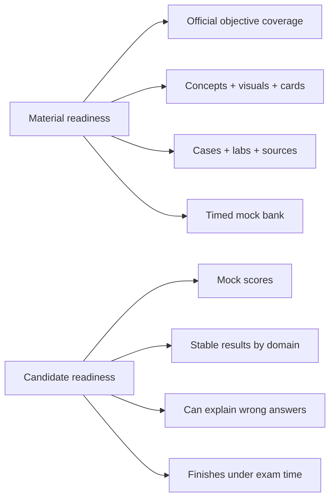
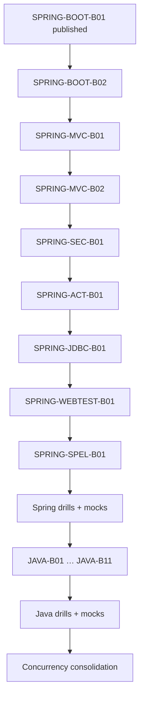

# Certification 99 Percent Readiness Dashboard

> [!summary]
> Цель проекта — довести **материалы** Spring 2V0-72.22, Java 1Z0-829 и Java Concurrency до измеряемых 99%. Личная готовность к экзамену считается отдельно и требует timed mock evidence.

Visual map: [[01_MAPS/Certification 99 Percent Map.canvas]].

# Two readiness dimensions



## Material readiness

```text
Does the repository cover every official objective?
Can the learner understand the mechanism visually?
Can the learner recall the rule in English?
Can the learner distinguish plausible wrong answers?
Can the behavior be reproduced in a lab?
Can the route be verified against primary sources?
Can full timed mocks be generated without topic gaps?
```

## Candidate readiness

```text
Can the learner solve mixed questions under time pressure?
Are the last results stable rather than accidental?
Is every domain above the minimum threshold?
Can every wrong answer be explained without notes?
```

# Material-readiness model

```text
Official objective mapping      25%
Canonical explanation           15%
Visual/mechanism coverage       10%
Base active-recall cards        15%
Exam-drill cards                10%
Production cases                7%
Executable labs                 8%
Primary-source/version review   5%
Timed mock bank                 5%
-----------------------------------
TOTAL                          100%
```

The machine implementation currently scores domain artifact roles and mapped base cards conservatively. It does not award 99% for a long note or excess cards in one domain.

# 99% material gate

```text
[ ] 100% official objectives mapped
[ ] no P0 or P1 objective gap
[ ] every objective has canonical/supporting explanation
[ ] mechanism-heavy objectives have topology/sequence/state/decision diagrams
[ ] all cards contain Question / Russian Translation / Answer / Explanation / Exam Trap
[ ] base-card target reached
[ ] exam-drill target reached
[ ] production cases cover high-risk misconceptions
[ ] API/runtime-heavy domains have executable labs
[ ] sources are version-pinned and verified
[ ] full timed mock bank exists
[ ] structural/cross-link/Mermaid/card/readiness CI passes
[ ] remaining 1% is only unseen wording and real exam uncertainty
```

# Candidate-readiness model

```text
Last full timed mocks          50%
Weakest-domain score           20%
Explanation quality            15%
Time management                10%
Confidence calibration          5%
----------------------------------
TOTAL                         100%
```

## Spring candidate gate

```text
[ ] 6 full 60-question / 130-minute mocks
[ ] last 3 mocks >= 90%
[ ] no domain below 85%
[ ] all guessed-correct answers reviewed
[ ] every wrong answer explained from mechanism
[ ] multiple-select discipline stable
```

## Java 1Z0-829 candidate gate

```text
[ ] 6 full timed mocks
[ ] last 4 mocks >= 90%
[ ] no domain below 85%
[ ] compile/no-compile classification stable
[ ] exact-output questions solved without IDE
[ ] wrong answers classified by language/API rule
```

## Java Concurrency candidate gate

```text
[ ] 6 mixed 30-question mini-mocks
[ ] last 4 mini-mocks >= 92%
[ ] JMM/happens-before >= 90%
[ ] executors/futures >= 90%
[ ] liveness/diagnostics >= 90%
[ ] lab outcome predicted before execution
```

# Current baseline

> [!warning]
> Final values are produced by `.github/scripts/audit_certification_readiness.py`. Conceptual maturity can be higher than artifact-complete certification readiness.

| Route | Conceptual baseline | Main artifact gap |
|---|---:|---|
| Spring 2V0-72.22 | medium/high in published domains | MVC, Security, Actuator, JDBC, MockMvc, SpEL, drills and mocks |
| Java 1Z0-829 | low outside Concurrency | ten full exam domains, drills and mocks |
| Java Concurrency | high conceptually | card bank, consolidated cases, controlled labs and mini-mocks |

Published Spring progress:

```text
SPRING-BOOT-B01 completed as a full route
30 Boot cards
31 Boot diagrams
15 Boot production cases
Boot 2.5 ApplicationContextRunner lab
```

# Master roadmaps

- [[30_CERTIFICATIONS/Spring/2V0-72.22/Spring 99 Percent Master Roadmap]]
- [[30_CERTIFICATIONS/Java/1Z0-829/Java SE 17 99 Percent Master Roadmap]]
- [[30_CERTIFICATIONS/Java/Concurrency/Java Concurrency 99 Percent Roadmap]]
- [[98_SOURCES/Java SE 17 1Z0-829 Sources]]
- [[98_SOURCES/Spring Boot Auto-configuration Sources]]

# Official baseline summary

## Spring 2V0-72.22

```text
60 questions
130 minutes
single and multiple choice
scaled passing score 300
```

The route separates Boot 2.x/Spring 5-era exam behavior from current Spring production deltas.

## Java 1Z0-829

Oracle's Java SE 17 learning path identifies:

```text
object-oriented programming
Java syntax and constructs
Collections and Streams
I/O and Concurrency
deployment
JDK 17 features
```

The Java master roadmap decomposes these into 11 domain routes.

# Delivery order



# Work policy

1. One vertical slice at a time.
2. Every slice includes theory, visuals, cards, cases, lab, Canvas and sources.
3. Exam baseline and current production delta are separated.
4. Percentage increases require machine-checkable evidence.
5. Runtime PASS requires executed tests/labs.
6. Mocks are original diagnostic artifacts, not copied exam dumps.
7. Official wording is paraphrased except for permitted short quotations.

# Related navigation

- [[01_MAPS/Certification 99 Percent Map.canvas]]
- [[00_HOME/Review Dashboard]]
- [[00_HOME/Knowledge Route Registry]]
- [[30_CERTIFICATIONS/Certification MOC]]
- [[90_TEMPLATES/Cross-Linking Standard]]
- [[90_TEMPLATES/Pedagogical Visual Standard]]
