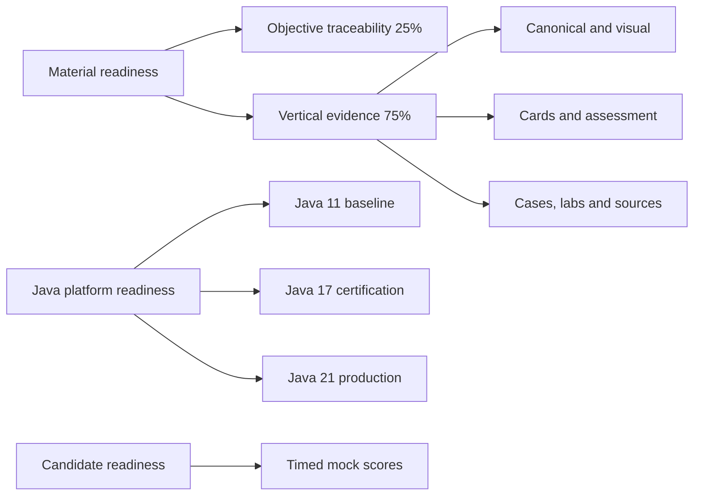

# Certification 99 Percent Readiness Dashboard

> [!summary]
> Material readiness measures objective-linked repository evidence. Candidate readiness measures stable timed performance. Java is tracked in two complementary models: Java 17 `1Z0-829` exam readiness and complete Java 11/17/21 platform knowledge.

# Entry points

- [[00_HOME/Java 11 17 21 Complete Knowledge Program]]
- [[30_CERTIFICATIONS/Java/JAVA-LTS-B01/JAVA-LTS-B01 Roadmap]]
- [[30_CERTIFICATIONS/Spring/2V0-72.22/Spring 99 Percent Master Roadmap]]
- [[30_CERTIFICATIONS/Spring/2V0-72.22/SPRING-MVC-B02/SPRING-MVC-B02 Roadmap]]
- [[01_MAPS/Java 11 17 21 LTS Map.canvas]]
- [[01_MAPS/Spring MVC REST Map.canvas]]
- [[01_MAPS/Certification 99 Percent Map.canvas]]
- [[00_HOME/Card Review Dashboard]]
- [[00_HOME/Knowledge Route Registry]]

# Readiness model



# Current certification machine scores

> [!warning]
> The table below reflects the last completed audit before `SPRING-MVC-B02`. New final percentages must be copied only from a successful workflow artifact after the B02 route run completes.

| Track | Last verified overall | Objective traceability | Vertical slices | Target |
|---|---:|---:|---:|---:|
| Spring Professional Develop 2V0-72.22 | **76.30%** | 62.11% | 81.03% | 99% |
| Java SE 17 Developer 1Z0-829 | **4.50%** | 4.00% | 4.67% | 99% |
| Java Concurrency | **45.70%** | 40.00% | 47.60% | 99% |

These are repository-evidence scores, not pass probabilities.

# Java 11, 17 and 21 platform readiness

## Requirement

```text
Every Java route must cover:
Java 11  compatibility and migration baseline
Java 17  exact certification semantics
Java 21  production delta and version traps
```

## Verified machine score

| Layer | Evidence coverage |
|---|---:|
| Shared Java domains | **10.83%** |
| Java 11 compatibility layer | **19.17%** |
| Java 17 certification layer | **15.00%** |
| Java 21 production layer | **16.39%** |
| **Overall Java platform** | **15.35%** |

Published route:

- [[30_CERTIFICATIONS/Java/JAVA-LTS-B01/JAVA-LTS-B01 Roadmap]]
- [[10_CONCEPTS/Java/Versions/Java 11 17 21 LTS Evolution]]
- [[10_CONCEPTS/Java/Versions/Java 11 17 21 Visual Deep Dive]]
- [[30_CERTIFICATIONS/Java/JAVA-LTS-B01/JAVA-LTS-B01 Cards]]
- [[40_PRODUCTION_CASES/Java/Java 11 17 21 Migration Cases]]
- [[50_LABS/Java/JAVA-LTS-B01/README]]
- [[98_SOURCES/Java 11 17 21 Official Sources]]

# Corrected learning-system status

- [x] Per-card progress registry.
- [x] SM-2-inspired scheduler.
- [x] Spring objective matrix.
- [x] Java 17 capability matrix.
- [x] Java Concurrency objective matrix.
- [x] Java 11/17/21 domain-version manifest.
- [x] Java version-coverage audit.
- [x] 148 legacy Spring cards normalized.
- [x] `SPRING-BOOT-B01`, `SPRING-BOOT-B02`, `SPRING-MVC-B01`, `SPRING-MVC-B02` vertical slices.
- [x] `JAVA-LTS-B01` complete vertical slice.
- [x] JDK 11/17/21 matrix verified.
- [ ] Timed mock engine and results.

# Objective status scale

```text
unmapped       0%
theory-only   25%
theory-visual 40%
cards-ready   60%
lab-proven    80%
mock-covered  95%
complete     100%
```

# Spring 2V0-72.22

## Newly added Spring MVC REST evidence

`SPRING-MVC-B02` closes the REST and client objective gap that was previously listed as critical:

```text
SPRING-3.2.1 REST endpoints for multiple HTTP verbs
SPRING-3.2.2 RestTemplate client operations
```

Published B02 artifacts:

- [[30_CERTIFICATIONS/Spring/2V0-72.22/SPRING-MVC-B02/SPRING-MVC-B02 Roadmap]]
- [[10_CONCEPTS/Spring/MVC/REST Endpoints ResponseEntity and RestTemplate]]
- [[10_CONCEPTS/Spring/MVC/Spring MVC REST Visual Deep Dive]]
- [[30_CERTIFICATIONS/Spring/2V0-72.22/SPRING-MVC-B02/SPRING-MVC-B02 Cards]]
- [[30_CERTIFICATIONS/Spring/2V0-72.22/SPRING-MVC-B02/SPRING-MVC-B02 Assessment]]
- [[40_PRODUCTION_CASES/Spring/Spring MVC REST Production Cases]]
- [[50_LABS/Spring/SPRING-MVC-B02/README]]
- [[98_SOURCES/Spring MVC REST and RestTemplate Sources]]

## Critical remaining objectives after B02

```text
SpEL
JdbcTemplate and result-set callbacks
translated DataAccessException handling
explicit MockMvc objective route
Spring Security
Actuator endpoints and security
custom metrics
custom health indicators
```

## Spring registration gate

```text
[x] SPRING-MVC-B02
[ ] SPRING-SEC-B01
[ ] SPRING-ACT-B01
[ ] SPRING-JDBC-B01
[ ] SPRING-WEBTEST-B01
[ ] SPRING-SPEL-B01
[ ] mixed exam-drill bank
[ ] 6 full 60-question / 130-minute mocks
[ ] last 3 mocks >= 90%
[ ] no domain below 85%
```

# Java 1Z0-829

```text
exact baseline             Java 17
required Java 11 context   compatibility and migration
required Java 21 context   production delta and version traps
unmapped exam domains      10 / 11
base exam cards             0 / 720
exam drills                 0 / 180
full timed mocks            0 / 6
```

Required preliminary route is complete and runtime-proven:

- [[30_CERTIFICATIONS/Java/JAVA-LTS-B01/JAVA-LTS-B01 Roadmap]].

Next Java implementation route:

```text
JAVA-B01 — Data, Text and Date-Time across Java 11/17/21
```

# Current delivery order

```text
Spring: SPRING-SEC-B01
Java:   JAVA-B01
Then:   ACT, JDBC, WEBTEST, SPEL, drills, mocks
```
