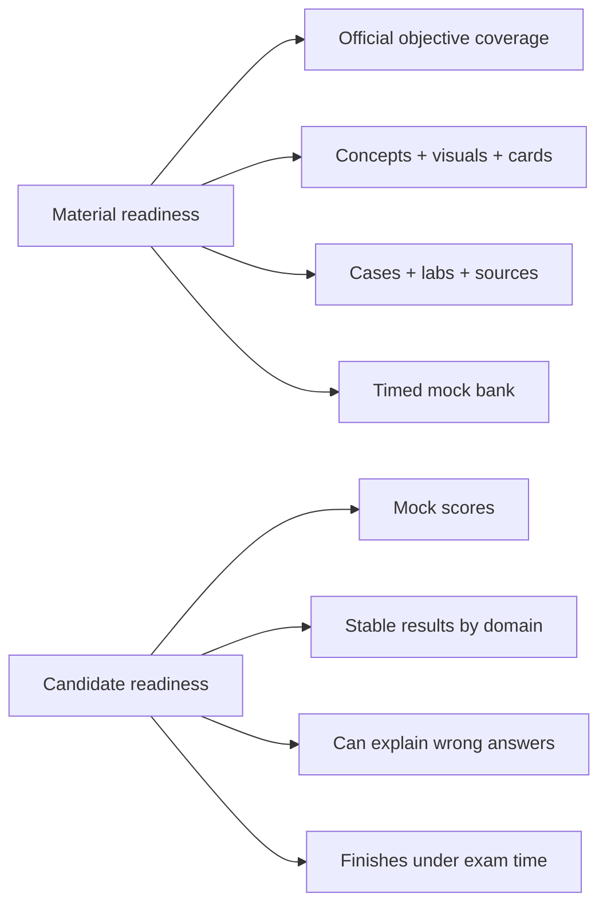
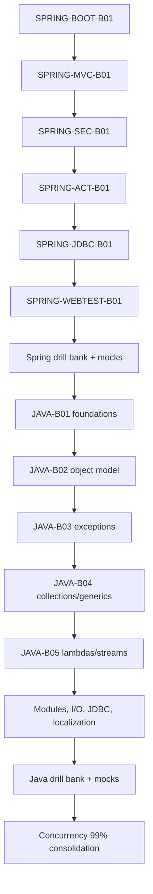

# Certification 99 Percent Readiness Dashboard

> [!summary]
> Цель проекта — довести **материалы** Spring 2V0-72.22, Java 1Z0-829 и Java Concurrency до измеряемых 99%. Личная готовность к экзамену считается отдельно и требует timed mock evidence.

# Two readiness dimensions



## Material readiness

Material readiness answers:

```text
Does the repository cover every official objective?
Can the learner understand the mechanism visually?
Can the learner recall the rule in English?
Can the learner distinguish plausible wrong answers?
Can the behavior be reproduced in a lab?
Can the route be verified against primary sources?
Can full timed mocks be generated without topic gaps?
```

## Candidate readiness

Candidate readiness answers:

```text
Can the learner solve mixed exam questions under time pressure?
Are the last results stable rather than accidental?
Is every domain above the minimum threshold?
Can every wrong answer be explained without opening notes?
```

# Material-readiness formula

```text
Official objective mapping      25%
Canonical explanation           15%
Visual/mechanism coverage       10%
Base active-recall cards        15%
Exam-drill cards                10%
Production cases                7%
Executable labs                 8%
Primary-source/version review   5%
Timed mock bank                 5%
-----------------------------------
TOTAL                          100%
```

## 99% material gate

A route may show `material_readiness: 99` only when:

```text
[ ] 100% official objectives mapped to repository artifacts
[ ] no P0 or P1 objective gap
[ ] every objective has canonical explanation or an explicit supporting note
[ ] mechanism-heavy objectives have topology/sequence/state/decision diagrams
[ ] every card has Question / Russian Translation / Answer / Explanation / Exam Trap
[ ] base-card target reached
[ ] exam-drill target reached
[ ] production cases cover high-risk misconceptions
[ ] labs cover API/runtime-heavy domains
[ ] primary sources are version-pinned and recently verified
[ ] full timed mock bank exists
[ ] structural, cross-link, Mermaid and card audits pass
[ ] remaining 1% consists only of real exam uncertainty and unseen wording
```

# Candidate-readiness formula

```text
Last full timed mocks          50%
Weakest-domain score           20%
Explanation quality            15%
Time management                10%
Confidence calibration          5%
----------------------------------
TOTAL                         100%
```

## Candidate 99% gate

### Spring

```text
[ ] 6 full 60-question / 130-minute mocks completed
[ ] last 3 mocks >= 90%
[ ] no official domain below 85%
[ ] all guessed-correct answers reviewed
[ ] all wrong answers explained from mechanism
[ ] multiple-select discipline stable
```

### Java 1Z0-829

```text
[ ] 6 full timed mocks completed
[ ] last 4 mocks >= 90%
[ ] no objective domain below 85%
[ ] compile/no-compile classification stable
[ ] exact-output questions solved without IDE
[ ] all wrong answers classified by language/API rule
```

### Java Concurrency

```text
[ ] 6 mixed 30-question timed mini-mocks completed
[ ] last 4 mini-mocks >= 92%
[ ] JMM/happens-before domain >= 90%
[ ] executors/futures domain >= 90%
[ ] liveness/diagnostics domain >= 90%
[ ] lab outcome predicted before execution
```

# Current material baseline

> [!warning]
> Baseline below is conservative. Existing material is counted only when it can be mapped to the selected exam objective or independent Concurrency route.

| Route | Current estimate | 99% target | Main gap |
|---|---:|---:|---|
| Spring 2V0-72.22 | 55–65% | 99% | Boot, MVC, Security, Actuator, JDBC, MockMvc, SpEL, drill/mock bank |
| Java 1Z0-829 | 20–25% | 99% | 10 of 11 exam domains lack complete vertical slices |
| Java Concurrency | 80–90% conceptually | 99% | dedicated card bank, cases, exam drills, stress/diagnostic labs and mocks |

# Master roadmaps

- [[30_CERTIFICATIONS/Spring/2V0-72.22/Spring 99 Percent Master Roadmap]]
- [[30_CERTIFICATIONS/Java/1Z0-829/Java SE 17 99 Percent Master Roadmap]]
- [[30_CERTIFICATIONS/Java/Concurrency/Java Concurrency 99 Percent Roadmap]]

# Official exam baselines

## Spring 2V0-72.22

Current official exam page:

```text
60 questions
130 minutes
single and multiple choice
scaled passing score 300
```

The knowledge route must preserve the exam-version boundary separately from modern Spring production deltas.

## Java 1Z0-829

Oracle's current Java SE 17 learning path identifies these broad capabilities:

```text
object-oriented programming
Java syntax and constructs
Collections and Streams
I/O and Concurrency
deployment
JDK 17 features
```

Detailed repository objectives are decomposed into 11 exam domains in the Java master roadmap.

# Delivery order



# Work policy

1. One vertical slice at a time.
2. Every slice includes theory, visual models, cards, cases, lab, Canvas and sources.
3. Exam baseline and current production delta are explicitly separated.
4. No percentage increases without machine-checkable evidence.
5. Runtime PASS is never claimed without executing the lab/test suite.
6. Mocks are diagnostic artifacts, not copied exam dumps.
7. Exact official wording is not reproduced beyond permitted short quotations.

# Review dashboard

Use together with:

- [[00_HOME/Review Dashboard]]
- [[00_HOME/Knowledge Route Registry]]
- [[30_CERTIFICATIONS/Certification MOC]]
- [[90_TEMPLATES/Cross-Linking Standard]]
- [[90_TEMPLATES/Pedagogical Visual Standard]]
