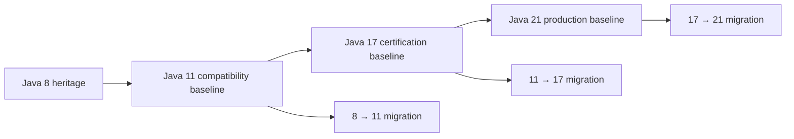
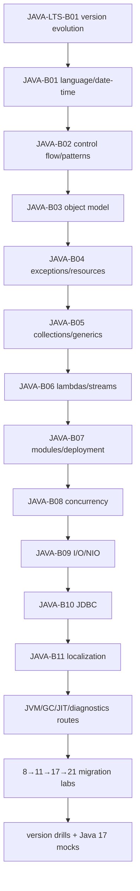

# Java 11, 17 and 21 Complete Knowledge Program

> [!summary]
> The Java knowledge base is cumulative. Java 11 provides the enterprise compatibility baseline, Java 17 provides the `1Z0-829` certification baseline, and Java 21 provides the modern production baseline. The program must cover shared Java fundamentals, every LTS delta, migration risks, JVM/runtime behavior, tooling, diagnostics and version-specific production decisions.

# Version roles

| Version | Role | Main purpose |
|---|---|---|
| Java 11 | Compatibility baseline | Maintain and migrate mature enterprise systems from Java 8/11-era stacks. |
| Java 17 | Certification baseline | Cover Java SE 17 language and API objectives for `1Z0-829`. |
| Java 21 | Production baseline | Use modern language, virtual threads, sequenced collections and current runtime capabilities. |



# Knowledge contract

A domain is complete only when it has:

```text
shared canonical explanation
Java 11 behavior and delta
Java 17 behavior and delta
Java 21 behavior and delta
feature-status classification
visual models
base cards
version-comparison drills
production/migration cases
executable labs under all applicable JDKs
primary JLS/JVMS/API/JEP sources
```

# Complete domain model

## JAVA-LTS-D01 — Language foundations

```text
lexical structure
primitive/reference types
variables and scope
operators and numeric promotion
conversions and casts
arrays
var and local type inference
strings, text blocks and StringBuilder
Date/Time API
regular expressions
locale-sensitive behavior
```

Version focus:

```text
Java 11  var lambda parameters, String/API additions
Java 17  text blocks, switch expressions, pattern matching for instanceof
Java 21  record patterns, pattern matching for switch
```

## JAVA-LTS-D02 — Control flow and pattern matching

```text
if/else
loops and labels
classic switch
switch expressions
yield
exhaustiveness
null handling
instanceof patterns
record patterns
switch patterns
guards and dominance
```

## JAVA-LTS-D03 — Object model and type system

```text
classes and interfaces
constructors and initialization
inheritance
polymorphism
method overloading/overriding
static hiding
nested classes
enums
records
sealed classes
annotations
reflection boundaries
```

## JAVA-LTS-D04 — Generics and type inference

```text
generic classes and methods
invariance
wildcards
PECS
intersection types
bounds
type erasure
raw types
capture conversion
overload resolution
diamond and inference
heap pollution
```

## JAVA-LTS-D05 — Collections and data structures

```text
List Set Map Queue Deque
immutable factory collections
HashMap and TreeMap mechanics
Comparable and Comparator
iterator semantics
fail-fast versus weakly consistent
concurrent collections
sequenced collections
algorithmic complexity
memory trade-offs
```

## JAVA-LTS-D06 — Functional Java and Streams

```text
functional interfaces
lambda capture
method references
Optional
stream laziness
map flatMap filter reduce
primitive streams
collectors
parallel streams
associativity and side effects
Flow API
```

Version focus:

```text
Java 11  Predicate.not and Optional/String refinements
Java 17  Stream.toList and later-JDK library delta awareness
Java 21  sequenced collection interoperability and modern pipeline decisions
```

## JAVA-LTS-D07 — Exceptions and deterministic cleanup

```text
checked and unchecked exceptions
multi-catch
finally
try-with-resources
AutoCloseable
suppressed exceptions
exception transparency
stack traces
helpful NullPointerExceptions
structured failure aggregation
```

## JAVA-LTS-D08 — I/O, NIO.2 and serialization

```text
byte and character streams
buffering
Path and Files
file attributes
channels and buffers
directory walking
watch service
serialization
filters and deserialization security
UTF-8 default charset change
```

## JAVA-LTS-D09 — Modules, packaging and deployment

```text
module-info.java
requires exports opens
qualified exports/opens
uses provides
named/automatic/unnamed modules
classpath versus module path
jar jdeps jlink jpackage
multi-release JARs
single-file source launch
custom runtime images
```

## JAVA-LTS-D10 — Concurrency and parallelism

```text
threads and lifecycle
Java Memory Model
happens-before
volatile and monitors
locks and conditions
atomics and CAS
executors and queues
Future and CompletableFuture
ForkJoinPool
parallel streams
concurrent collections
ThreadLocal
virtual threads
structured concurrency status
scoped values status
```

Version focus:

```text
Java 11  platform-thread and executor baseline
Java 17  certification/API baseline and strong JMM reasoning
Java 21  virtual threads and modern thread-per-task architecture
```

## JAVA-LTS-D11 — JVM, class loading and bytecode

```text
class loaders
loading linking initialization
runtime data areas
stack frames
bytecode and verification
invokedynamic
class-file evolution
reflection and method handles
hidden classes
dynamic constants
nestmates
```

## JAVA-LTS-D12 — Garbage collection and memory

```text
heap generations and allocation
GC roots
reference types
memory leaks
G1
ZGC
Shenandoah awareness
Epsilon
GC logs
heap dumps
allocation profiling
Java 21 generational ZGC
```

## JAVA-LTS-D13 — JIT and performance engineering

```text
interpreter and tiered compilation
C1/C2
inlining
escape analysis
scalar replacement
deoptimization
profiling bias
warm-up
microbenchmark traps
JMH
CPU, allocation and lock profiling
```

## JAVA-LTS-D14 — Networking and HTTP

```text
sockets
URI URL
HTTP Client
synchronous and asynchronous requests
BodyPublisher BodyHandler
WebSocket client
TLS
timeouts
cancellation
connection pooling concepts
Simple Web Server
```

## JAVA-LTS-D15 — Security and cryptography

```text
providers and algorithms
KeyStore
TLS 1.3
certificate validation
secure random
ChaCha20-Poly1305
EdDSA
KEM API
serialization filters
Security Manager deprecation/removal path
secure coding boundaries
```

## JAVA-LTS-D16 — JDBC and data access

```text
DriverManager and DataSource
Connection
Statement PreparedStatement CallableStatement
ResultSet
transactions
savepoints
batching
generated keys
resource ownership
SQL exceptions
connection pools
```

## JAVA-LTS-D17 — Tooling, observability and diagnostics

```text
javac java jar jdeps jlink jpackage
jshell
jcmd
jstack
jmap
jstat
JFR
JMC
unified logging
Native Memory Tracking
heap/thread dumps
async-profiler awareness
```

## JAVA-LTS-D18 — Migration and compatibility

```text
source compatibility
binary compatibility
behavioral compatibility
--release
multi-release JARs
illegal reflective access
strong encapsulation
removed Java EE/CORBA modules
JAXB/JAX-WS dependencies
removed tools and VM options
charset and locale changes
library/framework compatibility
container image changes
```

# Version-delta route

## JAVA-LTS-B01 — Java 11/17/21 Evolution and Migration

- [[30_CERTIFICATIONS/Java/JAVA-LTS-B01/JAVA-LTS-B01 Roadmap]]
- [[10_CONCEPTS/Java/Versions/Java 11 17 21 LTS Evolution]]
- [[30_CERTIFICATIONS/Java/JAVA-LTS-B01/JAVA-LTS-B01 Cards]]
- [[40_PRODUCTION_CASES/Java/Java 11 17 21 Migration Cases]]
- [[50_LABS/Java/JAVA-LTS-B01/README]]
- [[98_SOURCES/Java 11 17 21 Official Sources]]

Purpose:

```text
understand what changed
classify standard versus preview/incubator features
select a target runtime
migrate safely between LTS releases
avoid answering Java 17 exam questions with Java 21 behavior
```

# Relationship to `1Z0-829`

The certification route remains Java 17-specific:

- [[30_CERTIFICATIONS/Java/1Z0-829/Java SE 17 99 Percent Master Roadmap]].

Rules:

1. Java 17 exam answers use Java 17 JLS/API semantics.
2. Java 11 behavior is included where migration or compatibility explains the Java 17 baseline.
3. Java 21 behavior is marked as production delta and must not leak into exam answers.
4. Every Java 17 route includes `java_11_baseline` and `java_21_delta` sections where relevant.

# Delivery program



# Completion targets

```text
18 complete shared domains
18 Java 11 baseline/delta sections
18 Java 17 baseline/delta sections
18 Java 21 baseline/delta sections
complete JEP catalog classification for 11/17/21
720 Java 17 exam base cards
180 Java 17 exam drills
120 cross-version comparison cards
30 migration production cases
30 multi-JDK labs
6 Java 17 full mocks
6 Java LTS migration mini-mocks
CI execution on JDK 11, 17 and 21
```

# Quality gates

```text
[ ] no domain exists only as a heading
[ ] every feature has exact release and status
[ ] preview/incubator APIs are explicitly marked
[ ] every migration claim has runtime evidence
[ ] every code sample declares the minimum Java version
[ ] Java 17 exam cards reject Java 21-only semantics
[ ] all JDK 11/17/21 labs pass in CI
[ ] version coverage audit has zero integrity errors
[ ] objective/card/graph/Mermaid audits pass
```

# Related navigation

- [[01_MAPS/Java Map]]
- [[30_CERTIFICATIONS/Certification MOC]]
- [[00_HOME/Certification 99 Percent Readiness Dashboard]]
- [[98_SOURCES/Java 11 17 21 Official Sources]]
