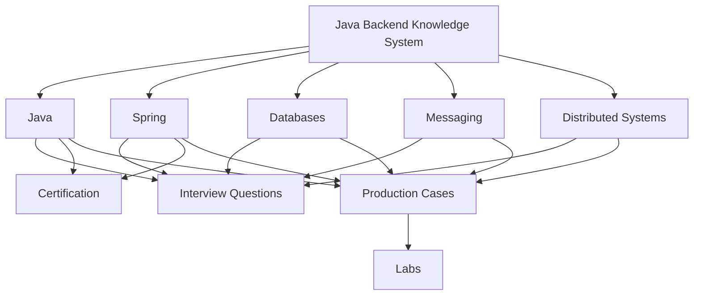
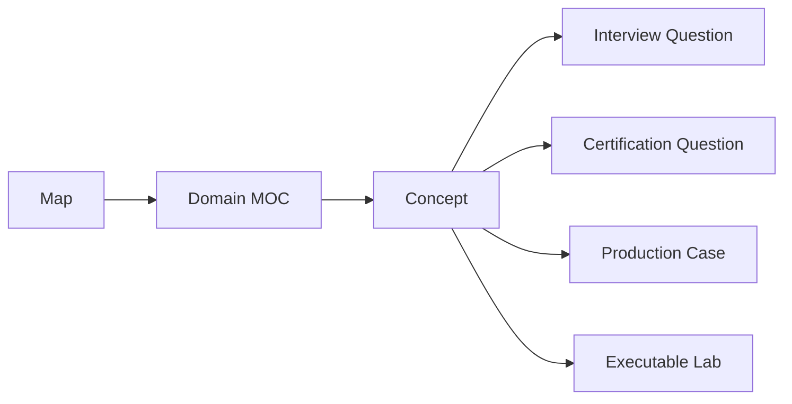
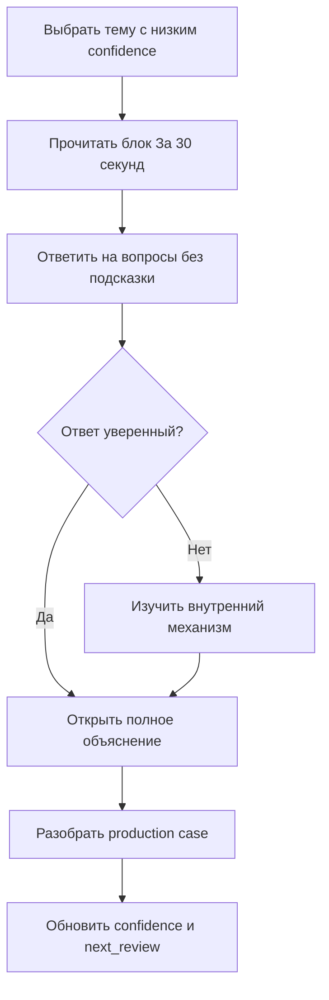

# Java Backend Knowledge System

> [!summary] Назначение
> Единая система для глубокого изучения, быстрого вспоминания, собеседований, сертификационных тестов и решения production-проблем.

## Общая карта

## Выберите режим

### Изучить предметную область

- [[01_MAPS/Java Map]]
- [[01_MAPS/Spring Map]]
- [[01_MAPS/Databases Map]]
- [[01_MAPS/Messaging Map]]
- [[01_MAPS/Distributed Systems Map]]

### Подготовиться к собеседованию

- [[20_QUESTIONS/Interview/Interview Questions MOC]]
- [[10_CONCEPTS/Java/Concurrency/ThreadLocal]]
- [[20_QUESTIONS/Interview/Java/Why can ThreadLocal leak in a thread pool]]
- [[40_PRODUCTION_CASES/Java/ThreadLocal context leaked between requests]]

### Подготовиться к сертификации

- [[30_CERTIFICATIONS/Certification MOC]]

### Открыть визуальную карту

- [[01_MAPS/Java Backend Map.canvas]]
- [[01_MAPS/Java Concurrency Map.canvas]]

## Слои знаний

## Процесс повторения

1. Откройте карту предметной области.
2. Выберите concept с низким `confidence`.
3. Прочитайте только блок «За 30 секунд».
4. Ответьте на связанные вопросы, не открывая ответы.
5. Сверьтесь с полным объяснением.
6. Обновите `confidence`, `last_reviewed` и `next_review`.

## Очерёдность наполнения

1. Java Concurrency и JVM.
2. Spring Core, AOP, Transactions и Spring Data.
3. Database transactions, locks, indexes и execution plans.
4. Kafka и RabbitMQ delivery semantics.
5. Reliability patterns распределённых систем.
6. Карты exam objectives для Java и Spring.
