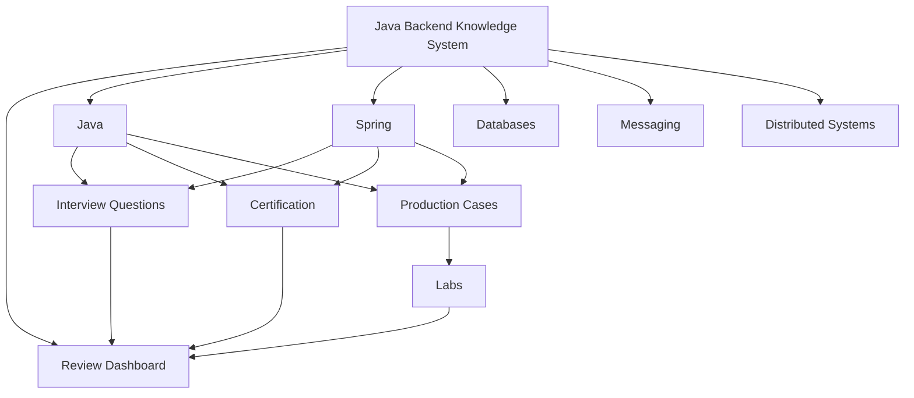
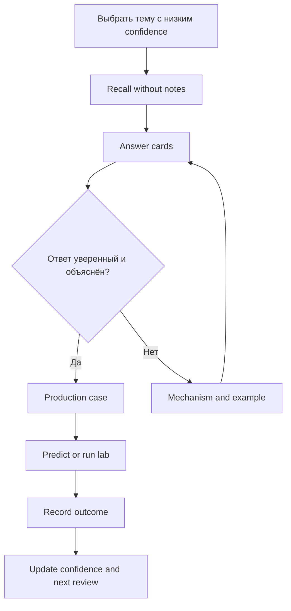

# Java Backend Knowledge System

> [!summary] Назначение
> Единая система для глубокого изучения, быстрого вспоминания, собеседований, сертификационных тестов и решения production-проблем.

## Главные входы

- [[00_HOME/Review Dashboard|Review Dashboard — что повторять сегодня]]
- [[01_MAPS/Java Backend Map.canvas|Java Backend Canvas]]
- [[20_QUESTIONS/Interview/Interview Questions MOC|Interview Questions]]
- [[30_CERTIFICATIONS/Certification MOC|Certification Routes]]

## Общая карта



# Выберите режим

## Повторить слабые темы

- [[00_HOME/Review Dashboard]];
- confidence scale;
- outcome taxonomy;
- active weakness register;
- 10-minute and 30-minute review protocols.

## Изучить предметную область

- [[01_MAPS/Java Map]]
- [[01_MAPS/Spring Map]]
- [[01_MAPS/Databases Map]]
- [[01_MAPS/Messaging Map]]
- [[01_MAPS/Distributed Systems Map]]

# Подготовиться к Spring certification

## Spring Core

1. [[10_CONCEPTS/Spring/Core/Spring Core Foundations]]
2. [[30_CERTIFICATIONS/Spring/2V0-72.22/CORE-B01/CORE-B01 Cards]]
3. [[10_CONCEPTS/Spring/Core/Dependency Resolution and Optional Injection]]
4. [[30_CERTIFICATIONS/Spring/2V0-72.22/CORE-B02/CORE-B02 Cards]]
5. [[10_CONCEPTS/Spring/Core/Bean Lifecycle from Definition to Destruction]]
6. [[30_CERTIFICATIONS/Spring/2V0-72.22/CORE-B03/CORE-B03 Cards]]
7. [[10_CONCEPTS/Spring/Core/Container Extension Points]]
8. [[30_CERTIFICATIONS/Spring/2V0-72.22/CORE-B04/CORE-B04 Cards]]
9. [[10_CONCEPTS/Spring/Core/Configuration Profiles and Externalized Properties]]
10. [[30_CERTIFICATIONS/Spring/2V0-72.22/CORE-B05/CORE-B05 Cards]]
11. [[10_CONCEPTS/Spring/Core/Advanced Core Scopes FactoryBean and Context Hierarchy]]
12. [[30_CERTIFICATIONS/Spring/2V0-72.22/CORE-B06/CORE-B06 Cards]]
13. [[30_CERTIFICATIONS/Spring/2V0-72.22/Spring Core Card Roadmap]]

## AOP and Cache

14. [[10_CONCEPTS/Spring/AOP/Spring AOP Proxy Mechanics]]
15. [[30_CERTIFICATIONS/Spring/2V0-72.22/AOP-B01/AOP-B01 Cards]]
16. [[10_CONCEPTS/Spring/Cache/Spring Cache with Caffeine and Redis]]
17. [[30_CERTIFICATIONS/Spring/2V0-72.22/CACHE-B01/CACHE-B01 Cards]]
18. [[30_CERTIFICATIONS/Spring/2V0-72.22/Spring AOP and Cache Roadmap]]

## Transaction Management

19. [[10_CONCEPTS/Spring/Transactions/Spring Transaction Management Deep Dive]]
20. [[30_CERTIFICATIONS/Spring/2V0-72.22/TX-B01/TX-B01 Cards]]
21. [[10_CONCEPTS/Spring/Transactions/Transactional Outbox and Commit Boundaries]]
22. [[40_PRODUCTION_CASES/Spring/Transaction Management Production Cases]]
23. [[50_LABS/Spring/TX-B01/README]]
24. [[30_CERTIFICATIONS/Spring/2V0-72.22/Spring Transaction Management Roadmap]]

## Spring Data and JPA

25. [[10_CONCEPTS/Spring/Data/Spring Data JPA Persistence Context and Entity Lifecycle]]
26. [[10_CONCEPTS/Spring/Data/Spring Data Repositories Queries and Fetching]]
27. [[30_CERTIFICATIONS/Spring/2V0-72.22/DATA-B01/DATA-B01 Cards]]
28. [[40_PRODUCTION_CASES/Spring/Spring Data JPA Production Cases]]
29. [[50_LABS/Spring/DATA-B01/README]]
30. [[30_CERTIFICATIONS/Spring/2V0-72.22/Spring Data JPA Roadmap]]

## Spring Testing

31. [[10_CONCEPTS/Spring/Testing/Spring TestContext and Test Slices]]
32. [[10_CONCEPTS/Spring/Testing/Spring Data JPA Testing with Testcontainers]]
33. [[30_CERTIFICATIONS/Spring/2V0-72.22/TEST-B01/TEST-B01 Cards]]
34. [[40_PRODUCTION_CASES/Spring/Spring Testing Production Cases]]
35. [[50_LABS/Spring/TEST-B01/README]]
36. [[30_CERTIFICATIONS/Spring/2V0-72.22/Spring Testing Roadmap]]

# Открыть визуальную карту

- [[01_MAPS/Java Backend Map.canvas]]
- [[01_MAPS/Java Concurrency Map.canvas]]
- [[01_MAPS/Java Advanced Concurrency Map.canvas]]
- [[01_MAPS/Spring Core Foundation Map.canvas]]
- [[01_MAPS/Spring Dependency Resolution Map.canvas]]
- [[01_MAPS/Spring Bean Lifecycle Map.canvas]]
- [[01_MAPS/Spring Container Extension Points Map.canvas]]
- [[01_MAPS/Spring Configuration and Profiles Map.canvas]]
- [[01_MAPS/Spring Advanced Core Map.canvas]]
- [[01_MAPS/Spring AOP and Caching Map.canvas]]
- [[01_MAPS/Spring Transaction Management Map.canvas]]
- [[01_MAPS/Spring Data JPA Map.canvas]]
- [[01_MAPS/Spring Testing Map.canvas]]

# Current Published Vertical Slices

## Java Concurrency

```text
Foundations
  -> JMM and happens-before
  -> volatile / synchronized / locks
  -> executors / CompletableFuture / virtual threads
  -> CAS / deadlock / concurrent collections
  -> recall + executable labs
```

## Spring Core

```text
CORE-B01  20
CORE-B02  24
CORE-B03  24
CORE-B04  24
CORE-B05  24
CORE-B06  24
------------
TOTAL    140 cards
```

## Spring AOP and Cache

```text
AOP-B01    24 cards
CACHE-B01  20 cards
-------------------
TOTAL      44 cards
```

Практика:

- [[50_LABS/Spring/AOP-B01/README]];
- [[50_LABS/Spring/CACHE-B01/README]];
- [[40_PRODUCTION_CASES/Spring/AOP and Cache Production Cases]].

## Spring Transaction Management

```text
TX-B01: logical/physical tx, propagation, isolation,
        rollback, callbacks, async and outbox        32 cards
```

Практика:

- [[01_MAPS/Spring Transaction Management Map.canvas]];
- [[40_PRODUCTION_CASES/Spring/Transaction Management Production Cases]];
- [[50_LABS/Spring/TX-B01/README]].

## Spring Data and JPA

```text
DATA-B01: persistence context, lifecycle, flush,
          repositories, dynamic queries, fetching   36 cards
```

Практика:

- [[01_MAPS/Spring Data JPA Map.canvas]];
- [[40_PRODUCTION_CASES/Spring/Spring Data JPA Production Cases]];
- [[50_LABS/Spring/DATA-B01/README]].

## Spring Testing

```text
TEST-B01: TestContext, slices, transactional tests,
          flush/clear, Testcontainers, SQL regressions 36 cards
```

Практика:

- [[01_MAPS/Spring Testing Map.canvas]];
- [[40_PRODUCTION_CASES/Spring/Spring Testing Production Cases]];
- [[50_LABS/Spring/TEST-B01/README]].

```text
Spring Core               140
AOP and Cache               44
Transaction Management      32
Spring Data and JPA          36
Spring Testing               36
-------------------------------
Published Spring total     288
```

# Spring learning sequence


# Процесс повторения



1. Откройте [[00_HOME/Review Dashboard]].
2. Выберите concept с низким `confidence`.
3. Воспроизведите определение без чтения.
4. Ответьте на связанные cards.
5. Объясните mechanism и boundary.
6. Разберите production case или lab.
7. Обновите outcome и review metadata.

# Очерёдность наполнения

1. Java Concurrency и JVM.
2. Spring Core, AOP, Cache, Transactions, Data/JPA и Testing — опубликованы.
3. Spring Boot internals и auto-configuration.
4. Database transactions, locks, indexes и execution plans.
5. Kafka и RabbitMQ delivery semantics.
6. Reliability patterns распределённых систем.
7. Карты exam objectives для Java и Spring.
