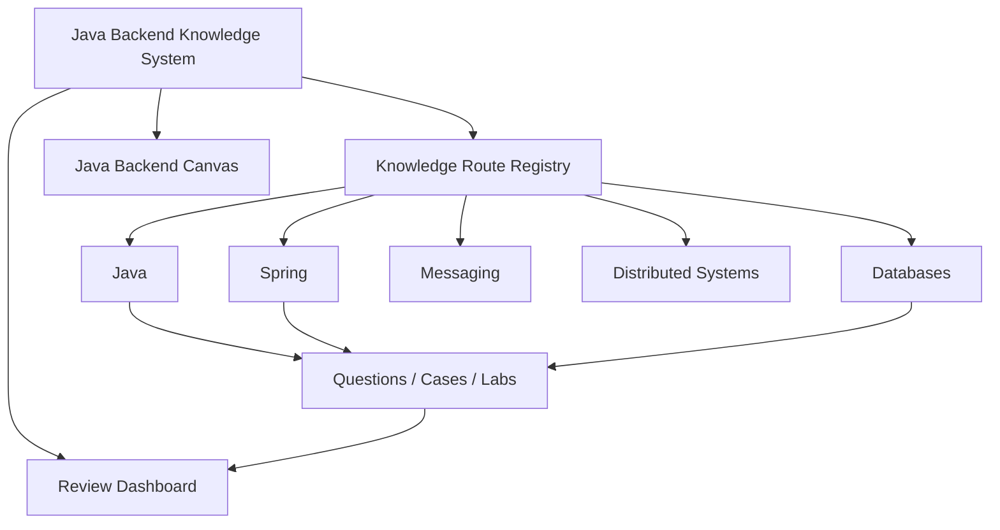
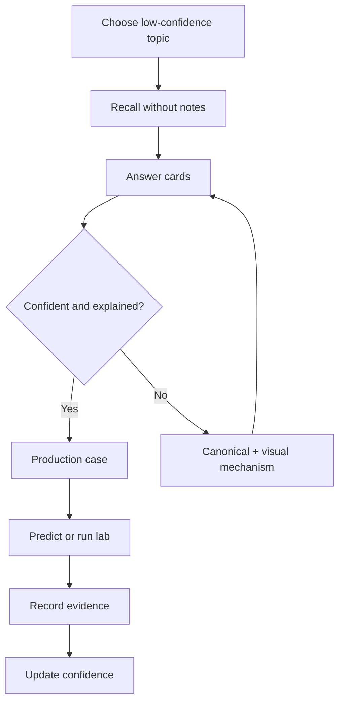

# Java Backend Knowledge System

> [!summary] Назначение
> Единая система для глубокого изучения, быстрого вспоминания, собеседований, сертификационных тестов и решения production-проблем.

# Главные входы

- [[00_HOME/Knowledge Route Registry|Knowledge Route Registry — все опубликованные маршруты]]
- [[00_HOME/Review Dashboard|Review Dashboard — что повторять сегодня]]
- [[01_MAPS/Java Backend Map.canvas|Java Backend Canvas]]
- [[20_QUESTIONS/Interview/Interview Questions MOC|Interview Questions]]
- [[30_CERTIFICATIONS/Certification MOC|Certification Routes]]
- [[90_TEMPLATES/Cross-Linking Standard|Cross-Linking Standard]]



# Выберите режим

## Найти опубликованный маршрут

Откройте [[00_HOME/Knowledge Route Registry]]. Реестр показывает для каждого route:

```text
Domain MOC
Roadmap
Canonical concepts
Visual deep dive / Canvas
Cards
Production cases
Lab
Primary sources
Previous / Next
```

## Повторить слабые темы

- [[00_HOME/Review Dashboard]];
- confidence scale;
- outcome taxonomy;
- active weakness register;
- 10-minute and 30-minute review protocols.

## Изучить предметную область

- [[01_MAPS/Java Map]]
- [[01_MAPS/Spring Map]]
- [[01_MAPS/Databases Map]]
- [[01_MAPS/Messaging Map]]
- [[01_MAPS/Distributed Systems Map]]

# Java Concurrency route

Recommended sequence:

1. [[10_CONCEPTS/Java/Concurrency/Concurrency Learning Path]]
2. [[10_CONCEPTS/Java/Concurrency/Java Concurrency Visual Deep Dive]]
3. [[01_MAPS/Java Concurrency Visual Atlas.canvas]]
4. [[20_QUESTIONS/Interview/Java/Concurrency/Advanced Concurrency Recall]]
5. [[50_LABS/Java/Concurrency/README]]
6. [[98_SOURCES/Java Concurrency Sources]]

Coverage:

```text
JMM and happens-before
visibility / atomicity / ordering
volatile / synchronized / locks
CAS and atomic state
executors / futures / backpressure
ThreadLocal
virtual threads
concurrent collections
liveness diagnostics
```

# Spring certification sequence

## Spring Core

1. [[30_CERTIFICATIONS/Spring/2V0-72.22/Spring Core Card Roadmap]]
2. [[10_CONCEPTS/Spring/Core/Spring Core Visual Deep Dive]]
3. [[01_MAPS/Spring Core Visual Atlas.canvas]]

Published batches:

```text
CORE-B01  20 — IoC, registration and injection
CORE-B02  24 — candidate resolution
CORE-B03  24 — lifecycle
CORE-B04  24 — extension points
CORE-B05  24 — configuration and profiles
CORE-B06  24 — scopes, FactoryBean and hierarchy
-----------------------------------------------
TOTAL    140 cards
```

## AOP and Cache

1. [[30_CERTIFICATIONS/Spring/2V0-72.22/Spring AOP and Cache Roadmap]]
2. [[10_CONCEPTS/Spring/AOP/Spring AOP Proxy Mechanics]]
3. [[10_CONCEPTS/Spring/AOP/Spring AOP Visual Deep Dive]]
4. [[10_CONCEPTS/Spring/Cache/Spring Cache with Caffeine and Redis]]
5. [[10_CONCEPTS/Spring/Cache/Spring Cache Visual Deep Dive]]
6. [[30_CERTIFICATIONS/Spring/2V0-72.22/AOP-B01/AOP-B01 Cards]]
7. [[30_CERTIFICATIONS/Spring/2V0-72.22/CACHE-B01/CACHE-B01 Cards]]
8. [[40_PRODUCTION_CASES/Spring/AOP and Cache Production Cases]]
9. [[50_LABS/Spring/AOP-B01/README]]
10. [[50_LABS/Spring/CACHE-B01/README]]

## Transaction Management

1. [[30_CERTIFICATIONS/Spring/2V0-72.22/Spring Transaction Management Roadmap]]
2. [[10_CONCEPTS/Spring/Transactions/Spring Transaction Management Deep Dive]]
3. [[10_CONCEPTS/Spring/Transactions/Spring Transaction Management Visual Deep Dive]]
4. [[10_CONCEPTS/Spring/Transactions/Transactional Outbox and Commit Boundaries]]
5. [[30_CERTIFICATIONS/Spring/2V0-72.22/TX-B01/TX-B01 Cards]]
6. [[40_PRODUCTION_CASES/Spring/Transaction Management Production Cases]]
7. [[50_LABS/Spring/TX-B01/README]]

## Spring Data and JPA

1. [[30_CERTIFICATIONS/Spring/2V0-72.22/Spring Data JPA Roadmap]]
2. [[10_CONCEPTS/Spring/Data/Spring Data JPA Persistence Context and Entity Lifecycle]]
3. [[10_CONCEPTS/Spring/Data/Spring Data Repositories Queries and Fetching]]
4. [[10_CONCEPTS/Spring/Data/Spring Data JPA Visual Deep Dive]]
5. [[30_CERTIFICATIONS/Spring/2V0-72.22/DATA-B01/DATA-B01 Cards]]
6. [[40_PRODUCTION_CASES/Spring/Spring Data JPA Production Cases]]
7. [[50_LABS/Spring/DATA-B01/README]]

## Spring Testing

1. [[30_CERTIFICATIONS/Spring/2V0-72.22/Spring Testing Roadmap]]
2. [[10_CONCEPTS/Spring/Testing/Spring TestContext and Test Slices]]
3. [[10_CONCEPTS/Spring/Testing/Spring Data JPA Testing with Testcontainers]]
4. [[10_CONCEPTS/Spring/Testing/Spring Testing Visual Deep Dive]]
5. [[30_CERTIFICATIONS/Spring/2V0-72.22/TEST-B01/TEST-B01 Cards]]
6. [[40_PRODUCTION_CASES/Spring/Spring Testing Production Cases]]
7. [[50_LABS/Spring/TEST-B01/README]]

```text
Spring Core               140
AOP and Cache               44
Transaction Management      32
Spring Data and JPA          36
Spring Testing               36
-------------------------------
Published Spring total     288 cards
```

# Database route

## DB-B01 — Indexes and Query Plans

1. [[30_CERTIFICATIONS/Databases/DB-B01/DB-B01 Roadmap]]
2. [[10_CONCEPTS/Databases/PostgreSQL Index Mechanics]]
3. [[10_CONCEPTS/Databases/PostgreSQL EXPLAIN and Query Plan Analysis]]
4. [[01_MAPS/Database Indexes and Query Plans Map.canvas]]
5. [[30_CERTIFICATIONS/Databases/DB-B01/DB-B01 Cards]]
6. [[40_PRODUCTION_CASES/Databases/Indexes and Query Plans Production Cases]]
7. [[50_LABS/Databases/DB-B01/README]]
8. [[98_SOURCES/PostgreSQL Indexes and Query Plans Sources]]

```text
2 canonical notes
62 visual diagrams
30 cards
14 production cases
10 PostgreSQL experiments
```

# Visual maps

- [[01_MAPS/Java Backend Map.canvas]]
- [[01_MAPS/Java Concurrency Visual Atlas.canvas]]
- [[01_MAPS/Spring Visual Learning Atlas.canvas]]
- [[01_MAPS/Spring Core Visual Atlas.canvas]]
- [[01_MAPS/Spring AOP and Cache Visual Atlas.canvas]]
- [[01_MAPS/Spring Transaction Management Map.canvas]]
- [[01_MAPS/Spring Data JPA Map.canvas]]
- [[01_MAPS/Spring Testing Map.canvas]]
- [[01_MAPS/Database Indexes and Query Plans Map.canvas]]

# Review process



1. Откройте [[00_HOME/Review Dashboard]].
2. Выберите concept с низким `confidence`.
3. Воспроизведите mechanism без чтения.
4. Ответьте на связанные cards.
5. Разберите production case.
6. Предскажите lab outcome, затем проверьте evidence.
7. Обновите outcome и review metadata.

# Cross-link quality

Navigation graph is defined by:

- [[00_HOME/Knowledge Route Registry]];
- [[90_TEMPLATES/Cross-Linking Standard]];
- `.github/knowledge-routes.json`;
- `.github/scripts/audit_cross_links.py`.

Published route is complete only when:

```text
README reaches registry
registry reaches route hub
route indexes cover all artifacts
every published artifact has inbound navigation
Canvas references exist
no broken or ambiguous strict-route links
```

# Next routes

1. DB-B02 — Transactions, MVCC and Locks.
2. Spring Boot Internals and Auto-configuration.
3. Java Language, Collections and JVM vertical slices.
4. Kafka and RabbitMQ delivery semantics.
5. Distributed Systems resilience and consistency.
