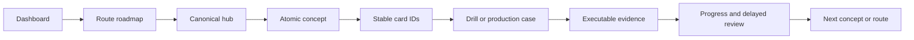

# Java Backend Knowledge System

> [!summary]
> Компактная домашняя страница vault. Актуальное состояние маршрутов хранится в специализированных dashboards и registry, а не дублируется вручную в нескольких длинных документах.

## Main actions

| Задача | Открыть |
|---|---|
| Продолжить Java-обучение | [[00_HOME/Java Learning Dashboard]] |
| Повторить карточки | [[00_HOME/Card Review Dashboard]] |
| Проверить readiness | [[00_HOME/Certification 99 Percent Readiness Dashboard]] |
| Посмотреть все опубликованные routes | [[00_HOME/Knowledge Route Registry]] |
| Выбрать certification track | [[30_CERTIFICATIONS/Certification MOC]] |
| Открыть Java Canvas | [[01_MAPS/Java Certification Routes.canvas]] |
| Открыть общую certification map | [[01_MAPS/Certification 99 Percent Map.canvas]] |

## Current Java position

```text
JAVA-B01  Values, Text and Date-Time       lab-proven
JAVA-B02  Control Flow and Pattern Switch  lab-proven
JAVA-B03  Object Model and Record Patterns next
```

Published Java exam inventory:

```text
atomic concept notes             17
base cards                      135
compile/output drills            35
positive proof classes            5
expected compile-fail cases      11
runtime lanes                JDK 17 / JDK 21
```

## Knowledge-system model



## Java routes

### Certification program

- [[00_HOME/Oracle Java 17 and 21 Certification Program]]
- [[30_CERTIFICATIONS/Java/1Z0-829/Java SE 17 99 Percent Master Roadmap]]
- [[30_CERTIFICATIONS/Java/1Z0-830/Java SE 21 99 Percent Master Roadmap]]
- [[30_CERTIFICATIONS/Java/Java 17 and 21 Exam Delta Matrix]]

### Published exam routes

- [[30_CERTIFICATIONS/Java/JAVA-B01/JAVA-B01 Roadmap]]
- [[10_CONCEPTS/Java/Core/Java Values Text and Date-Time]]
- [[30_CERTIFICATIONS/Java/JAVA-B02/JAVA-B02 Roadmap]]
- [[10_CONCEPTS/Java/Core/Java Control Flow and Pattern Switch]]

### Platform and advanced routes

- [[00_HOME/Java 11 17 21 Complete Knowledge Program]]
- [[30_CERTIFICATIONS/Java/JAVA-LTS-B01/JAVA-LTS-B01 Roadmap]]
- [[30_CERTIFICATIONS/Java/Concurrency/Java Concurrency 99 Percent Roadmap]]

## Other domains

- **Spring certification:** [[30_CERTIFICATIONS/Spring/2V0-72.22/Spring 99 Percent Master Roadmap]]
- **Databases:** [[30_CERTIFICATIONS/Databases/DB-B01/DB-B01 Roadmap]]
- **Interview questions:** [[20_QUESTIONS/Interview/Interview Questions MOC]]

## Repository layout

```text
00_HOME              dashboards and entry points
01_MAPS              Obsidian Canvas maps
10_CONCEPTS          canonical hubs and atomic notes
20_QUESTIONS         interview recall
30_CERTIFICATIONS    roadmaps, cards, assessments and mocks
40_PRODUCTION_CASES  production transfer
50_LABS              executable evidence
70_PROGRESS          per-card learning state
90_TEMPLATES         standards and templates
98_SOURCES           primary sources
99_AUDITS            audit reports
```

## Recommended daily path

```text
1. Open Java Learning Dashboard.
2. Continue from the next atomic concept.
3. Answer Active recall without notes.
4. Complete matching stable cards.
5. Attempt drills before executing code.
6. Predict lab outcomes.
7. Run the correct JDK lane.
8. Record outcome and confidence.
```

## Quality controls

The vault validates:

```text
Markdown structure
wikilinks and navigation sinks
Canvas file references
stable card IDs
progress compatibility
objective traceability
certification readiness
Java version coverage
route-specific executable proofs
```

Navigation standard: [[90_TEMPLATES/Cross-Linking Standard]].
