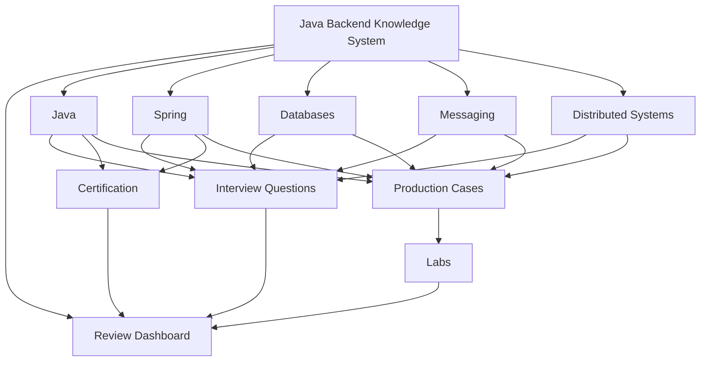
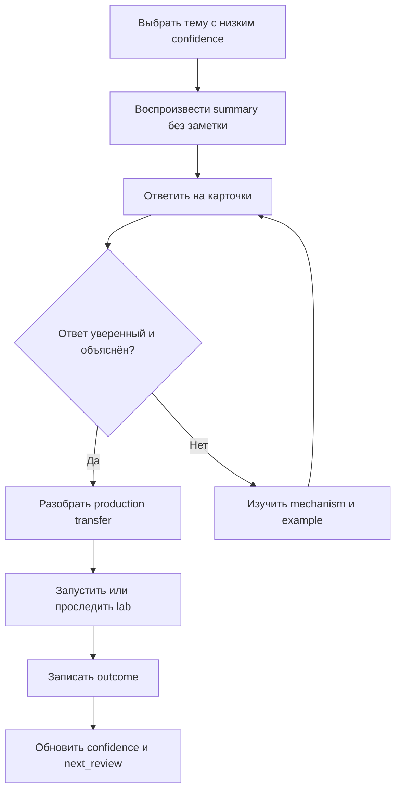

# Java Backend Knowledge System

> [!summary] Назначение
> Единая система для глубокого изучения, быстрого вспоминания, собеседований, сертификационных тестов и решения production-проблем.

## Главные входы

- [[00_HOME/Review Dashboard|Review Dashboard — что повторять сегодня]]
- [[01_MAPS/Java Backend Map.canvas|Java Backend Canvas]]
- [[20_QUESTIONS/Interview/Interview Questions MOC|Interview Questions]]
- [[30_CERTIFICATIONS/Certification MOC|Certification Routes]]

## Общая карта



## Выберите режим

### Повторить слабые темы

- [[00_HOME/Review Dashboard]]
- confidence scale;
- outcome taxonomy;
- active weakness register;
- 10-minute and 30-minute review protocols.

### Изучить предметную область

- [[01_MAPS/Java Map]]
- [[01_MAPS/Spring Map]]
- [[01_MAPS/Databases Map]]
- [[01_MAPS/Messaging Map]]
- [[01_MAPS/Distributed Systems Map]]

### Подготовиться к собеседованию

- [[20_QUESTIONS/Interview/Interview Questions MOC]]
- [[20_QUESTIONS/Interview/Java/Concurrency/Advanced Concurrency Recall]]
- [[40_PRODUCTION_CASES/Spring/Dependency Resolution Production Cases]]
- [[40_PRODUCTION_CASES/Spring/Bean Lifecycle Production Cases]]
- [[40_PRODUCTION_CASES/Spring/Container Extension Point Production Cases]]
- [[40_PRODUCTION_CASES/Spring/Configuration and Profiles Production Cases]]
- [[40_PRODUCTION_CASES/Java/ThreadLocal context leaked between requests]]

### Подготовиться к Spring certification

1. [[10_CONCEPTS/Spring/Core/Spring Core Foundations]]
2. [[30_CERTIFICATIONS/Spring/2V0-72.22/CORE-B01/CORE-B01 Cards]]
3. [[10_CONCEPTS/Spring/Core/Dependency Resolution and Optional Injection]]
4. [[30_CERTIFICATIONS/Spring/2V0-72.22/CORE-B02/CORE-B02 Cards]]
5. [[10_CONCEPTS/Spring/Core/Bean Lifecycle from Definition to Destruction]]
6. [[30_CERTIFICATIONS/Spring/2V0-72.22/CORE-B03/CORE-B03 Cards]]
7. [[10_CONCEPTS/Spring/Core/Container Extension Points]]
8. [[30_CERTIFICATIONS/Spring/2V0-72.22/CORE-B04/CORE-B04 Cards]]
9. [[10_CONCEPTS/Spring/Core/Configuration Profiles and Externalized Properties]]
10. [[30_CERTIFICATIONS/Spring/2V0-72.22/CORE-B05/CORE-B05 Cards]]
11. [[30_CERTIFICATIONS/Spring/2V0-72.22/Spring Core Card Roadmap]]

### Открыть визуальную карту

- [[01_MAPS/Java Backend Map.canvas]]
- [[01_MAPS/Java Concurrency Map.canvas]]
- [[01_MAPS/Java Advanced Concurrency Map.canvas]]
- [[01_MAPS/Spring Core Foundation Map.canvas]]
- [[01_MAPS/Spring Dependency Resolution Map.canvas]]
- [[01_MAPS/Spring Bean Lifecycle Map.canvas]]
- [[01_MAPS/Spring Container Extension Points Map.canvas]]
- [[01_MAPS/Spring Configuration and Profiles Map.canvas]]

## Current Published Vertical Slices

### Java Concurrency

```text
Foundations
  -> JMM and happens-before
  -> volatile / synchronized / locks
  -> executors / CompletableFuture / virtual threads
  -> CAS / deadlock / concurrent collections
  -> recall + executable labs
```

### Spring Core

```text
CORE-B01: IoC, beans, registration, injection styles          20 cards
CORE-B02: candidate resolution, qualifiers, optionality       24 cards
CORE-B03: bean lifecycle, init, proxy and destruction         24 cards
CORE-B04: container extension points and processor phases     24 cards
CORE-B05: configuration, profiles and property resolution     24 cards
TOTAL                                                         116 cards
```

## Spring learning sequence


## Процесс повторения



1. Откройте [[00_HOME/Review Dashboard]].
2. Выберите concept с низким `confidence`.
3. Воспроизведите определение без чтения.
4. Ответьте на связанные questions/cards.
5. Объясните mechanism и boundary.
6. Разберите production case или lab.
7. Обновите outcome и review metadata.

## Очерёдность наполнения

1. Java Concurrency и JVM.
2. Spring Core `CORE-B06`, затем AOP и Transactions.
3. Database transactions, locks, indexes и execution plans.
4. Kafka и RabbitMQ delivery semantics.
5. Reliability patterns распределённых систем.
6. Карты exam objectives для Java и Spring.
