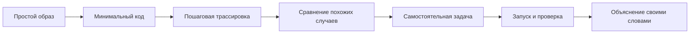

# Java Beginner Learning Path

> [!start]
> Эта страница предназначена для ученика, который ещё не умеет читать сложные Java-конспекты. Начинай отсюда, а не с экзаменационных карточек.

## Как устроено обучение

Каждая тема проходит три уровня.

| Уровень | Главный вопрос | Результат |
|---|---|---|
| 1. Понять | Что происходит простыми словами? | ученик может объяснить идею без терминов |
| 2. Разобрать | Как именно Java выполняет код? | ученик может пошагово проследить программу |
| 3. Применить | Где граница правила и типичная ошибка? | ученик решает новую задачу и объясняет причину |



## Правило безопасной нагрузки

> [!checkpoint]
> За одну учебную сессию изучай один новый механизм. Не пытайся одновременно учить синтаксис, исключения, коллекции и многопоточность.

Оптимальная последовательность:

1. Прочитай простое объяснение.
2. Закрой текст и перескажи идею.
3. Предскажи результат короткой программы.
4. Запусти программу.
5. Объясни, почему прогноз совпал или не совпал.
6. Реши одну похожую, но не идентичную задачу.

## Нулевая ступень — как Java исполняет программу

Перед B01 прочитай:

- [[10_CONCEPTS/Java/Foundations/Java Mental Model for Beginners]]

Нужно понять четыре объекта мышления:

```text
значение
переменная
объект
поток выполнения
```

## Ступень 1 — значения и вычисления

Начни с:

- [[10_CONCEPTS/Java/Foundations/Java B01 Beginner Bridge]]
- затем [[30_CERTIFICATIONS/Java/JAVA-B01/JAVA-B01 Roadmap]]

После ступени ученик должен уметь:

- отличать значение от переменной;
- объяснять тип;
- считать выражение по шагам;
- отличать String от StringBuilder;
- понимать дату без часового пояса и момент времени;
- не путать календарный день и 24 часа.

## Ступень 2 — как программа выбирает путь

Начни с:

- [[10_CONCEPTS/Java/Foundations/Java B02 Beginner Bridge]]
- затем [[30_CERTIFICATIONS/Java/JAVA-B02/JAVA-B02 Roadmap]]

После ступени ученик должен уметь:

- читать `if`, цикл и `switch` как маршрут;
- отмечать, какая строка выполнится следующей;
- объяснять `break`, `continue` и `return`;
- отличать обычный switch от switch expression;
- понимать, почему некоторые ветки недостижимы.

## Ступень 3 — объекты и классы

Начни с:

- [[10_CONCEPTS/Java/Foundations/Java B03 Beginner Bridge]]
- затем [[30_CERTIFICATIONS/Java/JAVA-B03/JAVA-B03 Roadmap]]

После ступени ученик должен уметь:

- отличать класс, объект и ссылку;
- объяснять создание объекта;
- понимать конструктор;
- отличать overload от override;
- объяснять наследование без фразы «дочерний класс получает всё»;
- выбирать record, enum, interface или обычный class для простой задачи.

## Ступень 4 — ошибки и безопасное освобождение ресурсов

Начни с:

- [[30_CERTIFICATIONS/Java/JAVA-B04/JAVA-B04 Roadmap]]

После ступени ученик должен уметь:

- отличать ошибку компиляции от exception во время выполнения;
- читать stack trace сверху к причине;
- понимать checked и unchecked exceptions;
- применять `try`, `catch`, `finally`;
- создавать понятное custom exception;
- использовать try-with-resources;
- объяснять suppressed exception.

## Как проверять понимание

Не спрашивай только «что такое X?». Используй четыре типа вопросов.

| Тип | Пример |
|---|---|
| Объяснение | Почему программа попала в эту ветку? |
| Прогноз | Скомпилируется ли код и что произойдёт? |
| Исправление | Как изменить минимальное количество строк? |
| Перенос | Где такое правило встретится в реальном сервисе? |

## Признаки настоящего понимания

Тема освоена, когда ученик может:

- объяснить её без текста;
- нарисовать простой поток выполнения;
- привести правильный пример;
- привести правдоподобный неправильный пример;
- предсказать результат нового кода;
- назвать границу применимости правила.

## Куда обращаться после ошибки

- [[00_HOME/Java Weakness Repair Center]] — определить тип ошибки.
- [[00_HOME/Card Review Dashboard]] — повторить карточки.
- [[70_PROGRESS/Java Learning Progress Dashboard]] — записать слабый механизм.
- [[00_HOME/Java Learning Cockpit]] — выбрать следующую сессию.
