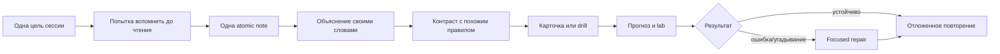

# Java Learning Cockpit

> [!start]
> **Начни отсюда.** Не выбирай папку и не пытайся «прочитать всё». Сначала выбери длительность сессии и учебную задачу: понять новый механизм, вспомнить без подсказки, применить в задаче или исправить ошибочную модель.

## Быстрый старт за 15 секунд

| У тебя есть | Состояние | Сделай сейчас |
|---:|---|---|
| 15–25 минут | устал / мало внимания | 8–12 due-карточек → одна ошибка в [[00_HOME/Java Weakness Repair Center]] |
| 40–60 минут | нормальная концентрация | одна atomic note → 8–15 карточек → 1–2 drills |
| 80–100 минут | высокий ресурс | atomic note → карточки → drills → письменный прогноз → lab |
| неизвестно, с чего начать | тревога / перегруз | открой [[70_PROGRESS/Java Learning Progress Dashboard]] и выбери самый слабый механизм |

> [!checkpoint]
> **Ограничение нагрузки:** одна сессия должна иметь одну главную учебную цель. Большой объём создаёт ощущение работы, но не гарантирует извлечение знания из памяти.

## Четыре учебных режима

> [!learn]
> ### 1. Понять
> Открой один atomic concept. До чтения сформулируй, что ты уже знаешь. После чтения объясни механизм своими словами и нарисуй один runtime/type-flow.
>
> [[00_HOME/Java Learning Dashboard|Выбрать маршрут и concept]]

> [!recall]
> ### 2. Вспомнить
> Отвечай до открытия заметки. Отмечай не только правильность, но и уверенность: правильный ответ, полученный угадыванием, ещё не является устойчивым знанием.
>
> [[00_HOME/Card Review Dashboard|Открыть review workflow]]

> [!practice]
> ### 3. Применить
> Сначала фиксируй Java version, затем предсказывай compile/no-compile, output или exception. Запуск кода выполняется только после письменного прогноза.
>
> [[00_HOME/Java Learning Dashboard#Практика и доказательства|Выбрать drills и lab]]

> [!repair]
> ### 4. Исправить модель
> Ошибка — это диагностический сигнал. Определи тип ошибки, вернись к одному механизму, реши контрастный пример и повтори позже.
>
> [[00_HOME/Java Weakness Repair Center|Начать repair loop]]

## Карта опубликованных маршрутов

| Route | Зачем изучать | Материал | Первый вход |
|---|---|---:|---|
| `JAVA-B01` | типы значений, строки, даты и время | 9 notes · 75 cards · 15 drills | [[10_CONCEPTS/Java/Core/Java Values Text and Date-Time]] |
| `JAVA-B02` | условия, циклы, switch и pattern switch | 8 notes · 60 cards · 20 drills | [[10_CONCEPTS/Java/Core/Java Control Flow and Pattern Switch]] |
| `JAVA-B03` | объектная модель, records, sealed types и record patterns | 12 notes · 115 cards · 35 drills | [[10_CONCEPTS/Java/Object Model/Java Object Model Records and Record Patterns]] |
| `JAVA-B05` | collections, generics, sequenced collections | следующий repository route | [[00_HOME/Java Learning Dashboard#Что будет дальше|Посмотреть границу]] |

## Рекомендуемый учебный цикл



## Правило психологической безопасности

> [!important]
> Неправильный ответ не описывает способности человека. Он показывает, какой следующий учебный шаг нужен:
>
> - **attention** — перечитать условие и версию;
> - **retrieval** — повторить позже без подсказки;
> - **discrimination** — сравнить два похожих правила;
> - **concept** — перестроить mental model;
> - **transfer** — решить новый пример и доказать кодом.

## Не перегружай рабочую память

1. Не изучай одновременно два новых atomic concepts.
2. Не открывай ответ карточки до собственной формулировки.
3. Не запускай код до прогноза.
4. После трёх концептуальных ошибок останови новые карточки и перейди в repair mode.
5. Заверши сессию записью одного следующего действия, а не длинным списком долгов.

## Практика и доказательства

- **B01:** [[30_CERTIFICATIONS/Java/JAVA-B01/JAVA-B01 Drills|15 drills]] · [[50_LABS/Java/JAVA-B01/README|JDK 17/21 proof]]
- **B02:** [[30_CERTIFICATIONS/Java/JAVA-B02/JAVA-B02 Drills|20 drills]] · [[50_LABS/Java/JAVA-B02/README|positive/negative proof]]
- **B03:** [[30_CERTIFICATIONS/Java/JAVA-B03/JAVA-B03 Drills|35 drills]] · [[50_LABS/Java/JAVA-B03/README|object-model proof]]

## Интерфейс и управление

- [[00_HOME/Java Learning Dashboard]] — каталог routes и atomic concepts.
- [[00_HOME/Card Review Dashboard]] — due queue и запись результата.
- [[70_PROGRESS/Java Learning Progress Dashboard]] — weekly review и learner state.
- [[00_HOME/Java Weakness Repair Center]] — диагностическая маршрутизация.
- [[01_MAPS/Java Learning Journey.canvas]] — пространственная карта учебного процесса.
- [[00_HOME/Obsidian Learning Interface Setup]] — включение визуального слоя.
- [[90_TEMPLATES/Learning Session Template]] — готовая структура учебной сессии.
- [[90_TEMPLATES/Atomic Lesson UX Template]] — стандарт нового atomic lesson.
- [[90_TEMPLATES/Route Learning UX Standard]] — педагогический UX-контракт.

## Завершение сессии

```text
[ ] Я могу объяснить механизм без текста.
[ ] Я различаю его с ближайшим похожим правилом.
[ ] Я сделал прогноз до просмотра ответа/запуска.
[ ] Я классифицировал ошибку, а не просто отметил «неправильно».
[ ] Я записал одно следующее действие.
```
