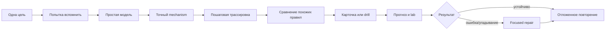

# Java Learning Cockpit

> [!start]
> **Если Java изучается впервые:** открой [[00_HOME/Java Beginner Learning Path]].  
> **Если базовый код уже понятен:** выбери длительность и учебную задачу ниже. Не начинай с просмотра всех папок.

## Быстрый старт за 15 секунд

| У тебя есть | Состояние | Сделай сейчас |
|---:|---|---|
| 15–25 минут | устал / мало внимания | 8–12 due-карточек → одна ошибка в [[00_HOME/Java Weakness Repair Center]] |
| 40–60 минут | нормальная концентрация | один atomic concept → пересказ → 8–15 карточек → 1–2 drills |
| 80–100 минут | высокий ресурс | concept → карточки → drills → письменный прогноз → lab |
| первый день Java | нет mental model | [[10_CONCEPTS/Java/Foundations/Java Mental Model for Beginners]] |
| не понимаю текущий route | перегруз | соответствующий Beginner Bridge в [[00_HOME/Java Beginner Learning Path]] |
| неизвестно, что повторять | тревога / много пробелов | [[70_PROGRESS/Java Learning Progress Dashboard]] → самый слабый механизм |

> [!checkpoint]
> Одна сессия — одна главная цель. Для начинающего один новый термин без практики полезнее десяти терминов, прочитанных подряд.

## Четыре учебных режима

> [!learn]
> ### 1. Понять
> Начинающий сначала читает простой образ и минимальный пример. Затем переходит к точному механизму. После чтения объясняет тему своими словами и рисует один flow.
>
> [[00_HOME/Java Learning Dashboard|Выбрать маршрут и concept]]

> [!recall]
> ### 2. Вспомнить
> Отвечай до открытия заметки. Правильный ответ, полученный угадыванием, отмечается отдельно от уверенного воспроизведения.
>
> [[00_HOME/Card Review Dashboard|Открыть review workflow]]

> [!practice]
> ### 3. Применить
> Зафиксируй Java version. Запиши compile/no-compile, output или exception и механизм. Только затем запускай код.
>
> [[00_HOME/Java Learning Dashboard#Практика и доказательства|Выбрать drills и lab]]

> [!repair]
> ### 4. Исправить модель
> Определи тип ошибки, вернись к одному механизму, сравни два похожих случая и повтори задачу позже.
>
> [[00_HOME/Java Weakness Repair Center|Начать repair loop]]

## Карта опубликованных маршрутов

| Route | Зачем изучать | Beginner entry | Материал |
|---|---|---|---:|
| `JAVA-B01` | типы значений, строки, даты и время | [[10_CONCEPTS/Java/Foundations/Java B01 Beginner Bridge|B01 bridge]] | 9 notes · 75 cards · 15 drills |
| `JAVA-B02` | условия, циклы, switch и pattern switch | [[10_CONCEPTS/Java/Foundations/Java B02 Beginner Bridge|B02 bridge]] | 8 notes · 60 cards · 20 drills |
| `JAVA-B03` | объекты, initialization, inheritance, records | [[10_CONCEPTS/Java/Foundations/Java B03 Beginner Bridge|B03 bridge]] | 12 notes · 115 cards · 35 drills |
| `JAVA-B04` | exceptions, stack traces и resource safety | [[30_CERTIFICATIONS/Java/JAVA-B04/JAVA-B04 Roadmap|начать B04]] | 6 notes · 36 cards · 20 drills · 8 cases |
| `JAVA-B05` | collections, generics, sequenced collections | следующий route | planned |

## Рекомендуемый учебный цикл


```mermaid
flowchart LR
    INTENT[Одна цель] --> RETRIEVE[Попытка вспомнить]
    RETRIEVE --> SIMPLE[Простая модель]
    SIMPLE --> CONCEPT[Точный mechanism]
    CONCEPT --> TRACE[Пошаговая трассировка]
    TRACE --> CONTRAST[Сравнение похожих правил]
    CONTRAST --> DRILL[Карточка или drill]
    DRILL --> PROOF[Прогноз и lab]
    PROOF --> CLASSIFY{Результат}
    CLASSIFY -->|устойчиво| SPACE[Отложенное повторение]
    CLASSIFY -->|ошибка/угадывание| REPAIR[Focused repair]
    REPAIR --> SPACE
```

## Пять диагностических категорий

- **attention** — пропущено слово, type или Java version;
- **retrieval** — правило знакомо, но не извлеклось;
- **discrimination** — смешаны похожие механизмы;
- **concept** — неверна причинная модель;
- **transfer** — правило не применилось к новому примеру.

Неправильный ответ не описывает способности ученика. Он выбирает следующее учебное действие.

## Не перегружай рабочую память

1. Не изучай одновременно два новых atomic concepts.
2. Для школьника сначала объясняй наблюдаемое поведение, затем термин.
3. Не открывай ответ до собственной формулировки.
4. Не запускай код до прогноза.
5. После трёх conceptual errors останови новые карточки.
6. Заверши сессию одним следующим действием.

## Практика и доказательства

- **B01:** [[30_CERTIFICATIONS/Java/JAVA-B01/JAVA-B01 Drills|15 drills]] · [[50_LABS/Java/JAVA-B01/README|JDK 17/21 proof]]
- **B02:** [[30_CERTIFICATIONS/Java/JAVA-B02/JAVA-B02 Drills|20 drills]] · [[50_LABS/Java/JAVA-B02/README|positive/negative proof]]
- **B03:** [[30_CERTIFICATIONS/Java/JAVA-B03/JAVA-B03 Drills|35 drills]] · [[50_LABS/Java/JAVA-B03/README|object-model proof]]
- **B04:** [[30_CERTIFICATIONS/Java/JAVA-B04/JAVA-B04 Drills|20 drills]] · [[40_PRODUCTION_CASES/Java/Java Exceptions Production Cases|8 cases]] · [[50_LABS/Java/JAVA-B04/README|exceptions proof]]

## Интерфейс и управление

- [[00_HOME/Java Beginner Learning Path]] — маршрут для первого знакомства.
- [[00_HOME/Java Learning Dashboard]] — каталог routes и concepts.
- [[00_HOME/Card Review Dashboard]] — due queue.
- [[70_PROGRESS/Java Learning Progress Dashboard]] — weekly learner state.
- [[00_HOME/Java Weakness Repair Center]] — ошибка → mechanism → repair.
- [[01_MAPS/Java Learning Journey.canvas]] — spatial journey.
- [[00_HOME/Obsidian Learning Interface Setup]] — visual setup.
- [[90_TEMPLATES/Learning Session Template]] — структура сессии.
- [[90_TEMPLATES/Student-Friendly Atomic Lesson Standard]] — требования к доступному уроку.

## Завершение сессии

```text
[ ] Я могу объяснить идею простыми словами.
[ ] Я могу назвать точный механизм.
[ ] Я прошёл код по шагам.
[ ] Я различаю ближайшее похожее правило.
[ ] Я сделал прогноз до ответа/запуска.
[ ] Я записал одно следующее действие.
```
