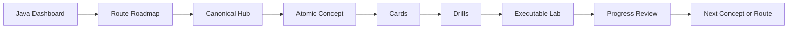

# Java Learning Dashboard

> [!summary]
> Главная пользовательская точка входа в Java 11/17/21 и Oracle certification tracks. Здесь выбирается не папка, а режим работы: изучение нового механизма, повторение карточек, compile/output drills или исполняемый lab.

## Continue learning

| Status | Route | Open |
|---|---|---|
| `lab-proven` | JAVA-B01 — Values, Text and Date-Time | [[30_CERTIFICATIONS/Java/JAVA-B01/JAVA-B01 Roadmap]] |
| `lab-proven` | JAVA-B02 — Control Flow and Pattern Switch | [[30_CERTIFICATIONS/Java/JAVA-B02/JAVA-B02 Roadmap]] |
| `lab-proven` | JAVA-B03 — Object Model, Records and Record Patterns | [[30_CERTIFICATIONS/Java/JAVA-B03/JAVA-B03 Roadmap]] |
| `next` | JAVA-B05 — Collections, Generics and Sequenced Collections | planned next route |

## Choose today's mode

### 1. Learn a new mechanism

Start from the current route hub and move through its atomic notes using **Next concept** links.

- [[10_CONCEPTS/Java/Core/Java Values Text and Date-Time|JAVA-B01 canonical hub]]
- [[10_CONCEPTS/Java/Core/Java Control Flow and Pattern Switch|JAVA-B02 canonical hub]]
- [[10_CONCEPTS/Java/Object Model/Java Object Model Records and Record Patterns|JAVA-B03 canonical hub]]

### 2. Review cards

```bash
python .github/scripts/card_progress.py audit \
  --root . \
  --progress 70_PROGRESS/card-progress.json \
  --catalog-output .audit/card-catalog.json \
  --queue-output .audit/card-review-queue.md
```

Then open `.audit/card-review-queue.md`.

For first initialization:

```bash
python .github/scripts/card_progress.py sync \
  --root . \
  --progress 70_PROGRESS/card-progress.json
```

Record an outcome:

```bash
python .github/scripts/card_progress.py record \
  --card-id JAVA-FLOW-B02-C001 \
  --outcome correct-confident \
  --confidence 4
```

Detailed workflow: [[00_HOME/Card Review Dashboard]].

### 3. Solve compile/output drills

- [[30_CERTIFICATIONS/Java/JAVA-B01/JAVA-B01 Drills|B01 — 15 drills]]
- [[30_CERTIFICATIONS/Java/JAVA-B02/JAVA-B02 Drills|B02 — 20 drills]]
- [[30_CERTIFICATIONS/Java/JAVA-B03/JAVA-B03 Drills|B03 — 35 drills]]

Protocol:

```text
1. Fix Java version.
2. Predict compile/no-compile.
3. If it compiles, predict exact output or exception.
4. Write the mechanism before revealing the answer.
5. Run the matching lab proof.
```

### 4. Run executable evidence

- [[50_LABS/Java/JAVA-B01/README|B01 proof on JDK 17 and 21]]
- [[50_LABS/Java/JAVA-B02/README|B02 positive and expected-failure proof]]
- [[50_LABS/Java/JAVA-B03/README|B03 object-model and record-pattern proof]]

### 5. Compare Java versions

- [[00_HOME/Java 11 17 21 Complete Knowledge Program]]
- [[30_CERTIFICATIONS/Java/Java 17 and 21 Exam Delta Matrix]]
- [[30_CERTIFICATIONS/Java/JAVA-LTS-B01/JAVA-LTS-B01 Roadmap]]

## JAVA-B01 concept map

| Order | Concept | Practice |
|---:|---|---|
| 1 | [[10_CONCEPTS/Java/Core/Java Primitive Values and Literals]] | `JAVA-VALUES-B01` |
| 2 | [[10_CONCEPTS/Java/Core/Java Numeric Promotion and Casting]] | `JAVA-VALUES-B01` |
| 3 | [[10_CONCEPTS/Java/Core/Java Wrappers Boxing and Math]] | `JAVA-VALUES-B01` |
| 4 | [[10_CONCEPTS/Java/Core/Java String Identity and Operations]] | `JAVA-TEXT-B01` |
| 5 | [[10_CONCEPTS/Java/Core/Java StringBuilder Mutation]] | `JAVA-TEXT-B01` |
| 6 | [[10_CONCEPTS/Java/Core/Java Text Blocks]] | `JAVA-TEXT-B01` |
| 7 | [[10_CONCEPTS/Java/Core/Java Local Date-Time Types]] | `JAVA-TIME-B01` |
| 8 | [[10_CONCEPTS/Java/Core/Java Period Duration and Instant]] | `JAVA-TIME-B01` |
| 9 | [[10_CONCEPTS/Java/Core/Java Zones DST and Formatting]] | `JAVA-TIME-B01` |

## JAVA-B02 concept map

| Order | Concept | Practice |
|---:|---|---|
| 1 | [[10_CONCEPTS/Java/Core/Java Conditions and Definite Assignment]] | `JAVA-FLOW-B02` |
| 2 | [[10_CONCEPTS/Java/Core/Java Loops Transfers and Labels]] | `JAVA-FLOW-B02` |
| 3 | [[10_CONCEPTS/Java/Core/Java Reachability Rules]] | `JAVA-FLOW-B02` |
| 4 | [[10_CONCEPTS/Java/Core/Java Classic Switch]] | `JAVA-SWITCH-B02` |
| 5 | [[10_CONCEPTS/Java/Core/Java Switch Expressions]] | `JAVA-SWITCH-B02` |
| 6 | [[10_CONCEPTS/Java/Core/Java Pattern Matching for instanceof]] | `JAVA-FLOW-B02` |
| 7 | [[10_CONCEPTS/Java/Core/Java 21 Pattern Switch]] | `JAVA-PATTERN-B02` |
| 8 | [[10_CONCEPTS/Java/Core/Java Switch Dominance and Exhaustiveness]] | `JAVA-PATTERN-B02` |

## JAVA-B03 concept map

| Order | Concept | Practice |
|---:|---|---|
| 1 | [[10_CONCEPTS/Java/Object Model/Java Object Creation Reachability and Lifecycle]] | `JAVA-OBJECT-B03` |
| 2 | [[10_CONCEPTS/Java/Object Model/Java Nested Local and Anonymous Classes]] | `JAVA-OBJECT-B03` |
| 3 | [[10_CONCEPTS/Java/Object Model/Java Fields Initializers and Constructor Order]] | `JAVA-INIT-B03` |
| 4 | [[10_CONCEPTS/Java/Object Model/Java Overloading Varargs and Method Selection]] | `JAVA-INIT-B03` |
| 5 | [[10_CONCEPTS/Java/Object Model/Java Scope Encapsulation Immutability and var]] | `JAVA-INIT-B03` |
| 6 | [[10_CONCEPTS/Java/Object Model/Java Inheritance Overriding Hiding and Polymorphism]] | `JAVA-INHERIT-B03` |
| 7 | [[10_CONCEPTS/Java/Object Model/Java Abstract Classes and Interfaces]] | `JAVA-INHERIT-B03` |
| 8 | [[10_CONCEPTS/Java/Object Model/Java Records]] | `JAVA-TYPES-B03` |
| 9 | [[10_CONCEPTS/Java/Object Model/Java Enums]] | `JAVA-TYPES-B03` |
| 10 | [[10_CONCEPTS/Java/Object Model/Java Sealed Types]] | `JAVA-TYPES-B03` |
| 11 | [[10_CONCEPTS/Java/Object Model/Java Record Patterns]] | `JAVA-TYPES-B03` |
| 12 | [[10_CONCEPTS/Java/Object Model/Java Nested Patterns and Exhaustiveness]] | `JAVA-TYPES-B03` |

## Current delivered inventory

```text
lab-proven Java exam routes       3
atomic concept notes             29
base cards                       250
drills                            70
positive proof classes             9
expected compile failures         28
JDK lanes                      17, 21
```

## User navigation model



## Master navigation

- [[00_HOME/Oracle Java 17 and 21 Certification Program]]
- [[30_CERTIFICATIONS/Certification MOC]]
- [[00_HOME/Knowledge Route Registry]]
- [[00_HOME/Certification 99 Percent Readiness Dashboard]]
- [[01_MAPS/Java Certification Routes.canvas]]
- [[01_MAPS/Certification 99 Percent Map.canvas]]

## Definition of done for a learner

A route is not personally mastered only because its material is `lab-proven`.

Recommended learner gate:

```text
all atomic notes read
active recall answered without notes
all base cards initialized in progress registry
repetitions >= 3 for core cards
all drills attempted before answer reveal
lab predictions written before execution
mixed timed mock threshold reached later
```
