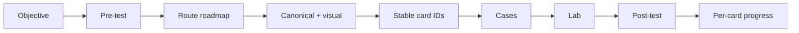

# Knowledge Route Registry

> [!summary]
> Единая точка навигации по published learning routes. Каждый новый route должен иметь objective evidence, stable card IDs, progress compatibility, cross-links и executable proof.

# Global entry points

- [[00_HOME/Certification 99 Percent Readiness Dashboard]]
- [[00_HOME/Card Review Dashboard]]
- [[30_CERTIFICATIONS/Certification MOC]]
- [[00_HOME/Review Dashboard]]
- [[01_MAPS/Java Backend Map.canvas]]
- [[90_TEMPLATES/Cross-Linking Standard]]
- [[70_PROGRESS/README]]



# Certification tracks

| Track | Master roadmap | Target |
|---|---|---:|
| Spring 2V0-72.22 | [[30_CERTIFICATIONS/Spring/2V0-72.22/Spring 99 Percent Master Roadmap]] | 99% |
| Java 1Z0-829 | [[30_CERTIFICATIONS/Java/1Z0-829/Java SE 17 99 Percent Master Roadmap]] | 99% |
| Java Concurrency | [[30_CERTIFICATIONS/Java/Concurrency/Java Concurrency 99 Percent Roadmap]] | 99% |

# Java routes

## JAVA-CONCURRENCY

| Role | Artifact |
|---|---|
| Domain map | [[01_MAPS/Java Map]] |
| Learning path | [[10_CONCEPTS/Java/Concurrency/Concurrency Learning Path]] |
| 99% roadmap | [[30_CERTIFICATIONS/Java/Concurrency/Java Concurrency 99 Percent Roadmap]] |
| Visual | [[10_CONCEPTS/Java/Concurrency/Java Concurrency Visual Deep Dive]] |
| Recall | [[20_QUESTIONS/Interview/Java/Concurrency/Advanced Concurrency Recall]] |
| Lab | [[50_LABS/Java/Concurrency/README]] |
| Sources | [[98_SOURCES/Java Concurrency Sources]] |

## JAVA-1Z0-829

- [[30_CERTIFICATIONS/Java/1Z0-829/Java SE 17 99 Percent Master Roadmap]]
- [[98_SOURCES/Java SE 17 1Z0-829 Sources]]
- Status: Concurrency foundation exists; ten other domain routes remain planned.

# Spring routes

## SPRING-CORE

- [[30_CERTIFICATIONS/Spring/2V0-72.22/Spring Core Card Roadmap]]
- [[10_CONCEPTS/Spring/Core/Spring Core Visual Deep Dive]]
- [[30_CERTIFICATIONS/Spring/2V0-72.22/CORE-B01/CORE-B01 Cards]]
- [[30_CERTIFICATIONS/Spring/2V0-72.22/CORE-B04/CORE-B04 Cards]]

## SPRING-AOP-CACHE

- [[30_CERTIFICATIONS/Spring/2V0-72.22/Spring AOP and Cache Roadmap]]
- [[10_CONCEPTS/Spring/AOP/Spring AOP Proxy Mechanics]]
- [[10_CONCEPTS/Spring/Cache/Spring Cache with Caffeine and Redis]]
- [[30_CERTIFICATIONS/Spring/2V0-72.22/AOP-B01/AOP-B01 Cards]]
- [[30_CERTIFICATIONS/Spring/2V0-72.22/CACHE-B01/CACHE-B01 Cards]]

## SPRING-TX

- [[30_CERTIFICATIONS/Spring/2V0-72.22/Spring Transaction Management Roadmap]]
- [[10_CONCEPTS/Spring/Transactions/Spring Transaction Management Deep Dive]]
- [[30_CERTIFICATIONS/Spring/2V0-72.22/TX-B01/TX-B01 Cards]]
- [[50_LABS/Spring/TX-B01/README]]

## SPRING-DATA-JPA

- [[30_CERTIFICATIONS/Spring/2V0-72.22/Spring Data JPA Roadmap]]
- [[10_CONCEPTS/Spring/Data/Spring Data JPA Persistence Context and Entity Lifecycle]]
- [[30_CERTIFICATIONS/Spring/2V0-72.22/DATA-B01/DATA-B01 Cards]]
- [[50_LABS/Spring/DATA-B01/README]]

## SPRING-TEST

- [[30_CERTIFICATIONS/Spring/2V0-72.22/Spring Testing Roadmap]]
- [[10_CONCEPTS/Spring/Testing/Spring TestContext and Test Slices]]
- [[30_CERTIFICATIONS/Spring/2V0-72.22/TEST-B01/TEST-B01 Cards]]
- [[50_LABS/Spring/TEST-B01/README]]

## SPRING-BOOT-B01 — Bootstrap and Auto-configuration

| Role | Artifact |
|---|---|
| Roadmap | [[30_CERTIFICATIONS/Spring/2V0-72.22/SPRING-BOOT-B01/SPRING-BOOT-B01 Roadmap]] |
| Canonical | [[10_CONCEPTS/Spring/Boot/Spring Boot Bootstrap and Auto-configuration]] |
| Visual | [[10_CONCEPTS/Spring/Boot/Spring Boot Auto-configuration Visual Deep Dive]] |
| Cards | [[30_CERTIFICATIONS/Spring/2V0-72.22/SPRING-BOOT-B01/SPRING-BOOT-B01 Cards]] |
| Cases | [[40_PRODUCTION_CASES/Spring/Spring Boot Auto-configuration Production Cases]] |
| Lab | [[50_LABS/Spring/SPRING-BOOT-B01/README]] |
| Canvas | [[01_MAPS/Spring Boot Auto-configuration Map.canvas]] |
| Sources | [[98_SOURCES/Spring Boot Auto-configuration Sources]] |

## SPRING-BOOT-B02 — Externalized Configuration

| Role | Artifact |
|---|---|
| Roadmap | [[30_CERTIFICATIONS/Spring/2V0-72.22/SPRING-BOOT-B02/SPRING-BOOT-B02 Roadmap]] |
| Canonical | [[10_CONCEPTS/Spring/Boot/Spring Boot Externalized Configuration and Type-safe Binding]] |
| Visual | [[10_CONCEPTS/Spring/Boot/Spring Boot Configuration Visual Deep Dive]] |
| Cards | [[30_CERTIFICATIONS/Spring/2V0-72.22/SPRING-BOOT-B02/SPRING-BOOT-B02 Cards]] |
| Assessment | [[30_CERTIFICATIONS/Spring/2V0-72.22/SPRING-BOOT-B02/SPRING-BOOT-B02 Assessment]] |
| Cases | [[40_PRODUCTION_CASES/Spring/Spring Boot Configuration Production Cases]] |
| Lab | [[50_LABS/Spring/SPRING-BOOT-B02/README]] |
| Canvas | [[01_MAPS/Spring Boot Configuration Map.canvas]] |
| Sources | [[98_SOURCES/Spring Boot Externalized Configuration Sources]] |
| Progress | [[70_PROGRESS/README]] |

## SPRING-MVC-B01 — DispatcherServlet and Controller Pipeline

| Role | Artifact |
|---|---|
| Roadmap | [[30_CERTIFICATIONS/Spring/2V0-72.22/SPRING-MVC-B01/SPRING-MVC-B01 Roadmap]] |
| Canonical | [[10_CONCEPTS/Spring/MVC/DispatcherServlet and Annotated Controller Pipeline]] |
| Visual | [[10_CONCEPTS/Spring/MVC/Spring MVC DispatcherServlet Visual Deep Dive]] |
| Cards | [[30_CERTIFICATIONS/Spring/2V0-72.22/SPRING-MVC-B01/SPRING-MVC-B01 Cards]] |
| Assessment | [[30_CERTIFICATIONS/Spring/2V0-72.22/SPRING-MVC-B01/SPRING-MVC-B01 Assessment]] |
| Cases | [[40_PRODUCTION_CASES/Spring/Spring MVC DispatcherServlet Production Cases]] |
| Lab | [[50_LABS/Spring/SPRING-MVC-B01/README]] |
| Canvas | [[01_MAPS/Spring MVC DispatcherServlet Map.canvas]] |
| Sources | [[98_SOURCES/Spring MVC DispatcherServlet Sources]] |
| Progress | [[70_PROGRESS/README]] |

Previous: [[30_CERTIFICATIONS/Spring/2V0-72.22/SPRING-BOOT-B02/SPRING-BOOT-B02 Roadmap]].

Next: `SPRING-MVC-B02 — REST Endpoints and HTTP Clients`.

# Database routes

## DB-B01 — Indexes and Query Plans

- [[30_CERTIFICATIONS/Databases/DB-B01/DB-B01 Roadmap]]
- [[10_CONCEPTS/Databases/PostgreSQL Index Mechanics]]
- [[10_CONCEPTS/Databases/PostgreSQL EXPLAIN and Query Plan Analysis]]
- [[30_CERTIFICATIONS/Databases/DB-B01/DB-B01 Cards]]
- [[40_PRODUCTION_CASES/Databases/Indexes and Query Plans Production Cases]]
- [[50_LABS/Databases/DB-B01/README]]

# Planned routes

| ID | Route | Status |
|---|---|---|
| SPRING-MVC-B02 | REST and HTTP clients | next |
| SPRING-SEC-B01 | Security | planned |
| SPRING-ACT-B01 | Actuator | planned |
| SPRING-JDBC-B01 | JdbcTemplate | planned |
| SPRING-WEBTEST-B01 | MockMvc | planned |
| SPRING-SPEL-B01 | SpEL | planned |
| JAVA-B01…B11 | Java 1Z0-829 domains | planned |
| DB-B02 | MVCC and Locks | planned |

# Registry quality checklist

```text
[x] README links registry and route
[x] domain MOC links route hub
[x] registry links route hub directly
[x] route lists canonical/visual/cards/assessment/cases/lab/sources
[x] objective matrix maps evidence
[x] card IDs are unique and progress-compatible
[x] Canvas references exist
[ ] no broken or ambiguous strict-route link — enforced by CI
```
