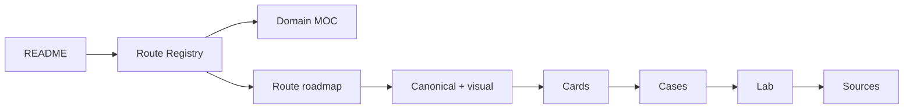

# Knowledge Route Registry

> [!summary]
> Единая точка навигации по опубликованным learning routes. Для certification readiness используй отдельный dashboard, который отличает полноту материалов от личных результатов timed mocks.

# Global entry points

- [[00_HOME/Certification 99 Percent Readiness Dashboard]]
- [[30_CERTIFICATIONS/Certification MOC]]
- [[00_HOME/Review Dashboard]]
- [[01_MAPS/Java Backend Map.canvas]]
- [[90_TEMPLATES/Cross-Linking Standard]]



# 99 percent certification tracks

| Track | Master roadmap | Target |
|---|---|---:|
| Spring 2V0-72.22 | [[30_CERTIFICATIONS/Spring/2V0-72.22/Spring 99 Percent Master Roadmap]] | 99% |
| Java 1Z0-829 | [[30_CERTIFICATIONS/Java/1Z0-829/Java SE 17 99 Percent Master Roadmap]] | 99% |
| Java Concurrency | [[30_CERTIFICATIONS/Java/Concurrency/Java Concurrency 99 Percent Roadmap]] | 99% |

# Java routes

## JAVA-CONCURRENCY — Java Concurrency

| Role | Artifact |
|---|---|
| Domain map | [[01_MAPS/Java Map]] |
| Learning path | [[10_CONCEPTS/Java/Concurrency/Concurrency Learning Path]] |
| 99% roadmap | [[30_CERTIFICATIONS/Java/Concurrency/Java Concurrency 99 Percent Roadmap]] |
| Visual deep dive | [[10_CONCEPTS/Java/Concurrency/Java Concurrency Visual Deep Dive]] |
| Visual atlas | [[01_MAPS/Java Concurrency Visual Atlas.canvas]] |
| Recall | [[20_QUESTIONS/Interview/Java/Concurrency/Advanced Concurrency Recall]] |
| Lab | [[50_LABS/Java/Concurrency/README]] |
| Sources | [[98_SOURCES/Java Concurrency Sources]] |
| Advanced sources | [[98_SOURCES/Advanced Concurrency Sources]] |

Canonical route covers:

- [[10_CONCEPTS/Java/Concurrency/Threads]];
- [[10_CONCEPTS/Java/Concurrency/Java Memory Model]];
- [[10_CONCEPTS/Java/Concurrency/Happens-Before]];
- [[10_CONCEPTS/Java/Concurrency/volatile]];
- [[10_CONCEPTS/Java/Concurrency/synchronized]];
- [[10_CONCEPTS/Java/Concurrency/ReentrantLock]];
- [[10_CONCEPTS/Java/Concurrency/Atomic CAS and Counters]];
- [[10_CONCEPTS/Java/Concurrency/ExecutorService]];
- [[10_CONCEPTS/Java/Concurrency/Future]];
- [[10_CONCEPTS/Java/Concurrency/ForkJoinPool]];
- [[10_CONCEPTS/Java/Concurrency/CompletableFuture]];
- [[10_CONCEPTS/Java/Concurrency/Concurrent Collections and Backpressure]];
- [[10_CONCEPTS/Java/Concurrency/ThreadLocal]];
- [[10_CONCEPTS/Java/Concurrency/Virtual Threads]];
- [[10_CONCEPTS/Java/Concurrency/Deadlock Livelock and Lock Ordering]].

## JAVA-1Z0-829 — Java SE 17 Developer

- Master roadmap: [[30_CERTIFICATIONS/Java/1Z0-829/Java SE 17 99 Percent Master Roadmap]].
- Domain map: [[01_MAPS/Java Map]].
- Status: foundation planned; Concurrency is the only mature sub-route.

# Spring routes

## SPRING-CORE

| Role | Artifact |
|---|---|
| Domain map | [[01_MAPS/Spring Map]] |
| Roadmap | [[30_CERTIFICATIONS/Spring/2V0-72.22/Spring Core Card Roadmap]] |
| Visual deep dive | [[10_CONCEPTS/Spring/Core/Spring Core Visual Deep Dive]] |
| Canvas | [[01_MAPS/Spring Core Visual Atlas.canvas]] |

## SPRING-AOP-CACHE

| Role | Artifact |
|---|---|
| Roadmap | [[30_CERTIFICATIONS/Spring/2V0-72.22/Spring AOP and Cache Roadmap]] |
| AOP canonical | [[10_CONCEPTS/Spring/AOP/Spring AOP Proxy Mechanics]] |
| Cache canonical | [[10_CONCEPTS/Spring/Cache/Spring Cache with Caffeine and Redis]] |
| Visual atlas | [[01_MAPS/Spring AOP and Cache Visual Atlas.canvas]] |
| Cards | [[30_CERTIFICATIONS/Spring/2V0-72.22/AOP-B01/AOP-B01 Cards]] and [[30_CERTIFICATIONS/Spring/2V0-72.22/CACHE-B01/CACHE-B01 Cards]] |
| Cases | [[40_PRODUCTION_CASES/Spring/AOP and Cache Production Cases]] |
| Labs | [[50_LABS/Spring/AOP-B01/README]] and [[50_LABS/Spring/CACHE-B01/README]] |
| Sources | [[98_SOURCES/Spring AOP and Cache Sources]] |

## SPRING-TX

| Role | Artifact |
|---|---|
| Roadmap | [[30_CERTIFICATIONS/Spring/2V0-72.22/Spring Transaction Management Roadmap]] |
| Canonical | [[10_CONCEPTS/Spring/Transactions/Spring Transaction Management Deep Dive]] |
| Visual | [[10_CONCEPTS/Spring/Transactions/Spring Transaction Management Visual Deep Dive]] |
| Outbox | [[10_CONCEPTS/Spring/Transactions/Transactional Outbox and Commit Boundaries]] |
| Cards | [[30_CERTIFICATIONS/Spring/2V0-72.22/TX-B01/TX-B01 Cards]] |
| Cases | [[40_PRODUCTION_CASES/Spring/Transaction Management Production Cases]] |
| Lab | [[50_LABS/Spring/TX-B01/README]] |
| Sources | [[98_SOURCES/Spring Transaction Management Sources]] |

## SPRING-DATA-JPA

| Role | Artifact |
|---|---|
| Roadmap | [[30_CERTIFICATIONS/Spring/2V0-72.22/Spring Data JPA Roadmap]] |
| Canonical | [[10_CONCEPTS/Spring/Data/Spring Data JPA Persistence Context and Entity Lifecycle]] |
| Queries/fetching | [[10_CONCEPTS/Spring/Data/Spring Data Repositories Queries and Fetching]] |
| Visual | [[10_CONCEPTS/Spring/Data/Spring Data JPA Visual Deep Dive]] |
| Cards | [[30_CERTIFICATIONS/Spring/2V0-72.22/DATA-B01/DATA-B01 Cards]] |
| Cases | [[40_PRODUCTION_CASES/Spring/Spring Data JPA Production Cases]] |
| Lab | [[50_LABS/Spring/DATA-B01/README]] |
| Sources | [[98_SOURCES/Spring Data JPA Sources]] |

## SPRING-TEST

| Role | Artifact |
|---|---|
| Roadmap | [[30_CERTIFICATIONS/Spring/2V0-72.22/Spring Testing Roadmap]] |
| TestContext | [[10_CONCEPTS/Spring/Testing/Spring TestContext and Test Slices]] |
| Testcontainers | [[10_CONCEPTS/Spring/Testing/Spring Data JPA Testing with Testcontainers]] |
| Visual | [[10_CONCEPTS/Spring/Testing/Spring Testing Visual Deep Dive]] |
| Cards | [[30_CERTIFICATIONS/Spring/2V0-72.22/TEST-B01/TEST-B01 Cards]] |
| Cases | [[40_PRODUCTION_CASES/Spring/Spring Testing Production Cases]] |
| Lab | [[50_LABS/Spring/TEST-B01/README]] |
| Sources | [[98_SOURCES/Spring Testing Sources]] |

## SPRING-BOOT-B01 — Bootstrap and Auto-configuration

| Role | Artifact |
|---|---|
| Master roadmap | [[30_CERTIFICATIONS/Spring/2V0-72.22/Spring 99 Percent Master Roadmap]] |
| Route roadmap | [[30_CERTIFICATIONS/Spring/2V0-72.22/SPRING-BOOT-B01/SPRING-BOOT-B01 Roadmap]] |
| Canonical | [[10_CONCEPTS/Spring/Boot/Spring Boot Bootstrap and Auto-configuration]] |
| Visual | [[10_CONCEPTS/Spring/Boot/Spring Boot Auto-configuration Visual Deep Dive]] |
| Canvas | [[01_MAPS/Spring Boot Auto-configuration Map.canvas]] |
| Cards | [[30_CERTIFICATIONS/Spring/2V0-72.22/SPRING-BOOT-B01/SPRING-BOOT-B01 Cards]] |
| Cases | [[40_PRODUCTION_CASES/Spring/Spring Boot Auto-configuration Production Cases]] |
| Lab | [[50_LABS/Spring/SPRING-BOOT-B01/README]] |
| Sources | [[98_SOURCES/Spring Boot Auto-configuration Sources]] |

Previous: [[30_CERTIFICATIONS/Spring/2V0-72.22/Spring Testing Roadmap]].

Next: `SPRING-BOOT-B02 — Configuration Properties and Externalized Configuration`.

# Database routes

## DB-B01 — Indexes and Query Plans

| Role | Artifact |
|---|---|
| Domain map | [[01_MAPS/Databases Map]] |
| Roadmap | [[30_CERTIFICATIONS/Databases/DB-B01/DB-B01 Roadmap]] |
| Index mechanics | [[10_CONCEPTS/Databases/PostgreSQL Index Mechanics]] |
| Plan analysis | [[10_CONCEPTS/Databases/PostgreSQL EXPLAIN and Query Plan Analysis]] |
| Canvas | [[01_MAPS/Database Indexes and Query Plans Map.canvas]] |
| Cards | [[30_CERTIFICATIONS/Databases/DB-B01/DB-B01 Cards]] |
| Cases | [[40_PRODUCTION_CASES/Databases/Indexes and Query Plans Production Cases]] |
| Lab | [[50_LABS/Databases/DB-B01/README]] |
| Sources | [[98_SOURCES/PostgreSQL Indexes and Query Plans Sources]] |

# Planned routes

| ID | Route | Status |
|---|---|---|
| SPRING-BOOT-B02 | Configuration Properties | next |
| SPRING-MVC-B01 | DispatcherServlet pipeline | planned |
| SPRING-SEC-B01 | Security | planned |
| JAVA-B01…B11 | Java 1Z0-829 domains | planned |
| DB-B02 | MVCC and Locks | planned |
| MSG-B01 | Kafka delivery and ordering | planned |
| DS-B01 | Resilience and consistency | planned |

# Registry quality checklist

```text
[ ] README links registry and readiness dashboard
[ ] registry links every published route hub
[ ] route roadmap links canonical/visual/cards/cases/lab/sources
[ ] every published artifact has inbound navigation
[ ] Canvas references exist and are linked from Markdown
[ ] no broken or ambiguous strict-route link
```
