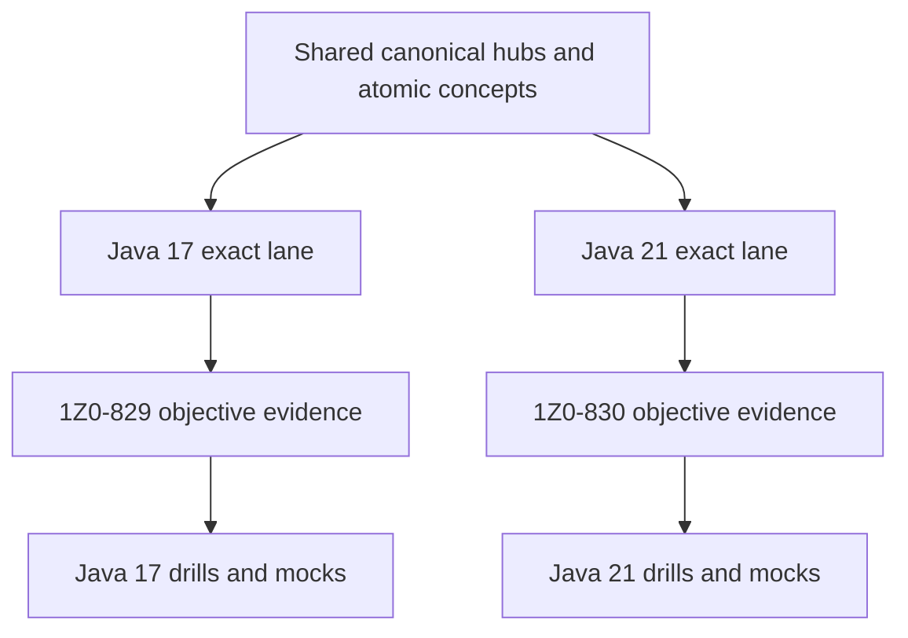

# Oracle Java 17 and 21 Certification Program

> [!summary]
> One cumulative knowledge system prepares for both Oracle exams without mixing baselines. Shared mechanisms are written once as canonical hubs and atomic notes; Java 17 and Java 21 compile/API lanes, objectives and mocks remain separate.

## Operational entry

- **Start or continue learning:** [[00_HOME/Java Learning Dashboard]]
- **Visual navigation:** [[01_MAPS/Java Certification Routes.canvas]]
- **Certification MOC:** [[30_CERTIFICATIONS/Certification MOC]]
- **Readiness:** [[00_HOME/Certification 99 Percent Readiness Dashboard]]
- **Review queue:** [[00_HOME/Card Review Dashboard]]

## Exact exam lanes

| Track | Exact baseline | Roadmap | Source index |
|---|---:|---|---|
| Java SE 17 Developer `1Z0-829` | Java 17 | [[30_CERTIFICATIONS/Java/1Z0-829/Java SE 17 99 Percent Master Roadmap]] | [[98_SOURCES/Java SE 17 1Z0-829 Sources]] |
| Java SE 21 Developer Professional `1Z0-830` | Java 21 | [[30_CERTIFICATIONS/Java/1Z0-830/Java SE 21 99 Percent Master Roadmap]] | [[98_SOURCES/Java SE 21 1Z0-830 Sources]] |

Mandatory comparison: [[30_CERTIFICATIONS/Java/Java 17 and 21 Exam Delta Matrix]].

## Why one program but two lanes



## Published routes

### JAVA-B01 — Values, Text and Date-Time

```text
9 atomic concepts
75 cards
15 drills
3 proof classes
JDK 17 and 21 PASS
status: lab-proven
```

- [[30_CERTIFICATIONS/Java/JAVA-B01/JAVA-B01 Roadmap]]
- [[10_CONCEPTS/Java/Core/Java Values Text and Date-Time]]

### JAVA-B02 — Control Flow and Pattern Switch

```text
8 atomic concepts
60 cards
20 drills
2 positive proof classes
11 expected compile failures
JDK 17 and 21 PASS
status: lab-proven
```

- [[30_CERTIFICATIONS/Java/JAVA-B02/JAVA-B02 Roadmap]]
- [[10_CONCEPTS/Java/Core/Java Control Flow and Pattern Switch]]

## Correct-answer protocol

Before solving any question:

```text
1. Identify exam code.
2. Select Java 17 or Java 21 baseline.
3. Decide compile/no-compile under that exact release.
4. Resolve conversions, overloads and inference.
5. Predict output or exception.
6. Check API availability in the selected release.
7. Reject options that belong only to the other lane.
```

## Route artifact contract

```text
route roadmap
canonical hub
atomic concept notes
base cards with stable IDs
version-bound drills
production and migration cases
positive compile/runtime tests
negative compile tests
official JLS/API/JEP/tool sources
objective mapping
progress and timed mocks
```

## Route inventory

| Route | Shared | 1Z0-829 | 1Z0-830 | Critical delta | Status |
|---|---:|---:|---:|---|---|
| `JAVA-B01` Values/Text/Date-Time | yes | yes | yes | exact API/version traps | lab-proven |
| `JAVA-B02` Program Flow | partial | yes | yes | Java 21 pattern switch | lab-proven |
| `JAVA-B03` Object Model | partial | yes | yes | Java 21 record patterns | next |
| `JAVA-B04` Exceptions | yes | yes | yes | mostly shared | planned |
| `JAVA-B05` Collections/Generics | partial | yes | yes | sequenced collections | planned |
| `JAVA-B06` Streams/Lambdas | yes | yes | yes | encounter-order interactions | planned |
| `JAVA-B07` Modules/Deployment | yes | yes | yes | tool baseline | planned |
| `JAVA-B08` Concurrency | partial | yes | yes | virtual threads | planned |
| `JAVA-B09` I/O/NIO/Serialization | yes | yes | yes | exact API baseline | planned |
| `JAVA-B10` JDBC | no | direct objective | no direct objective | 829-only quota | planned |
| `JAVA-B11` Localization | yes | yes | yes | formatter behavior | planned |
| `JAVA-SUP-B01` Supplementary | supporting | supplementary | supplementary | logging/annotations/generics | planned |

## Java 21 feature gates

The following require independent Java 21 evidence rather than a short appendix:

```text
pattern matching for switch
record patterns
sequenced collections
virtual threads
```

Each must have:

- final Java 21 semantics;
- Java 17 compile-fail or unavailability boundary;
- Java 21 compile/run evidence;
- focused cards and mixed drills;
- integration into Java 21 mocks.

## Java 17 JDBC gate

`JAVA-B10` remains a dedicated `1Z0-829` route:

```text
Connection
Statement / PreparedStatement / CallableStatement
execute / executeQuery / executeUpdate
ResultSet
transactions
commit / rollback / savepoints
resource ownership
```

It remains production knowledge for Java 21 developers but must not count toward missing `1Z0-830` objectives.

## Target material

| Track | Base cards | Drills | Full mocks |
|---|---:|---:|---:|
| `1Z0-829` | 720 | 180 | 6 |
| `1Z0-830` | 800 | 200 | 6 |
| Shared cross-version bank | 500+ reused | 120 comparison drills | 6 migration mini-mocks |

The totals are not additive because shared cards can satisfy both tracks through separate objective mappings.

## Current state

```text
JAVA-LTS-B01                  published
JAVA-B01                      lab-proven
JAVA-B02                      lab-proven
atomic concept notes          17
base exam cards              135
drills                         35
Java 17/21 full mocks           0
learner progress history        not initialized
```

## Delivery order


## Immediate next slice

```text
JAVA-B03 — Object Model, Records, Sealed Types and Record Patterns
```

B03 may assume all B01 expression/text rules and B02 flow/switch rules.
