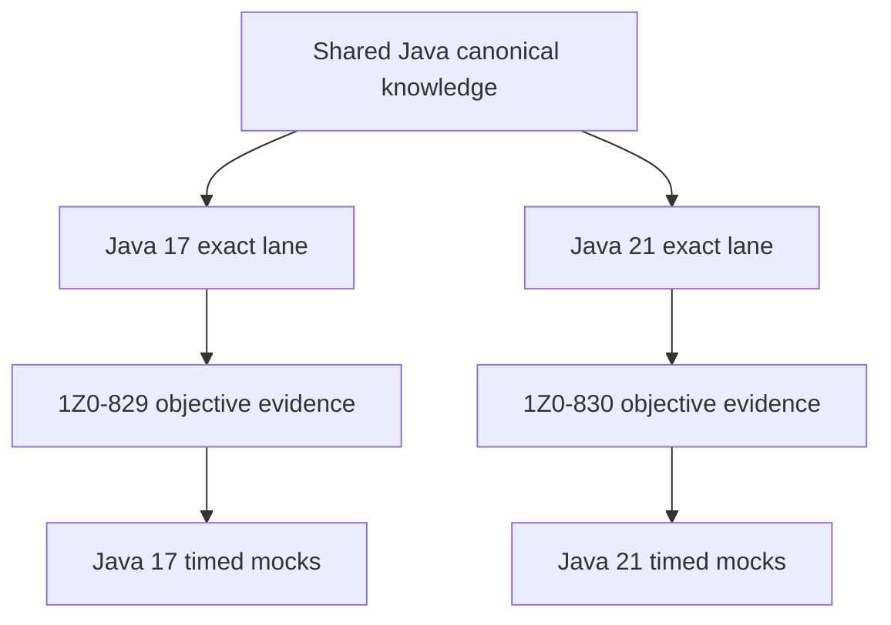

# Oracle Java 17 and 21 Certification Program

> [!summary]
> One cumulative knowledge system prepares for both Oracle exams without mixing baselines. Shared Java rules are written once. Java 17 and Java 21 compile/API lanes, exam-exclusive objectives, drills and timed mocks remain separate.

# Main entry points

| Track | Exact baseline | Roadmap | Source index |
|---|---:|---|---|
| Java SE 17 Developer `1Z0-829` | Java 17 | [[30_CERTIFICATIONS/Java/1Z0-829/Java SE 17 99 Percent Master Roadmap]] | [[98_SOURCES/Java SE 17 1Z0-829 Sources]] |
| Java SE 21 Developer Professional `1Z0-830` | Java 21 | [[30_CERTIFICATIONS/Java/1Z0-830/Java SE 21 99 Percent Master Roadmap]] | [[98_SOURCES/Java SE 21 1Z0-830 Sources]] |

Mandatory comparison:

- [[30_CERTIFICATIONS/Java/Java 17 and 21 Exam Delta Matrix]].

Platform context:

- [[00_HOME/Java 11 17 21 Complete Knowledge Program]];
- [[30_CERTIFICATIONS/Java/JAVA-LTS-B01/JAVA-LTS-B01 Roadmap]];
- [[30_CERTIFICATIONS/Java/Concurrency/Java Concurrency 99 Percent Roadmap]].

# Why one program but two exam lanes



Shared domains:

```text
values/text/date-time
program flow
object model
exceptions
arrays/collections/generics
streams/lambdas
modules/deployment
concurrency foundations
I/O/NIO/serialization
localization
supplementary logging/annotations
```

Exam-exclusive emphasis:

```text
1Z0-829 → JDBC as a direct objective
1Z0-830 → pattern switch, record patterns, sequenced collections, virtual threads
```

# Correct answer protocol

Before solving any question:

```text
1. Identify exam code.
2. Select Java 17 or Java 21 baseline.
3. Decide compile/no-compile under that exact release.
4. Resolve overload and type inference.
5. Predict runtime output or exception.
6. Check API availability in the selected release.
7. Reject options that belong only to the other exam lane.
```

# Artifact contract for every domain

```text
roadmap
pre-test
canonical mechanism note
visual deep dive
base cards with stable IDs
Java 17 drills
Java 21 drills
production and migration cases
positive compile tests
negative compile tests
runtime-output tests
post-test
official JLS/API/JEP/tool sources
objective mapping
```

# Shared-card policy

A card is shared only when its code and answer are identical under both versions.

```yaml
card_id: JAVA-B04-C012
applies_to:
  - java-17
  - java-21
objective_ids:
  - JAVA17-4.1
  - JAVA21-4.1
```

A version-specific card must not claim shared applicability:

```yaml
card_id: JAVA21-B02-D007
applies_to:
  - java-21
feature: pattern-switch
```

# Route inventory

| Route | Shared | 1Z0-829 | 1Z0-830 | Critical delta |
|---|---:|---:|---:|---|
| `JAVA-B01` Values/Text/Date-Time | yes | yes | yes | exact API/version traps |
| `JAVA-B02` Program Flow | partial | yes | yes | Java 21 pattern switch |
| `JAVA-B03` Object Model | partial | yes | yes | Java 21 record patterns |
| `JAVA-B04` Exceptions | yes | yes | yes | mostly shared |
| `JAVA-B05` Collections/Generics | partial | yes | yes | Java 21 sequenced collections |
| `JAVA-B06` Streams/Lambdas | yes | yes | yes | encounter-order interactions |
| `JAVA-B07` Modules/Deployment | yes | yes | yes | tool baseline |
| `JAVA-B08` Concurrency | partial | yes | yes | Java 21 virtual threads |
| `JAVA-B09` I/O/NIO/Serialization | yes | yes | yes | exact API baseline |
| `JAVA-B10` JDBC | no | yes | no direct objective | Java 17 exam-exclusive |
| `JAVA-B11` Localization | yes | yes | yes | exact formatter behavior |
| `JAVA-SUP-B01` Supplementary | yes | supplementary | supplementary | logging/annotations/generics |

# Required Java 21 delta route

The following content cannot remain a short appendix:

```text
pattern matching for switch
record patterns
sequenced collections
virtual threads
```

Each requires:

- canonical semantics;
- compile-fail traps on Java 17;
- compile-pass evidence on Java 21;
- at least 20 focused cards across the relevant domain;
- integration into mixed Java 21 mocks.

# Required Java 17 direct route

JDBC must retain a dedicated `JAVA-B10` route for `1Z0-829`:

```text
Connection
Statement / PreparedStatement / CallableStatement
execute / executeQuery / executeUpdate
ResultSet
transactions
commit / rollback / savepoints
resource ownership
```

It remains useful for production Java 21 developers, but it must not count as evidence for missing `1Z0-830` objectives.

# Target material

| Track | Base cards | Drills | Full mocks |
|---|---:|---:|---:|
| `1Z0-829` | 720 | 180 | 6 |
| `1Z0-830` | 800 | 200 | 6 |
| Shared cross-version bank | 500+ reused cards | 120 comparison drills | 6 migration mini-mocks |

The totals are not additive because shared cards satisfy both tracks through multiple objective mappings.

# Machine truth

```text
.github/objectives/java-1Z0-829.json
.github/objectives/java-1Z0-830.json
.github/java-version-coverage.json
.github/scripts/audit_objective_traceability.py
.github/scripts/audit_java_version_coverage.py
70_PROGRESS/card-progress.json
```

# Current state

```text
JAVA-LTS-B01                    published
1Z0-829 master roadmap          published
1Z0-829 detailed content        mostly absent
1Z0-830 objective manifest      created
1Z0-830 master roadmap          created
1Z0-830 detailed content        absent
concurrency theory              strong but not exam-normalized
Java 17/21 full mocks           absent
```

# Delivery order


# Immediate next slice

```text
JAVA-B01 — values, strings, text blocks and date/time
JAVA-B02 — flow control and pattern matching for switch
JAVA-B03 — object model, records, sealed classes and record patterns
```

This slice creates the language foundation required by later collections, streams, concurrency and module questions.
