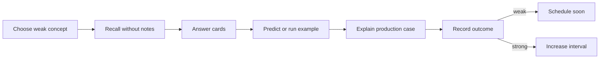

# Review Dashboard

> [!summary]
> Главная рабочая страница для повторения. Она отделяет прочитано от воспроизведено, уверенный ответ от угадывания и знание definition от способности применить mechanism к production case.

## Сегодняшний цикл



# Current Learning Routes

## Java Concurrency

1. [[10_CONCEPTS/Java/Concurrency/Concurrency Learning Path]]
2. [[01_MAPS/Java Concurrency Map.canvas]]
3. [[01_MAPS/Java Advanced Concurrency Map.canvas]]
4. [[20_QUESTIONS/Interview/Java/Concurrency/Advanced Concurrency Recall]]
5. [[50_LABS/Java/Concurrency/README]]

## Spring Core — complete route

1. [[10_CONCEPTS/Spring/Core/Spring Core Foundations]]
2. [[30_CERTIFICATIONS/Spring/2V0-72.22/CORE-B01/CORE-B01 Cards]]
3. [[10_CONCEPTS/Spring/Core/Dependency Resolution and Optional Injection]]
4. [[30_CERTIFICATIONS/Spring/2V0-72.22/CORE-B02/CORE-B02 Cards]]
5. [[10_CONCEPTS/Spring/Core/Bean Lifecycle from Definition to Destruction]]
6. [[30_CERTIFICATIONS/Spring/2V0-72.22/CORE-B03/CORE-B03 Cards]]
7. [[10_CONCEPTS/Spring/Core/Container Extension Points]]
8. [[30_CERTIFICATIONS/Spring/2V0-72.22/CORE-B04/CORE-B04 Cards]]
9. [[10_CONCEPTS/Spring/Core/Configuration Profiles and Externalized Properties]]
10. [[30_CERTIFICATIONS/Spring/2V0-72.22/CORE-B05/CORE-B05 Cards]]
11. [[10_CONCEPTS/Spring/Core/Advanced Core Scopes FactoryBean and Context Hierarchy]]
12. [[30_CERTIFICATIONS/Spring/2V0-72.22/CORE-B06/CORE-B06 Cards]]
13. [[30_CERTIFICATIONS/Spring/2V0-72.22/Spring Core Card Roadmap]]

```text
Spring Core: 140 cards
```

## Spring AOP and Cache — published route

1. [[10_CONCEPTS/Spring/AOP/Spring AOP Proxy Mechanics]]
2. [[30_CERTIFICATIONS/Spring/2V0-72.22/AOP-B01/AOP-B01 Cards]]
3. [[50_LABS/Spring/AOP-B01/README]]
4. [[10_CONCEPTS/Spring/Cache/Spring Cache with Caffeine and Redis]]
5. [[30_CERTIFICATIONS/Spring/2V0-72.22/CACHE-B01/CACHE-B01 Cards]]
6. [[50_LABS/Spring/CACHE-B01/README]]
7. [[40_PRODUCTION_CASES/Spring/AOP and Cache Production Cases]]
8. [[01_MAPS/Spring AOP and Caching Map.canvas]]
9. [[30_CERTIFICATIONS/Spring/2V0-72.22/Spring AOP and Cache Roadmap]]

```text
AOP-B01    24 cards
CACHE-B01  20 cards
TOTAL      44 cards
```

## Spring Transaction Management — active route

1. [[10_CONCEPTS/Spring/Transactions/Spring Transaction Management Deep Dive]]
2. [[30_CERTIFICATIONS/Spring/2V0-72.22/TX-B01/TX-B01 Cards]]
3. [[10_CONCEPTS/Spring/Transactions/Transactional Outbox and Commit Boundaries]]
4. [[40_PRODUCTION_CASES/Spring/Transaction Management Production Cases]]
5. [[50_LABS/Spring/TX-B01/README]]
6. [[01_MAPS/Spring Transaction Management Map.canvas]]
7. [[30_CERTIFICATIONS/Spring/2V0-72.22/Spring Transaction Management Roadmap]]

```text
TX-B01  32 cards
```

# Confidence Scale

| confidence | Реальное значение |
|---:|---|
| 0 | тема не изучена или не проверена |
| 1 | узнаю термин, но не воспроизвожу |
| 2 | отвечаю с подсказкой |
| 3 | объясняю самостоятельно |
| 4 | решаю новый code/production case |
| 5 | защищаю trade-offs на Senior-интервью |

> [!danger]
> Confidence повышается не после чтения, а после самостоятельного recall и transfer task.

# Outcome Taxonomy

| outcome | Что произошло | Следующее действие |
|---|---|---|
| `correct-confident` | ответ точный и объяснён | увеличить interval |
| `correct-guessed` | вариант выбран без механизма | повторить как ошибку |
| `wrong-concept` | неверна модель | concept + lab |
| `wrong-attention` | пропущено NOT/select N/phase | attention drill |
| `wrong-confusion` | перепутаны механизмы | comparison drill |

# Dynamic Search

```query
[confidence:0]
```

```query
[status:learning]
```

```query
[type:certification-question]
```

# Batch routes

## Core

- [[30_CERTIFICATIONS/Spring/2V0-72.22/CORE-B01/CORE-B01 Cards]]
- [[30_CERTIFICATIONS/Spring/2V0-72.22/CORE-B02/CORE-B02 Cards]]
- [[30_CERTIFICATIONS/Spring/2V0-72.22/CORE-B03/CORE-B03 Cards]]
- [[30_CERTIFICATIONS/Spring/2V0-72.22/CORE-B04/CORE-B04 Cards]]
- [[30_CERTIFICATIONS/Spring/2V0-72.22/CORE-B05/CORE-B05 Cards]]
- [[30_CERTIFICATIONS/Spring/2V0-72.22/CORE-B06/CORE-B06 Cards]]

## AOP and Cache

- [[30_CERTIFICATIONS/Spring/2V0-72.22/AOP-B01/AOP-B01 Cards]]
- [[30_CERTIFICATIONS/Spring/2V0-72.22/CACHE-B01/CACHE-B01 Cards]]

## Transactions

- [[30_CERTIFICATIONS/Spring/2V0-72.22/TX-B01/TX-B01 Cards]]

# Spring contrast drills

## Core selected contrasts

- `@Primary` vs `@Qualifier`;
- instantiation vs initialization;
- BFPP vs BPP;
- full vs lite configuration;
- singleton vs thread-safe;
- prototype vs provider;
- FactoryBean product vs factory;
- lazy timing vs scope;
- parent vs child visibility.

## AOP-B01

- aspect vs advisor;
- pointcut vs advice;
- JDK proxy vs CGLIB;
- interface contract vs target class;
- proxy call vs self-invocation;
- external collaborator vs self-injection;
- public overridable method vs final/private method;
- advisor order on entry vs exit;
- audit rethrow vs swallowed exception;
- runtime proxy vs raw object created with `new`;
- external `@Async` vs self-invoked method;
- annotation presence vs actual interceptor boundary.

### AOP memory model

```text
Caller enters proxy.
Proxy calculates applicable advisors.
Advisors form a nested interceptor chain.
Target executes only after inner proceed.
this.method() does not re-enter proxy.
JDK implements interfaces.
CGLIB subclasses target.
```

## CACHE-B01

- Spring Cache abstraction vs storage provider;
- `@Cacheable` vs `@CachePut`;
- after-success eviction vs `beforeInvocation`;
- `condition` vs `unless`;
- cache key identity vs method argument identity;
- Caffeine local state vs Redis shared state;
- `maximumSize` vs `maximumWeight`;
- `expireAfterWrite` vs `expireAfterAccess`;
- TTL vs invalidation;
- JSON serializer vs JDK serialization;
- `sync=true` local coordination vs distributed lock;
- cache outage fallback vs database protection;
- L1 Redis eviction vs L1 Caffeine invalidation;
- high hit rate vs correct fresh data.

### Cache memory model

```text
Spring decides whether and when to cache.
CacheManager chooses a named provider cache.
Key defines identity and isolation.
Caffeine lives inside one JVM.
Redis is shared through network and serialization.
TTL bounds time, not business correctness.
Every extra cache layer adds another stale copy.
```

## TX-B01

- logical transaction vs physical transaction;
- `REQUIRED` vs `REQUIRES_NEW`;
- `REQUIRES_NEW` vs `NESTED`;
- `MANDATORY` vs `NEVER`;
- caught exception vs committable transaction;
- rollback-only vs normal method return;
- runtime exception vs checked exception;
- `rollbackFor` vs `noRollbackFor`;
- read-only hint vs hard write prohibition;
- method isolation vs existing transaction isolation;
- transaction timeout vs HTTP/lock/socket timeout;
- declarative proxy boundary vs `TransactionTemplate`;
- one manager vs multiple local managers;
- after-commit callback vs durable message delivery;
- async worker vs caller transaction;
- cache transaction-aware timing vs XA;
- outbox durable intent vs exactly-once delivery;
- relay retry vs consumer idempotency.

### Transaction memory model

```text
Caller crosses proxy.
Interceptor reads transaction metadata.
Manager maps logical scope to physical resource transaction.
Propagation decides join, create, suspend, savepoint or reject.
Rollback rules interpret the method outcome.
Commit callbacks happen after the transaction decision.
Async does not inherit imperative thread-bound transaction.
Outbox persists publication intent; delivery can duplicate.
```

### TX-B01 five-minute trace drill

For any transactional code, answer:

```text
1. Which object reference receives the call?
2. Is it a Spring proxy?
3. Is there an existing physical transaction?
4. Which propagation branch applies?
5. How many logical scopes exist?
6. How many physical transactions exist?
7. Which exception/rollback rule applies?
8. Is rollback-only set?
9. Which rows actually commit?
10. What happens after process crash?
```

# Active Weakness Register

| Confusion pair | Проверка |
|---|---|
| JDK proxy vs CGLIB | interface implementation против subclass |
| proxy type vs self-invocation | implementation choice против caller path |
| pointcut vs advice | selection против action |
| `@Cacheable` vs `@CachePut` | skip-on-hit против always-invoke |
| condition vs unless | before invocation против result veto |
| Caffeine vs Redis | local latency против shared state |
| TTL vs eviction | time bound против explicit invalidation |
| logical vs physical transaction | method scope против resource commit |
| `REQUIRED` vs `REQUIRES_NEW` | join/create против independent transaction |
| `REQUIRES_NEW` vs `NESTED` | second transaction против savepoint |
| caught exception vs rollback-only | catch не очищает transaction state |
| checked vs runtime exception | commit default против rollback default |
| read-only vs no writes | hint/contract против enforcement |
| inner isolation vs outer transaction | local metadata против existing physical tx |
| after-commit vs outbox | callback против durable intent |
| async vs caller transaction | worker thread против thread-bound context |
| multiple managers vs atomicity | independent local resources |
| outbox vs exactly once | at-least-once + idempotency |

# Ten-Minute Review Session

1. Выбрать одну confusion pair.
2. Проговорить различие без notes.
3. Ответить на 3 связанные cards.
4. Нарисовать одну из схем:
   - caller → proxy → manager → resource;
   - logical scopes → physical transaction;
   - L1 → L2 → DB;
   - business row + outbox row → relay.
5. Открыть concept и исправить пропуски.
6. Зафиксировать outcome.

# Thirty-Minute Deep Session

```text
5 min   recall map
10 min  certification cards
10 min  production case or lab
5 min   summary from memory
```

Suggested lab rotation:

- Day 1: JDK/CGLIB and advisor chain.
- Day 2: self-invoked transaction and async.
- Day 3: Caffeine hits, put and evict.
- Day 4: Redis TTL, prefix and serializer.
- Day 5: REQUIRED and UnexpectedRollbackException.
- Day 6: REQUIRES_NEW and NESTED.
- Day 7: checked rollback rules and TransactionTemplate.
- Day 8: synchronization callbacks and transactional events.
- Day 9: outbox atomicity and duplicate-delivery exercise.

# Weekly Review Protocol

1. Найти `correct-guessed` outcomes.
2. Найти recurring confusion pairs.
3. Одну тему confidence 2 довести до 3.
4. Для одной темы confidence 3 решить новый production case.
5. Проверить labs, ещё не запущенные в real environment.
6. Не считать route mastered до первого полного review cycle.

# Rule of Completion

- [ ] Definition recall.
- [ ] Mechanism explanation.
- [ ] Proxy path diagram.
- [ ] Logical/physical transaction count.
- [ ] Propagation branch prediction.
- [ ] Rollback outcome prediction.
- [ ] Isolation/database boundary explanation.
- [ ] Cache key and topology explanation.
- [ ] Commit callback vs durable delivery distinction.
- [ ] Production transfer.
- [ ] Lab trace prediction.

# Next Planned Modules

- Spring Data and JPA.
- Java ForkJoinPool and parallel streams.
- Databases: transactions, isolation and locks.
- Messaging: delivery semantics and idempotency.
