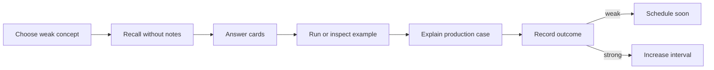

# Review Dashboard

> [!summary]
> Главная рабочая страница для повторения. Она отделяет прочитано от воспроизведено, правильный уверенный ответ от угадывания и знание определения от способности применить механизм к production-case.

## Сегодняшний цикл



## Current Learning Routes

### Java Concurrency

1. [[10_CONCEPTS/Java/Concurrency/Concurrency Learning Path]]
2. [[01_MAPS/Java Concurrency Map.canvas]]
3. [[01_MAPS/Java Advanced Concurrency Map.canvas]]
4. [[20_QUESTIONS/Interview/Java/Concurrency/Advanced Concurrency Recall]]
5. [[50_LABS/Java/Concurrency/README]]

### Spring Certification

1. [[10_CONCEPTS/Spring/Core/Spring Core Foundations]]
2. [[30_CERTIFICATIONS/Spring/2V0-72.22/CORE-B01/CORE-B01 Cards]]
3. [[10_CONCEPTS/Spring/Core/Dependency Resolution and Optional Injection]]
4. [[30_CERTIFICATIONS/Spring/2V0-72.22/CORE-B02/CORE-B02 Cards]]
5. [[10_CONCEPTS/Spring/Core/Bean Lifecycle from Definition to Destruction]]
6. [[30_CERTIFICATIONS/Spring/2V0-72.22/CORE-B03/CORE-B03 Cards]]
7. [[10_CONCEPTS/Spring/Core/Container Extension Points]]
8. [[30_CERTIFICATIONS/Spring/2V0-72.22/CORE-B04/CORE-B04 Cards]]
9. [[10_CONCEPTS/Spring/Core/Configuration Profiles and Externalized Properties]]
10. [[30_CERTIFICATIONS/Spring/2V0-72.22/CORE-B05/CORE-B05 Cards]]
11. [[30_CERTIFICATIONS/Spring/2V0-72.22/Spring Core Card Roadmap]]

```text
CORE-B01  20 cards
CORE-B02  24 cards
CORE-B03  24 cards
CORE-B04  24 cards
CORE-B05  24 cards
TOTAL     116 cards
```

## Confidence Scale

| confidence | Реальное значение |
|---:|---|
| 0 | тема не изучена или не проверена |
| 1 | узнаю термин, но не воспроизвожу |
| 2 | отвечаю с подсказкой |
| 3 | объясняю самостоятельно |
| 4 | решаю новый code/production case |
| 5 | защищаю trade-offs на Senior-интервью |

> [!danger]
> Confidence повышается не после чтения, а после самостоятельного воспроизведения и успешного transfer task.

## Outcome Taxonomy

| outcome | Что произошло | Следующее действие |
|---|---|---|
| `correct-confident` | ответ точный и объяснён | увеличить interval |
| `correct-guessed` | вариант выбран без механизма | повторить как ошибку |
| `wrong-concept` | неверна модель | перечитать concept + lab |
| `wrong-attention` | пропущено NOT/select N/phase | attention drill |
| `wrong-confusion` | перепутаны похожие механизмы | comparison card |

## Dynamic Search

```query
[confidence:0]
```

```query
[status:learning]
```

```query
[type:certification-question]
```

## Batch routes

- [[30_CERTIFICATIONS/Spring/2V0-72.22/CORE-B01/CORE-B01 Cards]]
- [[30_CERTIFICATIONS/Spring/2V0-72.22/CORE-B02/CORE-B02 Cards]]
- [[30_CERTIFICATIONS/Spring/2V0-72.22/CORE-B03/CORE-B03 Cards]]
- [[30_CERTIFICATIONS/Spring/2V0-72.22/CORE-B04/CORE-B04 Cards]]
- [[30_CERTIFICATIONS/Spring/2V0-72.22/CORE-B05/CORE-B05 Cards]]

## Spring contrast drills

### CORE-B01

- `@Bean` vs `@Component`;
- BeanFactory vs ApplicationContext;
- constructor vs setter vs field injection.

### CORE-B02

- `@Primary` vs `@Qualifier`;
- `Optional<T>` vs `ObjectProvider<T>`;
- collection ordering vs startup ordering.

### CORE-B03

- instantiation vs initialization;
- raw target vs published proxy;
- `@PostConstruct` vs `afterPropertiesSet()` vs custom init;
- singleton destruction vs prototype ownership.

### CORE-B04

- BFPP vs BPP;
- BDRPP vs BFPP;
- before-instantiation vs before-initialization;
- auto-detected ordering vs programmatic registration order;
- metadata mutation vs instance wrapping;
- normal reference vs early reference.

### CORE-B05

- full configuration vs lite mode;
- direct bean-method call vs method-parameter injection;
- `proxyBeanMethods` vs bean scope;
- profile vs property;
- profile vs feature flag;
- `@Import` vs component scanning;
- Framework `@PropertySource` vs Boot Config Data;
- `${...}` vs `#{...}`;
- `@Value` vs typed configuration properties;
- configured file value vs winning PropertySource.

CORE-B05 memory model:

```text
Configuration and imports shape the graph.
Profiles conditionally include definitions.
Environment resolves profiles and properties.
PropertySources compete by precedence.
@Value resolves a scalar.
Typed binding creates a configuration contract.
Feature flags decide runtime behavior.
```

Practice:

- [[01_MAPS/Spring Configuration and Profiles Map.canvas]]
- [[40_PRODUCTION_CASES/Spring/Configuration and Profiles Production Cases]]
- [[50_LABS/Spring/Core-B05/README]]

## Active Weakness Register

| Confusion pair | Проверка |
|---|---|
| `@Primary` vs `@Qualifier` | default preference против semantic filter |
| `Optional<T>` vs `ObjectProvider<T>` | construction-time absence против lazy lookup |
| instantiation vs initialization | constructor против init pipeline |
| BFPP vs BPP | metadata против instance |
| full vs lite configuration | managed lookup против ordinary call |
| `proxyBeanMethods` vs scope | call semantics против BeanDefinition metadata |
| profile vs property | graph selection против value selection |
| profile vs feature flag | startup-wide против runtime decision |
| `@PropertySource` vs Config Data | Framework source addition против Boot pipeline |
| `@Value` vs typed binding | scalar injection против cohesive contract |
| visibility vs atomicity | `volatile` против compound operation |
| deadlock vs contention | permanent cycle против long wait |

## Ten-Minute Review Session

1. Выбрать одну строку Active Weakness Register.
2. Не открывая notes, проговорить различие.
3. Ответить на 3 связанные карточки.
4. Нарисовать mechanism diagram от руки.
5. Открыть concept и исправить пропуски.
6. Зафиксировать outcome.

## Thirty-Minute Deep Session

```text
5 min   recall map
10 min  certification cards
10 min  production case or lab
5 min   summary from memory
```

## Weekly Review Protocol

1. Найти все `correct-guessed` outcomes.
2. Найти recurring confusion pairs.
3. Выбрать одну тему confidence 2 и довести до 3.
4. Выбрать одну тему confidence 3 и решить новый production case.
5. Проверить, какие labs ещё не запускались в реальном environment.
6. Не добавлять новый batch, если предыдущий не получил первый review cycle.

## Rule of Completion

- [ ] Definition recall.
- [ ] Mechanism explanation.
- [ ] Lifecycle/configuration phase identification.
- [ ] Trap discrimination.
- [ ] Production transfer.
- [ ] Lab trace prediction.
- [ ] PropertySource winner identification where applicable.

## Next Planned Modules

- Spring `CORE-B06`: scopes, FactoryBean, lazy initialization, circular dependencies and context hierarchy.
- Java: ForkJoinPool and parallel streams.
- Databases: transactions, isolation and locks.
- Messaging: delivery semantics and idempotency.
