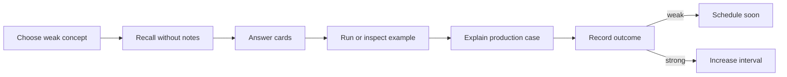

# Review Dashboard

> [!summary]
> Главная рабочая страница для повторения. Она отделяет **прочитано** от **воспроизведено**, правильный уверенный ответ от угадывания и знание определения от способности применить механизм к production-case.

## Сегодняшний цикл



## Current Learning Routes

### Java Concurrency

1. [[10_CONCEPTS/Java/Concurrency/Concurrency Learning Path]]
2. [[01_MAPS/Java Concurrency Map.canvas]]
3. [[01_MAPS/Java Advanced Concurrency Map.canvas]]
4. [[20_QUESTIONS/Interview/Java/Concurrency/Advanced Concurrency Recall]]
5. [[50_LABS/Java/Concurrency/README]]

### Spring Certification

1. [[10_CONCEPTS/Spring/Core/Spring Core Foundations]]
2. [[30_CERTIFICATIONS/Spring/2V0-72.22/CORE-B01/CORE-B01 Cards]]
3. [[10_CONCEPTS/Spring/Core/Dependency Resolution and Optional Injection]]
4. [[01_MAPS/Spring Dependency Resolution Map.canvas]]
5. [[30_CERTIFICATIONS/Spring/2V0-72.22/CORE-B02/CORE-B02 Cards]]
6. [[40_PRODUCTION_CASES/Spring/Dependency Resolution Production Cases]]
7. [[50_LABS/Spring/Core-B02/README]]

## Confidence Scale

| confidence | Реальное значение |
|---:|---|
| 0 | тема не изучена или не проверена |
| 1 | узнаю термин, но не воспроизвожу |
| 2 | отвечаю с подсказкой |
| 3 | объясняю самостоятельно |
| 4 | решаю новый code/production case |
| 5 | защищаю trade-offs на Senior-интервью |

> [!danger]
> Confidence повышается не после чтения, а после самостоятельного воспроизведения и успешного transfer task.

## Outcome Taxonomy

| outcome | Что произошло | Следующее действие |
|---|---|---|
| `correct-confident` | ответ точный и объяснён | увеличить interval |
| `correct-guessed` | вариант выбран без механизма | повторить как ошибку |
| `wrong-concept` | неверна модель | перечитать concept + lab |
| `wrong-attention` | пропущено NOT/select 3/тип dependency | attention drill |
| `wrong-confusion` | перепутаны похожие механизмы | comparison card |

## Dynamic Search — Unverified Concepts

Следующий встроенный поиск показывает заметки с `confidence: 0`.

```query
[confidence:0]
```

## Dynamic Search — Learning Status

```query
[status:learning]
```

## Dynamic Search — Certification Questions

```query
[type:certification-question]
```

Batch-файлы, содержащие несколько карточек, дополнительно доступны через:

- [[30_CERTIFICATIONS/Spring/2V0-72.22/CORE-B01/CORE-B01 Cards]]
- [[30_CERTIFICATIONS/Spring/2V0-72.22/CORE-B02/CORE-B02 Cards]]

## Weekly Review Protocol

### Step 1. Coverage

- Какие domains вообще не повторялись?
- Какие maps имеют placeholder nodes без concept notes?
- Есть ли certification objectives без карточек?

### Step 2. Retention

- Какие ответы были `correct-guessed`?
- Какие ошибки повторились дважды?
- Какие memory hooks не помогли?

### Step 3. Transfer

- Могу ли я объяснить production failure без терминов из вопроса?
- Могу ли выбрать механизм и назвать trade-off?
- Могу ли написать минимальный reproducer?

### Step 4. Maintenance

- Обновить `last_reviewed`.
- Назначить `next_review`.
- Увеличить `confidence` максимум на один уровень.
- Создать comparison note для повторяющейся confusion pair.

## Active Weakness Register

| Confusion pair | Проверка |
|---|---|
| `@Primary` vs `@Qualifier` | default preference против semantic filter |
| `Optional<T>` vs `ObjectProvider<T>` | construction-time absence против lazy lookup |
| List ordering vs bean startup order | `@Order` против dependency lifecycle |
| visibility vs atomicity | `volatile` против compound operation |
| deadlock vs contention | permanent cycle против long wait |
| `thenApply` vs `thenCompose` | transform против async flattening |

## Ten-Minute Review Session

1. Выбрать одну строку Active Weakness Register.
2. Не открывая notes, проговорить различие.
3. Ответить на 3 связанные карточки.
4. Нарисовать mechanism diagram от руки.
5. Открыть concept и исправить пропуски.
6. Зафиксировать outcome.

## Thirty-Minute Deep Session

```text
5 min   recall map
10 min  certification cards
10 min  production case or lab
5 min   summary from memory
```

## Rule of Completion

Тема считается готовой не когда заметка заполнена, а когда выполнены четыре проверки:

- [ ] Definition recall.
- [ ] Mechanism explanation.
- [ ] Trap discrimination.
- [ ] Production transfer.

## Next Planned Modules

- Spring `CORE-B03`: bean lifecycle.
- Java: ForkJoinPool and parallel streams.
- Databases: transactions, isolation and locks.
- Messaging: delivery semantics and idempotency.
