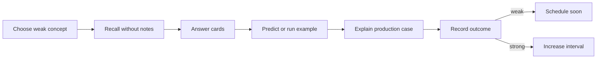

# Review Dashboard

> [!summary]
> Главная рабочая страница для повторения. Она отделяет прочитано от воспроизведено, уверенный ответ от угадывания и знание definition от способности применить mechanism к production case.

## Сегодняшний цикл



## Current Learning Routes

### Java Concurrency

1. [[10_CONCEPTS/Java/Concurrency/Concurrency Learning Path]]
2. [[01_MAPS/Java Concurrency Map.canvas]]
3. [[01_MAPS/Java Advanced Concurrency Map.canvas]]
4. [[20_QUESTIONS/Interview/Java/Concurrency/Advanced Concurrency Recall]]
5. [[50_LABS/Java/Concurrency/README]]

### Spring Core — complete route

1. [[10_CONCEPTS/Spring/Core/Spring Core Foundations]]
2. [[30_CERTIFICATIONS/Spring/2V0-72.22/CORE-B01/CORE-B01 Cards]]
3. [[10_CONCEPTS/Spring/Core/Dependency Resolution and Optional Injection]]
4. [[30_CERTIFICATIONS/Spring/2V0-72.22/CORE-B02/CORE-B02 Cards]]
5. [[10_CONCEPTS/Spring/Core/Bean Lifecycle from Definition to Destruction]]
6. [[30_CERTIFICATIONS/Spring/2V0-72.22/CORE-B03/CORE-B03 Cards]]
7. [[10_CONCEPTS/Spring/Core/Container Extension Points]]
8. [[30_CERTIFICATIONS/Spring/2V0-72.22/CORE-B04/CORE-B04 Cards]]
9. [[10_CONCEPTS/Spring/Core/Configuration Profiles and Externalized Properties]]
10. [[30_CERTIFICATIONS/Spring/2V0-72.22/CORE-B05/CORE-B05 Cards]]
11. [[10_CONCEPTS/Spring/Core/Advanced Core Scopes FactoryBean and Context Hierarchy]]
12. [[30_CERTIFICATIONS/Spring/2V0-72.22/CORE-B06/CORE-B06 Cards]]
13. [[30_CERTIFICATIONS/Spring/2V0-72.22/Spring Core Card Roadmap]]

```text
CORE-B01  20 cards
CORE-B02  24 cards
CORE-B03  24 cards
CORE-B04  24 cards
CORE-B05  24 cards
CORE-B06  24 cards
TOTAL    140 cards
```

## Confidence Scale

| confidence | Реальное значение |
|---:|---|
| 0 | тема не изучена или не проверена |
| 1 | узнаю термин, но не воспроизвожу |
| 2 | отвечаю с подсказкой |
| 3 | объясняю самостоятельно |
| 4 | решаю новый code/production case |
| 5 | защищаю trade-offs на Senior-интервью |

> [!danger]
> Confidence повышается не после чтения, а после самостоятельного recall и transfer task.

## Outcome Taxonomy

| outcome | Что произошло | Следующее действие |
|---|---|---|
| `correct-confident` | ответ точный и объяснён | увеличить interval |
| `correct-guessed` | вариант выбран без механизма | повторить как ошибку |
| `wrong-concept` | неверна модель | concept + lab |
| `wrong-attention` | пропущено NOT/select N/phase | attention drill |
| `wrong-confusion` | перепутаны механизмы | comparison drill |

## Dynamic Search

```query
[confidence:0]
```

```query
[status:learning]
```

```query
[type:certification-question]
```

## Batch routes

- [[30_CERTIFICATIONS/Spring/2V0-72.22/CORE-B01/CORE-B01 Cards]]
- [[30_CERTIFICATIONS/Spring/2V0-72.22/CORE-B02/CORE-B02 Cards]]
- [[30_CERTIFICATIONS/Spring/2V0-72.22/CORE-B03/CORE-B03 Cards]]
- [[30_CERTIFICATIONS/Spring/2V0-72.22/CORE-B04/CORE-B04 Cards]]
- [[30_CERTIFICATIONS/Spring/2V0-72.22/CORE-B05/CORE-B05 Cards]]
- [[30_CERTIFICATIONS/Spring/2V0-72.22/CORE-B06/CORE-B06 Cards]]

## Spring contrast drills

### CORE-B01

- `@Bean` vs `@Component`;
- BeanFactory vs ApplicationContext;
- constructor vs setter vs field injection.

### CORE-B02

- `@Primary` vs `@Qualifier`;
- `Optional<T>` vs `ObjectProvider<T>`;
- collection ordering vs startup ordering.

### CORE-B03

- instantiation vs initialization;
- raw target vs published proxy;
- init callbacks vs destruction callbacks;
- singleton destruction vs prototype ownership.

### CORE-B04

- BFPP vs BPP;
- BDRPP vs BFPP;
- before-instantiation vs before-initialization;
- auto-detected ordering vs programmatic order;
- normal reference vs early reference.

### CORE-B05

- full vs lite configuration;
- direct bean-method call vs method-parameter injection;
- profile vs property;
- profile vs feature flag;
- `@PropertySource` vs Boot Config Data;
- `@Value` vs typed configuration.

### CORE-B06

- singleton identity vs thread safety;
- prototype lookup vs business method call;
- prototype initialization vs destruction ownership;
- direct injection vs provider lookup;
- scoped proxy vs target scope;
- `ObjectProvider` optionality vs ambiguity;
- `FactoryBean` product vs factory;
- FactoryBean scope vs product identity;
- lazy timing vs bean scope;
- constructor cycle vs setter/field cycle;
- early reference vs fully initialized proxy;
- parent visibility vs child visibility;
- Resource vs File;
- message code vs localized text.

CORE-B06 memory model:

```text
Identity: how many instances?
Resolution: when is target selected?
Lifetime: how long does it live?
Ownership: who destroys it?

Singleton: one per definition per container.
Prototype: new per lookup; caller owns cleanup.
Scoped proxy: stable handle, contextual target.
Provider: ask container now.
FactoryBean: name → product, &name → factory.
Lazy: later creation, same scope.
Hierarchy: child sees parent, parent does not see child.
```

Practice:

- [[01_MAPS/Spring Advanced Core Map.canvas]]
- [[40_PRODUCTION_CASES/Spring/Advanced Core Production Cases]]
- [[50_LABS/Spring/Core-B06/README]]

## Active Weakness Register

| Confusion pair | Проверка |
|---|---|
| `@Primary` vs `@Qualifier` | preference против semantic filter |
| `Optional<T>` vs `ObjectProvider<T>` | absence против runtime lookup |
| instantiation vs initialization | constructor против init pipeline |
| BFPP vs BPP | metadata против instance |
| full vs lite configuration | managed lookup против ordinary call |
| profile vs property | graph selection против value selection |
| singleton vs thread-safe | identity против synchronization |
| prototype vs provider | scope policy против lookup timing |
| scoped proxy vs target | stable reference против contextual instance |
| FactoryBean vs `@Bean` | managed factory bean против factory method |
| lazy vs prototype | creation timing против identity |
| early reference vs final proxy | partial lifecycle против published bean |
| parent vs child visibility | downward lookup против bidirectional discovery |
| Resource vs File | abstraction против storage assumption |
| visibility vs atomicity | volatile против compound operation |
| deadlock vs contention | cycle против long wait |

## Ten-Minute Review Session

1. Выбрать одну confusion pair.
2. Проговорить различие без notes.
3. Ответить на 3 связанные cards.
4. Нарисовать mechanism diagram.
5. Открыть concept и исправить пропуски.
6. Зафиксировать outcome.

## Thirty-Minute Deep Session

```text
5 min   recall map
10 min  certification cards
10 min  production case or lab
5 min   summary from memory
```

## Weekly Review Protocol

1. Найти `correct-guessed` outcomes.
2. Найти recurring confusion pairs.
3. Одну тему confidence 2 довести до 3.
4. Для одной темы confidence 3 решить новый production case.
5. Проверить labs, ещё не запущенные в real environment.
6. Не считать route mastered до первого полного review cycle.

## Rule of Completion

- [ ] Definition recall.
- [ ] Mechanism explanation.
- [ ] Lifecycle/configuration phase identification.
- [ ] Identity/resolution/lifetime/ownership explanation.
- [ ] Trap discrimination.
- [ ] Production transfer.
- [ ] Lab trace prediction.

## Next Planned Modules

- Spring AOP and Proxies.
- Java ForkJoinPool and parallel streams.
- Databases: transactions, isolation and locks.
- Messaging: delivery semantics and idempotency.
