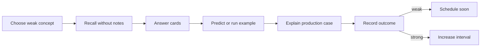

# Review Dashboard

> [!summary]
> Главная рабочая страница для повторения. Она отделяет прочитано от воспроизведено, уверенный ответ от угадывания и знание definition от способности применить mechanism к production case.

## Сегодняшний цикл



# Current Learning Routes

## Java Concurrency

1. [[10_CONCEPTS/Java/Concurrency/Concurrency Learning Path]]
2. [[01_MAPS/Java Concurrency Map.canvas]]
3. [[01_MAPS/Java Advanced Concurrency Map.canvas]]
4. [[20_QUESTIONS/Interview/Java/Concurrency/Advanced Concurrency Recall]]
5. [[50_LABS/Java/Concurrency/README]]

## Spring Core — complete

1. [[10_CONCEPTS/Spring/Core/Spring Core Foundations]]
2. [[30_CERTIFICATIONS/Spring/2V0-72.22/CORE-B01/CORE-B01 Cards]]
3. [[10_CONCEPTS/Spring/Core/Dependency Resolution and Optional Injection]]
4. [[30_CERTIFICATIONS/Spring/2V0-72.22/CORE-B02/CORE-B02 Cards]]
5. [[10_CONCEPTS/Spring/Core/Bean Lifecycle from Definition to Destruction]]
6. [[30_CERTIFICATIONS/Spring/2V0-72.22/CORE-B03/CORE-B03 Cards]]
7. [[10_CONCEPTS/Spring/Core/Container Extension Points]]
8. [[30_CERTIFICATIONS/Spring/2V0-72.22/CORE-B04/CORE-B04 Cards]]
9. [[10_CONCEPTS/Spring/Core/Configuration Profiles and Externalized Properties]]
10. [[30_CERTIFICATIONS/Spring/2V0-72.22/CORE-B05/CORE-B05 Cards]]
11. [[10_CONCEPTS/Spring/Core/Advanced Core Scopes FactoryBean and Context Hierarchy]]
12. [[30_CERTIFICATIONS/Spring/2V0-72.22/CORE-B06/CORE-B06 Cards]]
13. [[30_CERTIFICATIONS/Spring/2V0-72.22/Spring Core Card Roadmap]]

```text
Spring Core: 140 cards
```

## Spring AOP and Cache — published

1. [[10_CONCEPTS/Spring/AOP/Spring AOP Proxy Mechanics]]
2. [[30_CERTIFICATIONS/Spring/2V0-72.22/AOP-B01/AOP-B01 Cards]]
3. [[50_LABS/Spring/AOP-B01/README]]
4. [[10_CONCEPTS/Spring/Cache/Spring Cache with Caffeine and Redis]]
5. [[30_CERTIFICATIONS/Spring/2V0-72.22/CACHE-B01/CACHE-B01 Cards]]
6. [[50_LABS/Spring/CACHE-B01/README]]
7. [[40_PRODUCTION_CASES/Spring/AOP and Cache Production Cases]]
8. [[01_MAPS/Spring AOP and Caching Map.canvas]]
9. [[30_CERTIFICATIONS/Spring/2V0-72.22/Spring AOP and Cache Roadmap]]

```text
AOP-B01    24 cards
CACHE-B01  20 cards
TOTAL      44 cards
```

## Spring Transaction Management — published

1. [[10_CONCEPTS/Spring/Transactions/Spring Transaction Management Deep Dive]]
2. [[30_CERTIFICATIONS/Spring/2V0-72.22/TX-B01/TX-B01 Cards]]
3. [[10_CONCEPTS/Spring/Transactions/Transactional Outbox and Commit Boundaries]]
4. [[40_PRODUCTION_CASES/Spring/Transaction Management Production Cases]]
5. [[50_LABS/Spring/TX-B01/README]]
6. [[01_MAPS/Spring Transaction Management Map.canvas]]
7. [[30_CERTIFICATIONS/Spring/2V0-72.22/Spring Transaction Management Roadmap]]

```text
TX-B01  32 cards
```

## Spring Data and JPA — active route

1. [[10_CONCEPTS/Spring/Data/Spring Data JPA Persistence Context and Entity Lifecycle]]
2. [[10_CONCEPTS/Spring/Data/Spring Data Repositories Queries and Fetching]]
3. [[30_CERTIFICATIONS/Spring/2V0-72.22/DATA-B01/DATA-B01 Cards]]
4. [[40_PRODUCTION_CASES/Spring/Spring Data JPA Production Cases]]
5. [[50_LABS/Spring/DATA-B01/README]]
6. [[01_MAPS/Spring Data JPA Map.canvas]]
7. [[30_CERTIFICATIONS/Spring/2V0-72.22/Spring Data JPA Roadmap]]

```text
DATA-B01  36 cards
```

# Published Spring totals

```text
Spring Core               140
AOP and Cache               44
Transaction Management      32
Spring Data and JPA          36
-------------------------------
TOTAL                       252 cards
```

# Confidence Scale

| confidence | Реальное значение |
|---:|---|
| 0 | тема не изучена или не проверена |
| 1 | узнаю термин, но не воспроизвожу |
| 2 | отвечаю с подсказкой |
| 3 | объясняю самостоятельно |
| 4 | решаю новый code/production case |
| 5 | защищаю trade-offs на Senior-интервью |

> [!danger]
> Confidence повышается не после чтения, а после самостоятельного recall и transfer task.

# Outcome Taxonomy

| outcome | Что произошло | Следующее действие |
|---|---|---|
| `correct-confident` | ответ точный и объяснён | увеличить interval |
| `correct-guessed` | вариант выбран без механизма | повторить как ошибку |
| `wrong-concept` | неверна модель | concept + lab |
| `wrong-attention` | пропущено NOT/select N/phase | attention drill |
| `wrong-confusion` | перепутаны механизмы | comparison drill |

# Dynamic Search

```query
[confidence:0]
```

```query
[status:learning]
```

```query
[type:certification-question]
```

# Batch routes

## Core

- [[30_CERTIFICATIONS/Spring/2V0-72.22/CORE-B01/CORE-B01 Cards]]
- [[30_CERTIFICATIONS/Spring/2V0-72.22/CORE-B02/CORE-B02 Cards]]
- [[30_CERTIFICATIONS/Spring/2V0-72.22/CORE-B03/CORE-B03 Cards]]
- [[30_CERTIFICATIONS/Spring/2V0-72.22/CORE-B04/CORE-B04 Cards]]
- [[30_CERTIFICATIONS/Spring/2V0-72.22/CORE-B05/CORE-B05 Cards]]
- [[30_CERTIFICATIONS/Spring/2V0-72.22/CORE-B06/CORE-B06 Cards]]

## AOP and Cache

- [[30_CERTIFICATIONS/Spring/2V0-72.22/AOP-B01/AOP-B01 Cards]]
- [[30_CERTIFICATIONS/Spring/2V0-72.22/CACHE-B01/CACHE-B01 Cards]]

## Transactions

- [[30_CERTIFICATIONS/Spring/2V0-72.22/TX-B01/TX-B01 Cards]]

## Data and JPA

- [[30_CERTIFICATIONS/Spring/2V0-72.22/DATA-B01/DATA-B01 Cards]]

# Spring contrast drills

## Core selected contrasts

- `@Primary` vs `@Qualifier`;
- instantiation vs initialization;
- BFPP vs BPP;
- full vs lite configuration;
- singleton vs thread-safe;
- prototype vs provider;
- FactoryBean product vs factory;
- lazy timing vs scope;
- parent vs child visibility.

## AOP-B01

- aspect vs advisor;
- pointcut vs advice;
- JDK proxy vs CGLIB;
- proxy call vs self-invocation;
- public overridable method vs final/private method;
- advisor order on entry vs exit;
- audit rethrow vs swallowed exception;
- external `@Async` vs self-invoked method.

### AOP memory model

```text
Caller enters proxy.
Proxy calculates applicable advisors.
Advisors form a nested interceptor chain.
Target executes only after inner proceed.
this.method() does not re-enter proxy.
JDK implements interfaces.
CGLIB subclasses target.
```

## CACHE-B01

- Spring Cache abstraction vs storage provider;
- `@Cacheable` vs `@CachePut`;
- `condition` vs `unless`;
- Caffeine local state vs Redis shared state;
- `maximumSize` vs `maximumWeight`;
- TTL vs invalidation;
- `sync=true` local coordination vs distributed lock;
- L1 eviction vs cross-node invalidation.

### Cache memory model

```text
Spring decides whether and when to cache.
CacheManager selects provider cache.
Key defines identity and isolation.
Caffeine lives inside one JVM.
Redis is shared through network and serialization.
TTL bounds time, not business correctness.
Every extra cache layer adds another stale copy.
```

## TX-B01

- logical transaction vs physical transaction;
- `REQUIRED` vs `REQUIRES_NEW`;
- `REQUIRES_NEW` vs `NESTED`;
- caught exception vs rollback-only;
- runtime exception vs checked exception;
- read-only hint vs hard write prohibition;
- method isolation vs existing transaction isolation;
- after-commit callback vs durable message delivery;
- async worker vs caller transaction;
- outbox durable intent vs exactly-once delivery.

### Transaction memory model

```text
Caller crosses proxy.
Interceptor reads transaction metadata.
Manager maps logical scope to physical resource transaction.
Propagation decides join, create, suspend, savepoint or reject.
Rollback rules interpret method outcome.
Async does not inherit imperative thread-bound transaction.
Outbox persists publication intent; delivery can duplicate.
```

## DATA-B01

- Java object state vs persistence-context state vs committed DB state;
- first-level cache vs Redis/Caffeine;
- transient vs managed vs detached vs removed;
- dirty checking vs repository `save()`;
- flush vs commit;
- `persist()` vs `merge()`;
- merge argument vs merge result;
- `save()` vs `saveAndFlush()`;
- lazy loading vs N+1;
- fetch join vs `@EntityGraph`;
- entity vs interface/DTO projection;
- derived query vs `Specification`;
- `Page` vs `Slice`;
- offset pagination vs keyset concept;
- entity update vs bulk JPQL DML;
- optimistic vs pessimistic lock;
- H2 behavior vs production PostgreSQL/Oracle behavior.

### JPA memory model

```text
Service transaction defines the unit of work.
EntityManager owns a persistence context.
One entity identity maps to one managed Java instance.
Managed changes are detected during flush.
Flush executes SQL inside the transaction; commit finalizes it.
Detached objects are not tracked.
merge copies state and returns a managed copy.
Repository proxy chooses persist, merge or query execution.
Fetch plan determines associations; projection determines result shape.
```

### DATA-B01 five-minute trace drill

For any repository/service code, answer:

```text
1. Where does the transaction start and end?
2. Is the entity managed or detached?
3. Is this Java object the canonical instance for the ID?
4. Will dirty checking detect the change?
5. When can flush happen?
6. Which SQL statements are expected?
7. Does the query cause N+1?
8. Is entity, projection, Page or Slice the right result shape?
9. Can bulk DML leave the context stale?
10. What protects against lost updates?
```

# Active Weakness Register

| Confusion pair | Проверка |
|---|---|
| JDK proxy vs CGLIB | interface implementation против subclass |
| proxy type vs self-invocation | implementation choice против caller path |
| `@Cacheable` vs `@CachePut` | skip-on-hit против always-invoke |
| Caffeine vs Redis | local latency против shared state |
| logical vs physical transaction | method scope против resource commit |
| `REQUIRED` vs `REQUIRES_NEW` | join/create против independent transaction |
| checked vs runtime exception | commit default против rollback default |
| after-commit vs outbox | callback против durable intent |
| persistence context vs database | tracked object graph против committed rows |
| managed vs detached | dirty checking против ordinary object mutation |
| flush vs commit | SQL synchronization против durability |
| persist vs merge | new managed instance против state copy |
| merge argument vs result | detached original против managed copy |
| lazy vs N+1 | loading policy против repeated-query symptom |
| fetch join vs entity graph | query clause против fetch plan metadata |
| Page vs Slice | total count против hasNext |
| entity vs projection | mutable managed aggregate против read model |
| bulk DML vs managed state | direct DB update против context tracking |
| optimistic vs pessimistic lock | detect conflict против acquire DB lock |

# Ten-Minute Review Session

1. Выбрать одну confusion pair.
2. Проговорить различие без notes.
3. Ответить на 3 связанные cards.
4. Нарисовать одну схему:
   - caller → proxy → manager → resource;
   - logical scopes → physical transaction;
   - EntityManager → persistence context → flush → SQL;
   - root query → lazy association queries;
   - business row + outbox row → relay.
5. Открыть concept и исправить пропуски.
6. Зафиксировать outcome.

# Thirty-Minute Deep Session

```text
5 min   recall map
10 min  certification cards
10 min  production case or lab
5 min   summary from memory
```

Suggested lab rotation:

- Day 1: JDK/CGLIB and advisor chain.
- Day 2: self-invoked transaction and async.
- Day 3: Caffeine hits, put and evict.
- Day 4: Redis TTL, prefix and serializer.
- Day 5: REQUIRED and UnexpectedRollbackException.
- Day 6: REQUIRES_NEW and NESTED.
- Day 7: checked rollback rules and TransactionTemplate.
- Day 8: outbox atomicity and duplicate delivery.
- Day 9: JPA identity map and dirty checking.
- Day 10: detach/merge and `save()` return value.
- Day 11: N+1, fetch join and `@EntityGraph`.
- Day 12: projection, Specification, Page and Slice.
- Day 13: bulk DML stale context and locking.

# Weekly Review Protocol

1. Найти `correct-guessed` outcomes.
2. Найти recurring confusion pairs.
3. Одну тему confidence 2 довести до 3.
4. Для одной темы confidence 3 решить новый production case.
5. Проверить labs, ещё не запущенные в real environment.
6. Не считать route mastered до первого полного review cycle.

# Rule of Completion

- [ ] Definition recall.
- [ ] Mechanism explanation.
- [ ] Proxy path diagram.
- [ ] Logical/physical transaction count.
- [ ] Rollback outcome prediction.
- [ ] Entity-state identification.
- [ ] Flush/commit distinction.
- [ ] SQL/N+1 prediction.
- [ ] Fetch/result-shape decision.
- [ ] Locking and stale-context explanation.
- [ ] Production transfer.
- [ ] Lab trace prediction.

# Next Planned Modules

- Spring Testing.
- Java ForkJoinPool and parallel streams.
- Databases: transactions, isolation, locks, indexes and plans.
- Messaging: delivery semantics and idempotency.
