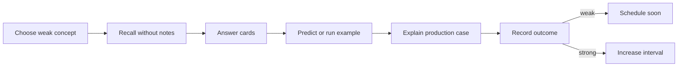

# Review Dashboard

> [!summary]
> Главная рабочая страница для повторения. Confidence повышается не после чтения, а после самостоятельного recall, mechanism explanation и transfer task.

# Сегодняшний цикл



# Current Learning Routes

## Java Concurrency

1. [[10_CONCEPTS/Java/Concurrency/Concurrency Learning Path]]
2. [[01_MAPS/Java Concurrency Map.canvas]]
3. [[01_MAPS/Java Advanced Concurrency Map.canvas]]
4. [[20_QUESTIONS/Interview/Java/Concurrency/Advanced Concurrency Recall]]
5. [[50_LABS/Java/Concurrency/README]]

## Spring Core — complete

- [[30_CERTIFICATIONS/Spring/2V0-72.22/Spring Core Card Roadmap]]
- `CORE-B01`–`CORE-B06`;
- 140 cards;
- six concept modules;
- six Canvas maps;
- lifecycle and extension-point labs.

## Spring AOP and Cache — published

1. [[10_CONCEPTS/Spring/AOP/Spring AOP Proxy Mechanics]]
2. [[30_CERTIFICATIONS/Spring/2V0-72.22/AOP-B01/AOP-B01 Cards]]
3. [[50_LABS/Spring/AOP-B01/README]]
4. [[10_CONCEPTS/Spring/Cache/Spring Cache with Caffeine and Redis]]
5. [[30_CERTIFICATIONS/Spring/2V0-72.22/CACHE-B01/CACHE-B01 Cards]]
6. [[50_LABS/Spring/CACHE-B01/README]]
7. [[01_MAPS/Spring AOP and Caching Map.canvas]]

```text
AOP-B01    24
CACHE-B01  20
TOTAL      44 cards
```

## Spring Transaction Management — published

1. [[10_CONCEPTS/Spring/Transactions/Spring Transaction Management Deep Dive]]
2. [[30_CERTIFICATIONS/Spring/2V0-72.22/TX-B01/TX-B01 Cards]]
3. [[10_CONCEPTS/Spring/Transactions/Transactional Outbox and Commit Boundaries]]
4. [[40_PRODUCTION_CASES/Spring/Transaction Management Production Cases]]
5. [[50_LABS/Spring/TX-B01/README]]
6. [[01_MAPS/Spring Transaction Management Map.canvas]]

```text
TX-B01  32 cards
```

## Spring Data and JPA — published

1. [[10_CONCEPTS/Spring/Data/Spring Data JPA Persistence Context and Entity Lifecycle]]
2. [[10_CONCEPTS/Spring/Data/Spring Data Repositories Queries and Fetching]]
3. [[30_CERTIFICATIONS/Spring/2V0-72.22/DATA-B01/DATA-B01 Cards]]
4. [[40_PRODUCTION_CASES/Spring/Spring Data JPA Production Cases]]
5. [[50_LABS/Spring/DATA-B01/README]]
6. [[01_MAPS/Spring Data JPA Map.canvas]]

```text
DATA-B01  36 cards
```

## Spring Testing — published

1. [[10_CONCEPTS/Spring/Testing/Spring TestContext and Test Slices]]
2. [[10_CONCEPTS/Spring/Testing/Spring Data JPA Testing with Testcontainers]]
3. [[30_CERTIFICATIONS/Spring/2V0-72.22/TEST-B01/TEST-B01 Cards]]
4. [[40_PRODUCTION_CASES/Spring/Spring Testing Production Cases]]
5. [[50_LABS/Spring/TEST-B01/README]]
6. [[01_MAPS/Spring Testing Map.canvas]]
7. [[30_CERTIFICATIONS/Spring/2V0-72.22/Spring Testing Roadmap]]

```text
TEST-B01  36 cards
```

# Published Spring totals

```text
Spring Core               140
AOP and Cache               44
Transaction Management      32
Spring Data and JPA          36
Spring Testing               36
-------------------------------
TOTAL                       288 cards
```

# Confidence Scale

| confidence | Реальное значение |
|---:|---|
| 0 | тема не изучена или не проверена |
| 1 | узнаю термин, но не воспроизвожу |
| 2 | отвечаю с подсказкой |
| 3 | объясняю самостоятельно |
| 4 | решаю новый code/production case |
| 5 | защищаю trade-offs на Senior-интервью |

# Outcome Taxonomy

| outcome | Что произошло | Следующее действие |
|---|---|---|
| `correct-confident` | ответ точный и объяснён | увеличить interval |
| `correct-guessed` | вариант выбран без механизма | повторить как ошибку |
| `wrong-concept` | неверна mental model | concept + lab |
| `wrong-attention` | пропущено NOT/select N/phase | attention drill |
| `wrong-confusion` | перепутаны похожие механизмы | comparison drill |

# Dynamic Search

```query
[confidence:0]
```

```query
[status:learning]
```

```query
[type:certification-question]
```

# Batch routes

## Core

- [[30_CERTIFICATIONS/Spring/2V0-72.22/CORE-B01/CORE-B01 Cards]]
- [[30_CERTIFICATIONS/Spring/2V0-72.22/CORE-B02/CORE-B02 Cards]]
- [[30_CERTIFICATIONS/Spring/2V0-72.22/CORE-B03/CORE-B03 Cards]]
- [[30_CERTIFICATIONS/Spring/2V0-72.22/CORE-B04/CORE-B04 Cards]]
- [[30_CERTIFICATIONS/Spring/2V0-72.22/CORE-B05/CORE-B05 Cards]]
- [[30_CERTIFICATIONS/Spring/2V0-72.22/CORE-B06/CORE-B06 Cards]]

## AOP and Cache

- [[30_CERTIFICATIONS/Spring/2V0-72.22/AOP-B01/AOP-B01 Cards]]
- [[30_CERTIFICATIONS/Spring/2V0-72.22/CACHE-B01/CACHE-B01 Cards]]

## Transactions

- [[30_CERTIFICATIONS/Spring/2V0-72.22/TX-B01/TX-B01 Cards]]

## Data and JPA

- [[30_CERTIFICATIONS/Spring/2V0-72.22/DATA-B01/DATA-B01 Cards]]

## Testing

- [[30_CERTIFICATIONS/Spring/2V0-72.22/TEST-B01/TEST-B01 Cards]]

# Spring contrast drills

## Core selected contrasts

- `@Primary` vs `@Qualifier`;
- instantiation vs initialization;
- BFPP vs BPP;
- full vs lite configuration;
- singleton vs thread-safe;
- prototype vs provider;
- FactoryBean product vs factory;
- lazy timing vs scope;
- parent vs child visibility.

## AOP-B01

- JDK proxy vs CGLIB;
- proxy call vs self-invocation;
- public overridable vs final/private method;
- advisor order on entry vs exit;
- rethrow vs swallowed exception;
- external `@Async` vs self-invoked method.

## CACHE-B01

- cache abstraction vs provider;
- `@Cacheable` vs `@CachePut`;
- `condition` vs `unless`;
- Caffeine local vs Redis shared;
- TTL vs invalidation;
- `sync=true` vs distributed lock;
- L1 eviction vs cross-node invalidation.

## TX-B01

- logical vs physical transaction;
- `REQUIRED` vs `REQUIRES_NEW`;
- `REQUIRES_NEW` vs `NESTED`;
- caught exception vs rollback-only;
- checked vs runtime exception;
- read-only hint vs write prohibition;
- after-commit callback vs durable outbox;
- async worker vs caller transaction.

## DATA-B01

- Java object vs persistence-context vs committed DB state;
- managed vs detached;
- dirty checking vs `save()`;
- flush vs commit;
- `persist()` vs `merge()`;
- merge argument vs merge result;
- LAZY vs N+1;
- fetch join vs `@EntityGraph`;
- entity vs projection;
- `Page` vs `Slice`;
- bulk DML vs managed state;
- optimistic vs pessimistic lock.

## TEST-B01

- unit test vs Spring integration test;
- slice vs full context;
- `@DataJpaTest` vs `@SpringBootTest`;
- test-managed transaction vs service transaction;
- rollback test vs commit test;
- flush vs clear;
- `@Commit` vs `TestTransaction`;
- `@BeforeEach` vs `@BeforeTransaction`;
- H2 vs PostgreSQL Testcontainers;
- embedded replacement vs `replace = NONE`;
- static vs instance container;
- context cache vs `@DirtiesContext`;
- event published vs message delivered;
- correct result vs bounded SQL count.

### Testing memory model

```text
Choose the smallest boundary that can prove the risk.
TestContext loads and caches the Spring context.
Slice proves one infrastructure layer.
Full context proves application wiring.
Test transaction rolls back by default.
Flush proves SQL; clear proves reload.
Real commit proves after-commit behavior.
H2 proves JPA mechanics; PostgreSQL proves PostgreSQL.
Container lifecycle must outlive cached context.
```

### TEST-B01 five-minute trace drill

```text
1. Which annotation bootstraps the test?
2. Which beans are actually loaded?
3. Is a test-managed transaction active?
4. Which thread executes the write?
5. Does the application join or create a transaction?
6. Has SQL flushed?
7. Is the entity still managed?
8. Which database engine is connected?
9. Will the test commit or roll back?
10. What external effect can survive rollback?
```

# Active Weakness Register

| Confusion pair | Проверка |
|---|---|
| proxy type vs self-invocation | implementation choice vs caller path |
| Caffeine vs Redis | local state vs shared state |
| logical vs physical transaction | method scope vs resource commit |
| after-commit vs outbox | callback vs durable intent |
| managed vs detached | dirty checking vs ordinary object mutation |
| flush vs commit | SQL synchronization vs durability |
| persist vs merge | new managed instance vs state copy |
| lazy vs N+1 | loading policy vs repeated-query symptom |
| Page vs Slice | total count vs hasNext |
| slice vs full context | one layer vs application graph |
| rollback vs commit test | isolation vs real commit proof |
| flush vs clear | execute SQL vs discard identity map |
| H2 vs PostgreSQL | JPA mechanics vs engine semantics |
| context cleanup vs data cleanup | cache invalidation vs rows/schema isolation |
| static container vs context cache | lifecycle ownership compatibility |

# Ten-Minute Review Session

1. Выбрать одну confusion pair.
2. Проговорить различие без notes.
3. Ответить на 3 связанные cards.
4. Нарисовать одну схему:
   - caller → proxy → manager → resource;
   - EntityManager → persistence context → flush → SQL;
   - JUnit → TestContext → listener → transaction;
   - H2 slice vs PostgreSQL container;
   - business row + outbox row → relay.
5. Открыть concept и исправить пропуски.
6. Зафиксировать outcome.

# Thirty-Minute Deep Session

```text
5 min   recall map
10 min  certification cards
10 min  production case or lab
5 min   summary from memory
```

Suggested lab rotation:

- Day 1: JDK/CGLIB and advisor chain.
- Day 2: self-invoked transaction and async.
- Day 3: Caffeine and Redis.
- Day 4: REQUIRED/REQUIRES_NEW/NESTED.
- Day 5: outbox atomicity.
- Day 6: JPA identity map and dirty checking.
- Day 7: detach/merge.
- Day 8: N+1 and entity graph.
- Day 9: projection, Specification, Page/Slice.
- Day 10: testing slice boundary.
- Day 11: flush/clear and constraint evidence.
- Day 12: service rollback without test transaction.
- Day 13: explicit `TestTransaction` commit/rollback.
- Day 14: PostgreSQL Testcontainers native query.
- Day 15: optimistic/pessimistic concurrency exercise.

# Weekly Review Protocol

1. Найти `correct-guessed` outcomes.
2. Найти recurring confusion pairs.
3. Одну тему confidence 2 довести до 3.
4. Для одной темы confidence 3 решить новый production case.
5. Проверить labs, ещё не запущенные в real environment.
6. Не считать route mastered до первого полного review cycle.

# Rule of Completion

- [ ] Definition recall.
- [ ] Mechanism explanation.
- [ ] Proxy/transaction path diagram.
- [ ] Entity-state identification.
- [ ] Flush/commit/clear distinction.
- [ ] Test scope selection.
- [ ] Test transaction topology.
- [ ] Real database boundary explanation.
- [ ] SQL/N+1 prediction.
- [ ] Container/context lifecycle explanation.
- [ ] Production transfer.
- [ ] Lab trace prediction.

# Next Planned Modules

- Spring Boot internals and auto-configuration.
- Java ForkJoinPool and parallel streams.
- Databases: transactions, isolation, locks, indexes and plans.
- Messaging: delivery semantics and idempotency.
