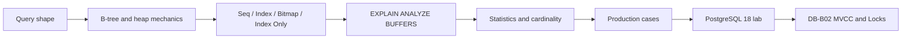

# Databases Map

# Published route — DB-B01



## DB-B01 — Indexes and Query Plans

- [[30_CERTIFICATIONS/Databases/DB-B01/DB-B01 Roadmap]]
- [[10_CONCEPTS/Databases/PostgreSQL Index Mechanics]]
- [[10_CONCEPTS/Databases/PostgreSQL EXPLAIN and Query Plan Analysis]]
- [[30_CERTIFICATIONS/Databases/DB-B01/DB-B01 Cards|DB-B01 — 30 cards]]
- [[40_PRODUCTION_CASES/Databases/Indexes and Query Plans Production Cases|14 production cases]]
- [[50_LABS/Databases/DB-B01/README|PostgreSQL 18 lab]]
- [[01_MAPS/Database Indexes and Query Plans Map.canvas]]
- [[98_SOURCES/PostgreSQL Indexes and Query Plans Sources]]

```text
Canonical notes        2
Visual diagrams       62
Cards                 30
Production cases      14
Lab experiments       10
Canvas maps            1
```

Coverage:

- heap and secondary-index separation;
- B-tree pages, TIDs, equality and range traversal;
- selectivity, cardinality and data skew;
- multicolumn indexes and leading-prefix reasoning;
- PostgreSQL 18 skip-scan boundary;
- ordered indexes and early `LIMIT` stop;
- covering indexes, `INCLUDE`, visibility map and `Heap Fetches`;
- partial and expression indexes;
- bitmap scans and index combination;
- write amplification and HOT-update boundary;
- `EXPLAIN`, `ANALYZE`, `BUFFERS`, rows and loops;
- Seq, Index, Index Only and Bitmap plan nodes;
- `Index Cond`, `Filter`, `Rows Removed`;
- single-column and extended statistics;
- nested-loop, hash and merge joins;
- sort/hash spill and temp I/O;
- OFFSET versus keyset pagination;
- cases where another index cannot remove required large-data work.

# Модель данных и SQL

Planned routes:

- Relational model;
- Normalization and denormalization;
- Joins;
- Aggregation;
- Subqueries and CTE;
- Dynamic queries.

# Transactions and concurrency

Next route:

```text
DB-B02 — Transactions, MVCC and Locks
```

Planned:

- ACID;
- snapshots and tuple visibility;
- READ COMMITTED and REPEATABLE READ;
- Serializable Snapshot Isolation;
- optimistic and pessimistic locking;
- row/table locks;
- lock queues and deadlocks;
- long transactions, vacuum and bloat.

# Scaling and reliability

Future routes:

- Partitioning;
- Sharding;
- Physical replication;
- Logical replication;
- Read replicas;
- Failover;
- Consistency trade-offs.

# DBMS-specific routes

## PostgreSQL

- [[30_CERTIFICATIONS/Databases/DB-B01/DB-B01 Roadmap|DB-B01 — Indexes and Query Plans]]
- DB-B02 — MVCC and Locks — planned.
- DB-B03 — Partitioning — planned.
- DB-B04 — Physical and Logical Replication — planned.

## Oracle

- Execution plans and indexes — planned.
- Undo/MVCC and locking — planned.
- Partitioning — planned.
