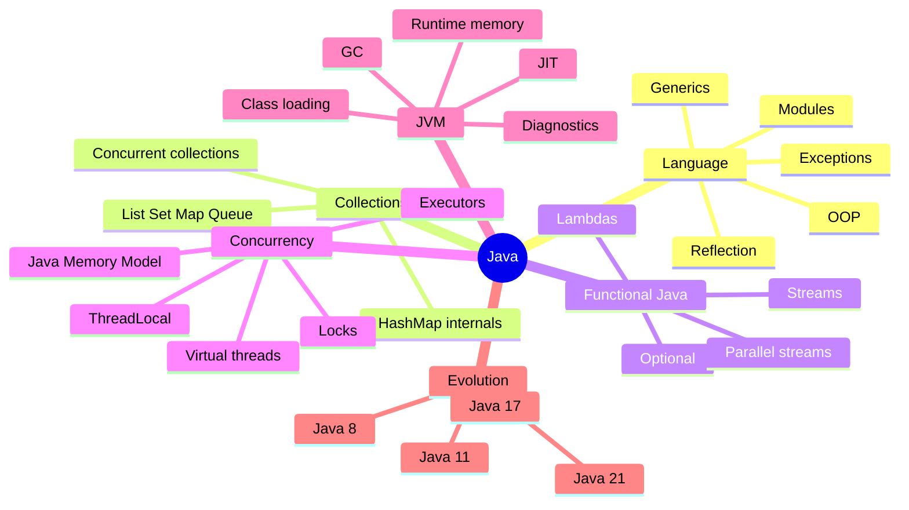

# Java Map

## Основы языка

- Types and variables
- Object-oriented programming
- Exceptions
- Generics
- Annotations
- Reflection
- Modules

## Collections

- List, Set, Map and Queue
- HashMap internals
- Concurrent collections
- Iterators and fail-fast behavior
- Equality and hashing

## Functional Java

- Lambda expressions
- Functional interfaces
- Method references
- Stream API
- Collectors
- Optional
- Parallel streams

## Concurrency

- [[01_MAPS/Java Concurrency Map.canvas]]
- Java Memory Model
- happens-before
- synchronized
- volatile
- Locks
- Atomic classes
- Executors
- CompletableFuture
- ForkJoinPool
- [[10_CONCEPTS/Java/Concurrency/ThreadLocal]]
- Virtual threads
- Structured concurrency

## JVM

- Class loading
- Runtime data areas
- Bytecode
- JIT compilation
- Garbage collectors
- References
- Diagnostics and profiling

## Эволюция Java

- Java 8
- Java 11
- Java 17
- Java 21
- Migration routes
- Removed and deprecated APIs

## Практические маршруты

- Interview questions
- Certification questions
- Code-output questions
- Production cases
- Executable labs
