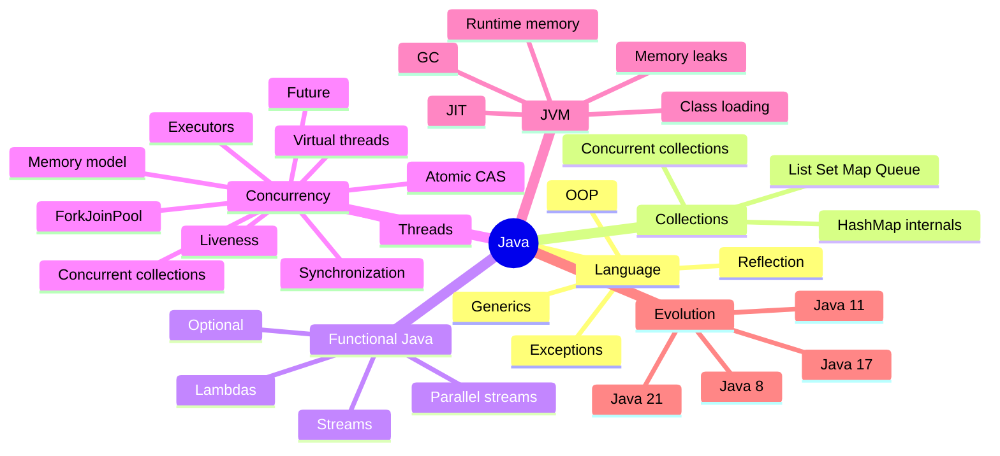

# Java Map

## Concurrency

> [!tip] Рекомендуемый маршрут
> Начни с [[10_CONCEPTS/Java/Concurrency/Concurrency Learning Path|Concurrency Learning Path]], затем используй две Canvas-карты: фундаментальную и advanced.

### Visual maps

- [[01_MAPS/Java Concurrency Map.canvas|Java Concurrency Canvas]]
- [[01_MAPS/Java Advanced Concurrency Map.canvas|Java Advanced Concurrency Canvas]]

### Foundations

- [[10_CONCEPTS/Java/Concurrency/Threads]]
- [[10_CONCEPTS/Java/Concurrency/Visibility Atomicity Ordering]]
- [[10_CONCEPTS/Java/Concurrency/Race Condition]]
- [[10_CONCEPTS/Java/Concurrency/Java Memory Model]]
- [[10_CONCEPTS/Java/Concurrency/Happens-Before]]
- [[10_CONCEPTS/Java/Concurrency/volatile]]
- [[10_CONCEPTS/Java/Concurrency/synchronized]]
- [[10_CONCEPTS/Java/Concurrency/ReentrantLock]]

### Advanced coordination

- [[10_CONCEPTS/Java/Concurrency/Atomic CAS and Counters]]
- [[10_CONCEPTS/Java/Concurrency/Deadlock Livelock and Lock Ordering]]
- [[10_CONCEPTS/Java/Concurrency/Concurrent Collections and Backpressure]]

### Task execution

- [[10_CONCEPTS/Java/Concurrency/ExecutorService]]
- [[10_CONCEPTS/Java/Concurrency/Future]]
- [[10_CONCEPTS/Java/Concurrency/ForkJoinPool]]
- [[10_CONCEPTS/Java/Concurrency/CompletableFuture]]
- [[10_CONCEPTS/Java/Concurrency/ThreadLocal]]
- [[10_CONCEPTS/Java/Concurrency/Virtual Threads]]

### JVM lifecycle risks

- [[10_CONCEPTS/Java/JVM/Memory Leaks]]

### Active recall and labs

- [[20_QUESTIONS/Interview/Java/Concurrency/Advanced Concurrency Recall]]
- [[50_LABS/Java/Concurrency/java8/AdvancedConcurrencyLab.java]]
- [[50_LABS/Java/Concurrency/README]]

## Other Java domains

### Language

- OOP
- Exceptions
- Generics
- Annotations
- Reflection
- Modules

### Collections fundamentals

- List, Set, Map and Queue
- HashMap internals
- equality and hashing
- iterator semantics

### Functional Java

- lambda expressions
- functional interfaces
- Stream API
- collectors
- Optional
- parallel streams

### JVM

- runtime data areas
- class loading
- bytecode and JIT
- garbage collectors
- diagnostics and profiling

### Version evolution

- Java 8
- Java 11
- Java 17
- Java 21
- migration routes

## Practice routes

- [[20_QUESTIONS/Interview/Interview Questions MOC]]
- [[30_CERTIFICATIONS/Certification MOC]]
- Production cases
- Executable labs
