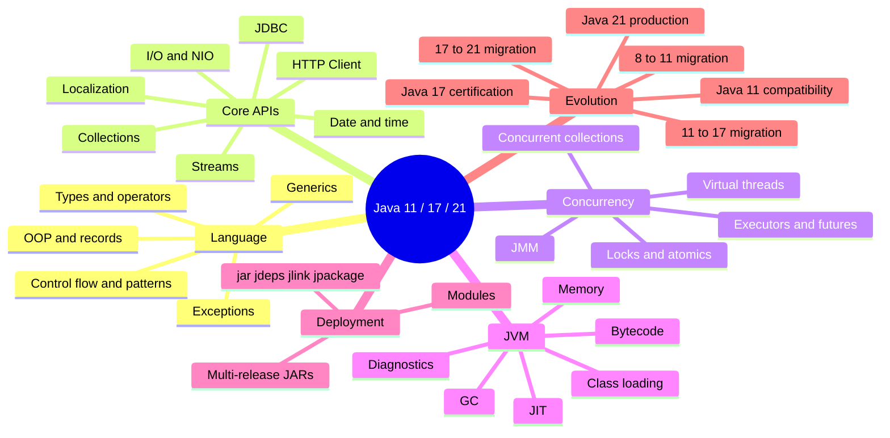

# Java Map

> [!summary]
> Java is taught as one cumulative platform with three explicit LTS roles: Java 11 compatibility baseline, Java 17 certification baseline and Java 21 production baseline. Every detailed route must separate shared semantics from version-specific deltas.

# Primary entry points

- [[00_HOME/Java 11 17 21 Complete Knowledge Program]]
- [[30_CERTIFICATIONS/Java/JAVA-LTS-B01/JAVA-LTS-B01 Roadmap]]
- [[30_CERTIFICATIONS/Java/1Z0-829/Java SE 17 99 Percent Master Roadmap]]
- [[30_CERTIFICATIONS/Java/Concurrency/Java Concurrency 99 Percent Roadmap]]
- [[98_SOURCES/Java 11 17 21 Official Sources]]
- [[00_HOME/Card Review Dashboard]]



# Version roles

| Version | Role | Required knowledge |
|---|---|---|
| Java 11 | Compatibility baseline | Post-Java-8 migration, modules, HTTP Client, removed Java EE/CORBA modules, JFR, TLS and runtime packaging. |
| Java 17 | Certification baseline | Complete `1Z0-829` language/API semantics and all permanent features inherited through Java 17. |
| Java 21 | Production baseline | Virtual threads, record/switch patterns, sequenced collections, modern GC and exact preview/incubator boundaries. |

# JAVA-LTS-B01 — version evolution and migration

- [[10_CONCEPTS/Java/Versions/Java 11 17 21 LTS Evolution]];
- [[30_CERTIFICATIONS/Java/JAVA-LTS-B01/JAVA-LTS-B01 Cards|30 version cards]];
- [[40_PRODUCTION_CASES/Java/Java 11 17 21 Migration Cases|10 migration cases]];
- [[50_LABS/Java/JAVA-LTS-B01/README|JDK 11/17/21 compile-run matrix]];
- [[98_SOURCES/Java 11 17 21 Official Sources]].

Coverage:

```text
feature-state taxonomy
Java 11, 17 and 21 roles
language/API comparison
removed/deprecated modules and tools
--release and compatibility dimensions
8→11, 11→17 and 17→21 migration
virtual-thread resource limits
preview/incubator boundaries
multi-release JAR risks
```

# Complete Java domain model

```text
JAVA-LTS-D01  Language foundations, text and date-time
JAVA-LTS-D02  Control flow and pattern matching
JAVA-LTS-D03  Object model and type system
JAVA-LTS-D04  Generics and type inference
JAVA-LTS-D05  Collections and data structures
JAVA-LTS-D06  Functional Java and Streams
JAVA-LTS-D07  Exceptions and deterministic cleanup
JAVA-LTS-D08  I/O, NIO.2 and serialization
JAVA-LTS-D09  Modules, packaging and deployment
JAVA-LTS-D10  Concurrency and parallelism
JAVA-LTS-D11  JVM, class loading and bytecode
JAVA-LTS-D12  Garbage collection and memory
JAVA-LTS-D13  JIT and performance engineering
JAVA-LTS-D14  Networking and HTTP
JAVA-LTS-D15  Security and cryptography
JAVA-LTS-D16  JDBC and data access
JAVA-LTS-D17  Tooling, observability and diagnostics
JAVA-LTS-D18  Migration and compatibility
```

Machine coverage:

```text
.github/java-version-coverage.json
.github/scripts/audit_java_version_coverage.py
```

# Java Concurrency — visually enriched

> [!tip] Рекомендуемый маршрут
> Начни с [[10_CONCEPTS/Java/Concurrency/Concurrency Learning Path|Concurrency Learning Path]], затем открой [[10_CONCEPTS/Java/Concurrency/Java Concurrency Visual Deep Dive]] и [[01_MAPS/Java Concurrency Visual Atlas.canvas]]. После visual route переходи к canonical notes и lab.

## Visual learning

- [[10_CONCEPTS/Java/Concurrency/Java Concurrency Visual Deep Dive]] — 35 visual models;
- [[01_MAPS/Java Concurrency Visual Atlas.canvas]] — единая learning map;
- [[01_MAPS/Java Concurrency Map.canvas|Java Concurrency Canvas]];
- [[01_MAPS/Java Advanced Concurrency Map.canvas|Java Advanced Concurrency Canvas]].

Visual coverage:

```text
thread lifecycle
program order and happens-before
volatile publication and lost increment
monitor, wait/notify and ReentrantLock
CAS, AtomicReference and LongAdder
ExecutorService, saturation and backpressure
Future and CompletableFuture
ForkJoin work stealing
ThreadLocal leak paths
virtual threads and resource limits
ConcurrentHashMap compound actions
BlockingQueue
Deadlock/livelock/starvation
race and saturation diagnostic trees
```

## Foundations

- [[10_CONCEPTS/Java/Concurrency/Threads]]
- [[10_CONCEPTS/Java/Concurrency/Visibility Atomicity Ordering]]
- [[10_CONCEPTS/Java/Concurrency/Race Condition]]
- [[10_CONCEPTS/Java/Concurrency/Java Memory Model]]
- [[10_CONCEPTS/Java/Concurrency/Happens-Before]]
- [[10_CONCEPTS/Java/Concurrency/volatile]]
- [[10_CONCEPTS/Java/Concurrency/synchronized]]
- [[10_CONCEPTS/Java/Concurrency/ReentrantLock]]

## Advanced coordination

- [[10_CONCEPTS/Java/Concurrency/Atomic CAS and Counters]]
- [[10_CONCEPTS/Java/Concurrency/Deadlock Livelock and Lock Ordering]]
- [[10_CONCEPTS/Java/Concurrency/Concurrent Collections and Backpressure]]

## Task execution

- [[10_CONCEPTS/Java/Concurrency/ExecutorService]]
- [[10_CONCEPTS/Java/Concurrency/Future]]
- [[10_CONCEPTS/Java/Concurrency/ForkJoinPool]]
- [[10_CONCEPTS/Java/Concurrency/CompletableFuture]]
- [[10_CONCEPTS/Java/Concurrency/ThreadLocal]]
- [[10_CONCEPTS/Java/Concurrency/Virtual Threads]]

## JVM lifecycle risks

- [[10_CONCEPTS/Java/JVM/Memory Leaks]]

## Active recall and labs

- [[20_QUESTIONS/Interview/Java/Concurrency/Advanced Concurrency Recall]]
- [[50_LABS/Java/Concurrency/java8/AdvancedConcurrencyLab.java]]
- [[50_LABS/Java/Concurrency/README]]

# Java 17 certification domains

```text
JAVA-B01 Data, Text and Date-Time
JAVA-B02 Control Flow
JAVA-B03 Object Model
JAVA-B04 Exceptions and Resources
JAVA-B05 Collections and Generics
JAVA-B06 Lambdas and Streams
JAVA-B07 Modules and Deployment
JAVA-B08 Concurrency Exam Objectives
JAVA-B09 I/O and NIO.2
JAVA-B10 JDBC
JAVA-B11 Localization
```

Each route must contain:

```text
shared Java model
Java 11 baseline/delta
Java 17 exam baseline
Java 21 production delta
minimum-version examples
compile/output drills
multi-JDK migration notes where applicable
```

# JVM and runtime routes still required

```text
class loading and initialization
bytecode and verification
JIT and deoptimization
G1, ZGC and Generational ZGC
JFR, jcmd, jstack and heap dumps
Native Memory Tracking
JMH and performance methodology
security and cryptography
HTTP Client and networking
```

# Practice routes

- [[20_QUESTIONS/Interview/Interview Questions MOC]]
- [[30_CERTIFICATIONS/Certification MOC]]
- [[00_HOME/Card Review Dashboard]]
- Production cases
- Executable labs
