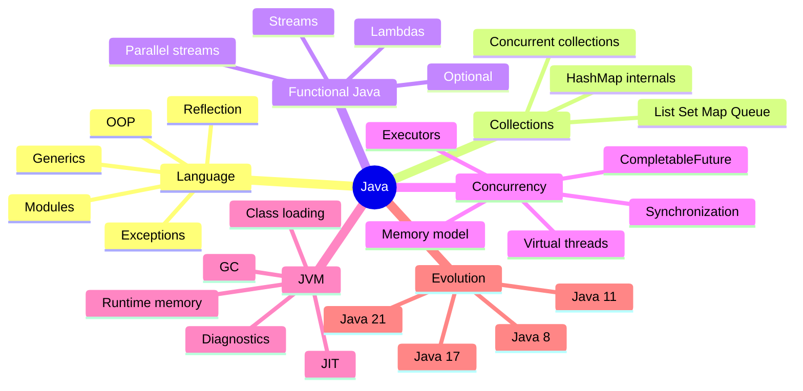

# Java Map

## Основы языка

- Types and variables
- Object-oriented programming
- Exceptions
- Generics
- Annotations
- Reflection
- Modules

## Collections

- List, Set, Map and Queue
- HashMap internals
- Concurrent collections
- Iterators and fail-fast behavior
- Equality and hashing

## Functional Java

- Lambda expressions
- Functional interfaces
- Method references
- Stream API
- Collectors
- Optional
- Parallel streams

## Concurrency

> [!tip] Рекомендуемый вход
> Начни с [[10_CONCEPTS/Java/Concurrency/Concurrency Learning Path|Concurrency Learning Path]], а Canvas используй для пространственной навигации.

- [[01_MAPS/Java Concurrency Map.canvas|Java Concurrency Canvas]]
- [[10_CONCEPTS/Java/Concurrency/Concurrency Learning Path|Concurrency Learning Path]]
- [[10_CONCEPTS/Java/Concurrency/Visibility Atomicity Ordering|Visibility, Atomicity and Ordering]]
- [[10_CONCEPTS/Java/Concurrency/Race Condition|Race Condition]]
- [[10_CONCEPTS/Java/Concurrency/Java Memory Model|Java Memory Model]]
- [[10_CONCEPTS/Java/Concurrency/Happens-Before|Happens-Before]]
- [[10_CONCEPTS/Java/Concurrency/volatile|volatile]]
- [[10_CONCEPTS/Java/Concurrency/synchronized|synchronized]]
- [[10_CONCEPTS/Java/Concurrency/ReentrantLock|ReentrantLock]]
- Atomic classes and CAS
- [[10_CONCEPTS/Java/Concurrency/ExecutorService|ExecutorService]]
- [[10_CONCEPTS/Java/Concurrency/CompletableFuture|CompletableFuture]]
- ForkJoinPool
- [[10_CONCEPTS/Java/Concurrency/ThreadLocal|ThreadLocal]]
- [[10_CONCEPTS/Java/Concurrency/Virtual Threads|Virtual Threads]]
- Structured concurrency
- [[50_LABS/Java/Concurrency/README|Runnable Concurrency Labs]]

### Проверка понимания

- [[20_QUESTIONS/Interview/Java/Concurrency/Why volatile does not make increment atomic]]
- [[20_QUESTIONS/Interview/Java/Concurrency/What does happens-before actually guarantee]]
- [[20_QUESTIONS/Interview/Java/Concurrency/How synchronized provides visibility]]
- [[20_QUESTIONS/Interview/Java/Concurrency/execute vs submit]]
- [[20_QUESTIONS/Interview/Java/Concurrency/thenApply vs thenCompose]]
- [[20_QUESTIONS/Interview/Java/Concurrency/Are virtual threads faster]]

## JVM

- Class loading
- Runtime data areas
- Bytecode
- JIT compilation
- Garbage collectors
- References
- Diagnostics and profiling

## Эволюция Java

- Java 8
- Java 11
- Java 17
- Java 21
- Migration routes
- Removed and deprecated APIs

## Практические маршруты

- [[20_QUESTIONS/Interview/Interview Questions MOC|Interview Questions]]
- [[30_CERTIFICATIONS/Certification MOC|Certification Questions]]
- Code-output questions
- Production cases
- Executable labs
