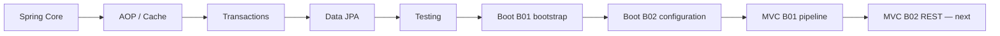

# Spring Map

# Entry points

- [[00_HOME/Certification 99 Percent Readiness Dashboard]]
- [[00_HOME/Card Review Dashboard]]
- [[30_CERTIFICATIONS/Spring/2V0-72.22/Spring 99 Percent Master Roadmap]]
- [[30_CERTIFICATIONS/Spring/2V0-72.22/Spring Core Card Roadmap]]
- [[30_CERTIFICATIONS/Spring/2V0-72.22/Spring AOP and Cache Roadmap]]
- [[30_CERTIFICATIONS/Spring/2V0-72.22/Spring Transaction Management Roadmap]]
- [[30_CERTIFICATIONS/Spring/2V0-72.22/Spring Data JPA Roadmap]]
- [[30_CERTIFICATIONS/Spring/2V0-72.22/Spring Testing Roadmap]]
- [[30_CERTIFICATIONS/Spring/2V0-72.22/SPRING-BOOT-B01/SPRING-BOOT-B01 Roadmap]]
- [[30_CERTIFICATIONS/Spring/2V0-72.22/SPRING-BOOT-B02/SPRING-BOOT-B02 Roadmap]]
- [[30_CERTIFICATIONS/Spring/2V0-72.22/SPRING-MVC-B01/SPRING-MVC-B01 Roadmap]]

# Learning route



# Visual metrics

```text
Spring Core                       26 diagrams
AOP                               20 diagrams
Cache                             27 diagrams
Transactions                      20 diagrams
Data JPA                          31 diagrams
Testing                           24 diagrams
Boot Auto-configuration           31 diagrams
Boot Externalized Configuration   30 diagrams
MVC DispatcherServlet             30 diagrams
Canvas entry maps                  6
---------------------------------------------
Spring visual elements           245
```

Visual maps:

- [[01_MAPS/Spring Core Visual Atlas.canvas]]
- [[01_MAPS/Spring AOP and Cache Visual Atlas.canvas]]
- [[01_MAPS/Spring Boot Auto-configuration Map.canvas]]
- [[01_MAPS/Spring Boot Configuration Map.canvas]]
- [[01_MAPS/Spring MVC DispatcherServlet Map.canvas]]
- [[01_MAPS/Spring Visual Learning Atlas.canvas]]

# Published card routes

| Route | Cards | Status |
|---|---:|---|
| Spring Core | 140 | published; CORE-B01/B04 normalized |
| AOP and Cache | 44 | normalized |
| Transaction Management | 32 | normalized |
| Spring Data JPA | 36 | normalized |
| Spring Testing | 36 | normalized |
| SPRING-BOOT-B01 | 30 | published |
| SPRING-BOOT-B02 | 35 | published |
| SPRING-MVC-B01 | 35 | published |
| **Total** | **388** | |

# Spring Core

- [[10_CONCEPTS/Spring/Core/Spring Core Visual Deep Dive]]
- [[30_CERTIFICATIONS/Spring/2V0-72.22/CORE-B01/CORE-B01 Cards]]
- [[30_CERTIFICATIONS/Spring/2V0-72.22/CORE-B04/CORE-B04 Cards]]

# AOP and Cache

- [[10_CONCEPTS/Spring/AOP/Spring AOP Visual Deep Dive]]
- [[10_CONCEPTS/Spring/Cache/Spring Cache Visual Deep Dive]]
- [[30_CERTIFICATIONS/Spring/2V0-72.22/AOP-B01/AOP-B01 Cards]]
- [[30_CERTIFICATIONS/Spring/2V0-72.22/CACHE-B01/CACHE-B01 Cards]]
- [[40_PRODUCTION_CASES/Spring/AOP and Cache Production Cases]]

# Transaction Management

- [[10_CONCEPTS/Spring/Transactions/Spring Transaction Management Deep Dive]]
- [[10_CONCEPTS/Spring/Transactions/Spring Transaction Management Visual Deep Dive]]
- [[30_CERTIFICATIONS/Spring/2V0-72.22/TX-B01/TX-B01 Cards]]
- [[50_LABS/Spring/TX-B01/README]]

# Spring Data JPA

- [[10_CONCEPTS/Spring/Data/Spring Data JPA Persistence Context and Entity Lifecycle]]
- [[10_CONCEPTS/Spring/Data/Spring Data Repositories Queries and Fetching]]
- [[10_CONCEPTS/Spring/Data/Spring Data JPA Visual Deep Dive]]
- [[30_CERTIFICATIONS/Spring/2V0-72.22/DATA-B01/DATA-B01 Cards]]
- [[50_LABS/Spring/DATA-B01/README]]

# Spring Testing

- [[10_CONCEPTS/Spring/Testing/Spring TestContext and Test Slices]]
- [[10_CONCEPTS/Spring/Testing/Spring Data JPA Testing with Testcontainers]]
- [[10_CONCEPTS/Spring/Testing/Spring Testing Visual Deep Dive]]
- [[30_CERTIFICATIONS/Spring/2V0-72.22/TEST-B01/TEST-B01 Cards]]
- [[50_LABS/Spring/TEST-B01/README]]

# SPRING-BOOT-B01 — Bootstrap and Auto-configuration

- [[30_CERTIFICATIONS/Spring/2V0-72.22/SPRING-BOOT-B01/SPRING-BOOT-B01 Roadmap]]
- [[10_CONCEPTS/Spring/Boot/Spring Boot Bootstrap and Auto-configuration]]
- [[10_CONCEPTS/Spring/Boot/Spring Boot Auto-configuration Visual Deep Dive]]
- [[30_CERTIFICATIONS/Spring/2V0-72.22/SPRING-BOOT-B01/SPRING-BOOT-B01 Cards]]
- [[50_LABS/Spring/SPRING-BOOT-B01/README]]

# SPRING-BOOT-B02 — Externalized Configuration

- [[30_CERTIFICATIONS/Spring/2V0-72.22/SPRING-BOOT-B02/SPRING-BOOT-B02 Roadmap]]
- [[10_CONCEPTS/Spring/Boot/Spring Boot Externalized Configuration and Type-safe Binding]]
- [[10_CONCEPTS/Spring/Boot/Spring Boot Configuration Visual Deep Dive]]
- [[30_CERTIFICATIONS/Spring/2V0-72.22/SPRING-BOOT-B02/SPRING-BOOT-B02 Cards]]
- [[30_CERTIFICATIONS/Spring/2V0-72.22/SPRING-BOOT-B02/SPRING-BOOT-B02 Assessment]]
- [[40_PRODUCTION_CASES/Spring/Spring Boot Configuration Production Cases]]
- [[50_LABS/Spring/SPRING-BOOT-B02/README]]
- [[01_MAPS/Spring Boot Configuration Map.canvas]]
- [[98_SOURCES/Spring Boot Externalized Configuration Sources]]

Objective coverage:

```text
SPRING-1.3.1 external properties
SPRING-1.3.2 profiles
SPRING-6.2.1 property definition/loading options
```

# SPRING-MVC-B01 — DispatcherServlet and Controller Pipeline

- [[30_CERTIFICATIONS/Spring/2V0-72.22/SPRING-MVC-B01/SPRING-MVC-B01 Roadmap]]
- [[10_CONCEPTS/Spring/MVC/DispatcherServlet and Annotated Controller Pipeline]]
- [[10_CONCEPTS/Spring/MVC/Spring MVC DispatcherServlet Visual Deep Dive]]
- [[30_CERTIFICATIONS/Spring/2V0-72.22/SPRING-MVC-B01/SPRING-MVC-B01 Cards]]
- [[30_CERTIFICATIONS/Spring/2V0-72.22/SPRING-MVC-B01/SPRING-MVC-B01 Assessment]]
- [[40_PRODUCTION_CASES/Spring/Spring MVC DispatcherServlet Production Cases]]
- [[50_LABS/Spring/SPRING-MVC-B01/README]]
- [[01_MAPS/Spring MVC DispatcherServlet Map.canvas]]
- [[98_SOURCES/Spring MVC DispatcherServlet Sources]]

Objective coverage:

```text
SPRING-3.1.1 Boot MVC application
SPRING-3.1.2 request-processing lifecycle
SPRING-3.1.3 simple GET REST controller
SPRING-3.1.4 deployment configuration — cards-ready
```

# Next Spring route

```text
SPRING-MVC-B02 — REST Endpoints and HTTP Clients
```

Remaining P0 routes:

```text
SPRING-MVC-B02
SPRING-SEC-B01
SPRING-ACT-B01
SPRING-JDBC-B01
SPRING-WEBTEST-B01
SPRING-SPEL-B01
```

# Backend continuation

- [[30_CERTIFICATIONS/Databases/DB-B01/DB-B01 Roadmap]]
- [[01_MAPS/Database Indexes and Query Plans Map.canvas]]
