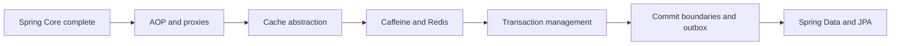

# Spring Map

## Сертификационные маршруты

- [[30_CERTIFICATIONS/Spring/2V0-72.22/Spring Certification Card System]]
- [[30_CERTIFICATIONS/Spring/2V0-72.22/Spring Core Card Roadmap]]
- [[30_CERTIFICATIONS/Spring/2V0-72.22/Spring AOP and Cache Roadmap]]
- [[30_CERTIFICATIONS/Spring/2V0-72.22/Spring Transaction Management Roadmap]]
- [[00_HOME/Review Dashboard]]



# Spring Core — completed route

| Batch | Cards | Focus |
|---|---:|---|
| [[30_CERTIFICATIONS/Spring/2V0-72.22/CORE-B01/CORE-B01 Cards|CORE-B01]] | 20 | IoC, beans, registration, injection |
| [[30_CERTIFICATIONS/Spring/2V0-72.22/CORE-B02/CORE-B02 Cards|CORE-B02]] | 24 | candidate resolution and optionality |
| [[30_CERTIFICATIONS/Spring/2V0-72.22/CORE-B03/CORE-B03 Cards|CORE-B03]] | 24 | lifecycle, initialization and destruction |
| [[30_CERTIFICATIONS/Spring/2V0-72.22/CORE-B04/CORE-B04 Cards|CORE-B04]] | 24 | extension points and early references |
| [[30_CERTIFICATIONS/Spring/2V0-72.22/CORE-B05/CORE-B05 Cards|CORE-B05]] | 24 | configuration, profiles and properties |
| [[30_CERTIFICATIONS/Spring/2V0-72.22/CORE-B06/CORE-B06 Cards|CORE-B06]] | 24 | scopes, FactoryBean, cycles and hierarchy |

```text
Spring Core total: 140 cards
```

## Core visual maps

- [[01_MAPS/Spring Core Foundation Map.canvas]]
- [[01_MAPS/Spring Dependency Resolution Map.canvas]]
- [[01_MAPS/Spring Bean Lifecycle Map.canvas]]
- [[01_MAPS/Spring Container Extension Points Map.canvas]]
- [[01_MAPS/Spring Configuration and Profiles Map.canvas]]
- [[01_MAPS/Spring Advanced Core Map.canvas]]

# AOP and Proxies — published

- [[10_CONCEPTS/Spring/AOP/Spring AOP Proxy Mechanics]]
- [[01_MAPS/Spring AOP and Caching Map.canvas]]
- [[30_CERTIFICATIONS/Spring/2V0-72.22/AOP-B01/AOP-B01 Cards|AOP-B01 — 24 cards]]
- [[50_LABS/Spring/AOP-B01/README]]
- [[40_PRODUCTION_CASES/Spring/AOP and Cache Production Cases]]

Coverage:

- aspect, join point, pointcut, advice and advisor;
- JDK dynamic proxy and CGLIB;
- proxy selection;
- self-invocation;
- final/private method boundaries;
- around advice and exception propagation;
- advisor ordering;
- runtime proxy diagnostics;
- real `@Transactional` and `@Async` proxy behavior;
- relationship to method security and caching.

# Spring Cache — published

- [[10_CONCEPTS/Spring/Cache/Spring Cache with Caffeine and Redis]]
- [[30_CERTIFICATIONS/Spring/2V0-72.22/CACHE-B01/CACHE-B01 Cards|CACHE-B01 — 20 cards]]
- [[50_LABS/Spring/CACHE-B01/README]]
- [[50_LABS/Spring/CACHE-B01/compose.yaml|Redis Docker Compose]]
- [[40_PRODUCTION_CASES/Spring/AOP and Cache Production Cases]]
- [[98_SOURCES/Spring AOP and Cache Sources]]

Coverage:

- cache abstraction and `CacheManager`;
- `@Cacheable`, `@CachePut`, `@CacheEvict`;
- keys, tenant isolation, condition and unless;
- self-invocation and cache proxy;
- `sync=true` and stampede limits;
- negative caching;
- Caffeine local cache, expiration and statistics;
- Redis shared cache, TTL, prefix and JSON serialization;
- Redis outage and DB fallback risk;
- Caffeine L1 + Redis L2 invalidation.

```text
AOP-B01    24 cards
CACHE-B01  20 cards
TOTAL      44 cards
```

# Transaction Management — published

- [[10_CONCEPTS/Spring/Transactions/Spring Transaction Management Deep Dive]]
- [[10_CONCEPTS/Spring/Transactions/Transactional Outbox and Commit Boundaries]]
- [[01_MAPS/Spring Transaction Management Map.canvas]]
- [[30_CERTIFICATIONS/Spring/2V0-72.22/TX-B01/TX-B01 Cards|TX-B01 — 32 cards]]
- [[40_PRODUCTION_CASES/Spring/Transaction Management Production Cases]]
- [[50_LABS/Spring/TX-B01/README]]
- [[98_SOURCES/Spring Transaction Management Sources]]

Coverage:

- transaction interceptor and manager selection;
- logical vs physical transactions;
- `REQUIRED` and `UnexpectedRollbackException`;
- `REQUIRES_NEW` and connection-pool pressure;
- `NESTED` savepoints;
- `SUPPORTS`, `MANDATORY`, `NOT_SUPPORTED`, `NEVER`;
- isolation phenomena and database-specific semantics;
- rollback rules for runtime and checked exceptions;
- read-only and timeout boundaries;
- `TransactionTemplate`;
- multiple transaction managers;
- synchronization callbacks and transactional events;
- database/cache ordering;
- async/thread boundaries;
- Transactional Outbox, idempotency and relay design.

```text
Spring Core  140 cards
AOP/Cache     44 cards
TX-B01        32 cards
----------------------
TOTAL        216 cards
```

# Next route — Spring Data and JPA

- persistence context;
- entity lifecycle states;
- dirty checking;
- flush vs commit;
- optimistic and pessimistic locking;
- repository proxies;
- query derivation;
- specifications and dynamic queries;
- projections;
- pagination;
- N+1;
- fetch joins and entity graphs;
- transaction boundaries around repositories.

# Web and Boot

- Spring MVC and WebFlux;
- validation and exception handling;
- auto-configuration;
- configuration properties;
- actuator;
- testing;
- security.
