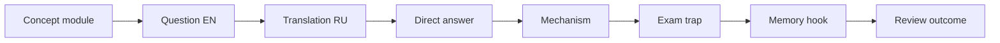

# Spring Map

## Сертификационный маршрут

- [[30_CERTIFICATIONS/Spring/2V0-72.22/Spring Certification Card System]]
- [[30_CERTIFICATIONS/Spring/2V0-72.22/Spring Core Card Roadmap]]
- [[30_CERTIFICATIONS/Spring/2V0-72.22/CORE-B01/CORE-B01 Cards|CORE-B01 — 20 cards]]
- [[01_MAPS/Spring Core Foundation Map.canvas]]

## Spring Core — published foundation

- [[10_CONCEPTS/Spring/Core/Spring Core Foundations]]
  - IoC vs DI;
  - Spring bean;
  - BeanDefinition;
  - BeanFactory vs ApplicationContext;
  - component scanning and stereotypes;
  - `@Bean` vs `@Component`;
  - `@Configuration`;
  - constructor, setter and field injection.

## Next Spring Core batch

`CORE-B02`:

- candidate resolution;
- `@Primary`;
- `@Qualifier`;
- bean name fallback;
- collection injection;
- optional dependencies.

## AOP and proxies

- join point, pointcut and advice;
- JDK dynamic proxy;
- CGLIB;
- self-invocation;
- proxy limitations;
- aspect ordering.

## Transactions

- `@Transactional`;
- propagation;
- isolation;
- rollback rules;
- read-only;
- transaction managers;
- programmatic transactions.

## Data access

- Spring JDBC;
- Spring Data repositories;
- JPA lifecycle;
- query derivation;
- specifications;
- pagination and projections.

## Web and Boot

- Spring MVC and WebFlux;
- validation and exception handling;
- auto-configuration;
- configuration properties;
- actuator;
- caching;
- testing;
- security.
