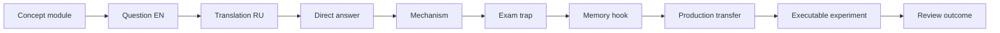

# Spring Map

## Сертификационный маршрут

- [[30_CERTIFICATIONS/Spring/2V0-72.22/Spring Certification Card System]]
- [[30_CERTIFICATIONS/Spring/2V0-72.22/Spring Core Card Roadmap]]
- [[30_CERTIFICATIONS/Spring/2V0-72.22/CORE-B01/CORE-B01 Cards|CORE-B01 — 20 cards]]
- [[30_CERTIFICATIONS/Spring/2V0-72.22/CORE-B02/CORE-B02 Cards|CORE-B02 — 24 cards]]
- [[30_CERTIFICATIONS/Spring/2V0-72.22/CORE-B03/CORE-B03 Cards|CORE-B03 — 24 cards]]
- [[30_CERTIFICATIONS/Spring/2V0-72.22/CORE-B04/CORE-B04 Cards|CORE-B04 — 24 cards]]
- [[00_HOME/Review Dashboard]]

## Spring Core — published modules

### CORE-B01: container and registration

- [[10_CONCEPTS/Spring/Core/Spring Core Foundations]]
- [[01_MAPS/Spring Core Foundation Map.canvas]]
- [[30_CERTIFICATIONS/Spring/2V0-72.22/CORE-B01/CORE-B01 Cards]]

Покрытие:

- IoC vs DI;
- Spring bean и BeanDefinition;
- BeanFactory vs ApplicationContext;
- component scanning and stereotypes;
- `@Bean`, `@Component`, `@Configuration`;
- constructor, setter и field injection.

### CORE-B02: dependency resolution

- [[10_CONCEPTS/Spring/Core/Dependency Resolution and Optional Injection]]
- [[01_MAPS/Spring Dependency Resolution Map.canvas]]
- [[30_CERTIFICATIONS/Spring/2V0-72.22/CORE-B02/CORE-B02 Cards]]
- [[40_PRODUCTION_CASES/Spring/Dependency Resolution Production Cases]]
- [[50_LABS/Spring/Core-B02/README]]

Покрытие:

- candidate resolution;
- `@Primary`;
- `@Qualifier` and custom qualifiers;
- bean-name fallback;
- collection/map injection;
- strategy ordering;
- optional dependencies;
- `ObjectProvider`;
- constructor resolution;
- generics as qualifiers.

### CORE-B03: bean lifecycle

- [[10_CONCEPTS/Spring/Core/Bean Lifecycle from Definition to Destruction]]
- [[01_MAPS/Spring Bean Lifecycle Map.canvas]]
- [[30_CERTIFICATIONS/Spring/2V0-72.22/CORE-B03/CORE-B03 Cards]]
- [[40_PRODUCTION_CASES/Spring/Bean Lifecycle Production Cases]]
- [[50_LABS/Spring/Core-B03/README]]

Покрытие:

- BeanDefinition to raw instance;
- instantiation vs initialization;
- dependency population;
- aware callbacks;
- BPP before/after initialization;
- `@PostConstruct`, `afterPropertiesSet()`, custom init;
- proxy publication;
- destruction callbacks and prototype boundary.

### CORE-B04: container extension points

- [[10_CONCEPTS/Spring/Core/Container Extension Points]]
- [[01_MAPS/Spring Container Extension Points Map.canvas]]
- [[30_CERTIFICATIONS/Spring/2V0-72.22/CORE-B04/CORE-B04 Cards]]
- [[40_PRODUCTION_CASES/Spring/Container Extension Point Production Cases]]
- [[50_LABS/Spring/Core-B04/README]]

Покрытие:

- metadata plane vs instance plane;
- `BeanDefinitionRegistryPostProcessor`;
- `BeanFactoryPostProcessor`;
- `BeanPostProcessor` and proxy publication;
- processor ordering and programmatic registration;
- early bean creation and auto-proxy eligibility;
- `InstantiationAwareBeanPostProcessor`;
- `SmartInstantiationAwareBeanPostProcessor`;
- `DestructionAwareBeanPostProcessor`;
- custom annotations, dynamic definitions and proxy patterns.

## Next Spring Core batch

`CORE-B05 — Configuration and Profiles`:

- full vs lite `@Configuration`;
- `proxyBeanMethods`;
- inter-bean method calls;
- `@Import`;
- component scanning boundaries;
- profiles;
- Environment;
- property sources and precedence;
- placeholder resolution;
- type-safe configuration.

## AOP and proxies

- join point, pointcut and advice;
- JDK dynamic proxy;
- CGLIB;
- self-invocation;
- proxy limitations;
- aspect ordering.

## Transactions

- `@Transactional`;
- propagation;
- isolation;
- rollback rules;
- read-only;
- transaction managers;
- programmatic transactions.

## Data access

- Spring JDBC;
- Spring Data repositories;
- JPA lifecycle;
- query derivation;
- specifications;
- pagination and projections.

## Web and Boot

- Spring MVC and WebFlux;
- validation and exception handling;
- auto-configuration;
- configuration properties;
- actuator;
- caching;
- testing;
- security.
