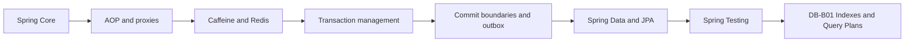

# Spring Map

# Certification routes

- [[30_CERTIFICATIONS/Spring/2V0-72.22/Spring Certification Card System]]
- [[30_CERTIFICATIONS/Spring/2V0-72.22/Spring Core Card Roadmap]]
- [[30_CERTIFICATIONS/Spring/2V0-72.22/Spring AOP and Cache Roadmap]]
- [[30_CERTIFICATIONS/Spring/2V0-72.22/Spring Transaction Management Roadmap]]
- [[30_CERTIFICATIONS/Spring/2V0-72.22/Spring Data JPA Roadmap]]
- [[30_CERTIFICATIONS/Spring/2V0-72.22/Spring Testing Roadmap]]
- [[00_HOME/Review Dashboard]]

# Visual learning entry points

- [[01_MAPS/Spring Visual Learning Atlas.canvas]]
- [[01_MAPS/Spring Core Visual Atlas.canvas]]
- [[01_MAPS/Spring AOP and Cache Visual Atlas.canvas]]
- [[90_TEMPLATES/Pedagogical Visual Standard]]
- [[99_AUDITS/Pedagogical Visual Enrichment Pass]]

```text
Spring Core Visual Deep Dive   26 diagrams
AOP Visual Deep Dive           20 diagrams
Cache Visual Deep Dive         27 diagrams
Transactions Visual Deep Dive  20 diagrams
Data JPA Visual Deep Dive      31 diagrams
Testing Visual Deep Dive       24 diagrams
Standard example                1 diagram
Canvas atlases                  3 maps
------------------------------------------
Spring visual elements        152
```



# Spring Core — completed and visually enriched

## Visual route

- [[10_CONCEPTS/Spring/Core/Spring Core Visual Deep Dive]] — 26 models;
- [[01_MAPS/Spring Core Visual Atlas.canvas]];
- [[01_MAPS/Spring Core Foundation Map.canvas]];
- [[01_MAPS/Spring Dependency Resolution Map.canvas]];
- [[01_MAPS/Spring Bean Lifecycle Map.canvas]];
- [[01_MAPS/Spring Container Extension Points Map.canvas]];
- [[01_MAPS/Spring Configuration and Profiles Map.canvas]];
- [[01_MAPS/Spring Advanced Core Map.canvas]].

Visual coverage:

```text
configuration metadata → BeanDefinition
IoC container pipeline
candidate-resolution decision tree
constructor and collection injection
optional dependencies and ObjectProvider
bean lifecycle timeline
BFPP versus BPP
proxy creation point
singleton/prototype/request scopes
prototype-in-singleton trap
FactoryBean product/factory model
@Configuration proxyBeanMethods
profiles and conditions
property precedence
constructor cycles and early references
parent/child contexts
startup diagnostic tree
```

## Card batches

| Batch | Cards | Focus |
|---|---:|---|
| [[30_CERTIFICATIONS/Spring/2V0-72.22/CORE-B01/CORE-B01 Cards|CORE-B01]] | 20 | IoC, beans, registration, injection |
| [[30_CERTIFICATIONS/Spring/2V0-72.22/CORE-B02/CORE-B02 Cards|CORE-B02]] | 24 | candidate resolution and optionality |
| [[30_CERTIFICATIONS/Spring/2V0-72.22/CORE-B03/CORE-B03 Cards|CORE-B03]] | 24 | lifecycle, initialization and destruction |
| [[30_CERTIFICATIONS/Spring/2V0-72.22/CORE-B04/CORE-B04 Cards|CORE-B04]] | 24 | extension points and early references |
| [[30_CERTIFICATIONS/Spring/2V0-72.22/CORE-B05/CORE-B05 Cards|CORE-B05]] | 24 | configuration, profiles and properties |
| [[30_CERTIFICATIONS/Spring/2V0-72.22/CORE-B06/CORE-B06 Cards|CORE-B06]] | 24 | scopes, FactoryBean, cycles and hierarchy |

```text
Spring Core total: 140 cards
```

# AOP and Proxies — published, normalized and visually enriched

- [[10_CONCEPTS/Spring/AOP/Spring AOP Proxy Mechanics]]
- [[10_CONCEPTS/Spring/AOP/Spring AOP Visual Deep Dive]]
- [[01_MAPS/Spring AOP and Caching Map.canvas]]
- [[01_MAPS/Spring AOP and Cache Visual Atlas.canvas]]
- [[30_CERTIFICATIONS/Spring/2V0-72.22/AOP-B01/AOP-B01 Cards|AOP-B01 — 24 cards]]
- [[50_LABS/Spring/AOP-B01/README]]
- [[40_PRODUCTION_CASES/Spring/AOP and Cache Production Cases]]

Coverage: proxy creation, JDK/CGLIB, self-invocation, advisor ordering, exception propagation, async/security/transaction boundaries and runtime diagnostics.

# Spring Cache — published, normalized and visually enriched

- [[10_CONCEPTS/Spring/Cache/Spring Cache with Caffeine and Redis]]
- [[10_CONCEPTS/Spring/Cache/Spring Cache Visual Deep Dive]]
- [[30_CERTIFICATIONS/Spring/2V0-72.22/CACHE-B01/CACHE-B01 Cards|CACHE-B01 — 20 cards]]
- [[50_LABS/Spring/CACHE-B01/README]]
- [[50_LABS/Spring/CACHE-B01/compose.yaml|Redis Docker Compose]]
- [[98_SOURCES/Spring AOP and Cache Sources]]

Coverage: cache interception, keys, stampede, Caffeine locality, Redis serialization/TTL, outage cascade and L1/L2 invalidation.

# Transaction Management — published and visually enriched

- [[10_CONCEPTS/Spring/Transactions/Spring Transaction Management Deep Dive]]
- [[10_CONCEPTS/Spring/Transactions/Spring Transaction Management Visual Deep Dive]]
- [[10_CONCEPTS/Spring/Transactions/Transactional Outbox and Commit Boundaries]]
- [[01_MAPS/Spring Transaction Management Map.canvas]]
- [[30_CERTIFICATIONS/Spring/2V0-72.22/TX-B01/TX-B01 Cards|TX-B01 — 32 cards]]
- [[40_PRODUCTION_CASES/Spring/Transaction Management Production Cases]]
- [[50_LABS/Spring/TX-B01/README]]

Coverage: logical/physical transactions, propagation, rollback-only, savepoints, isolation, callbacks, async boundaries and outbox.

# Spring Data and JPA — published and visually enriched

- [[10_CONCEPTS/Spring/Data/Spring Data JPA Persistence Context and Entity Lifecycle]]
- [[10_CONCEPTS/Spring/Data/Spring Data Repositories Queries and Fetching]]
- [[10_CONCEPTS/Spring/Data/Spring Data JPA Visual Deep Dive]]
- [[01_MAPS/Spring Data JPA Map.canvas]]
- [[30_CERTIFICATIONS/Spring/2V0-72.22/DATA-B01/DATA-B01 Cards|DATA-B01 — 36 cards]]
- [[40_PRODUCTION_CASES/Spring/Spring Data JPA Production Cases]]
- [[50_LABS/Spring/DATA-B01/README]]

Coverage: entity states, identity map, dirty checking, flush, merge, queries, projections, pagination, N+1, fetch plans and locking.

# Spring Testing — published and visually enriched

- [[10_CONCEPTS/Spring/Testing/Spring TestContext and Test Slices]]
- [[10_CONCEPTS/Spring/Testing/Spring Data JPA Testing with Testcontainers]]
- [[10_CONCEPTS/Spring/Testing/Spring Testing Visual Deep Dive]]
- [[01_MAPS/Spring Testing Map.canvas]]
- [[30_CERTIFICATIONS/Spring/2V0-72.22/TEST-B01/TEST-B01 Cards|TEST-B01 — 36 cards]]
- [[40_PRODUCTION_CASES/Spring/Spring Testing Production Cases]]
- [[50_LABS/Spring/TEST-B01/README]]

Coverage: TestContext, slices, transaction proof, commit boundaries, H2/PostgreSQL and Testcontainers.

```text
Spring Core               140
AOP and Cache               44
Transaction Management      32
Spring Data and JPA          36
Spring Testing               36
-------------------------------
TOTAL                       288 cards
```

# Published backend continuation

- [[30_CERTIFICATIONS/Databases/DB-B01/DB-B01 Roadmap|DB-B01 — Indexes and Query Plans]]
- [[01_MAPS/Database Indexes and Query Plans Map.canvas]]

# Future Spring routes

- Spring Boot internals and auto-configuration;
- Spring MVC and WebFlux;
- validation and exception handling;
- Spring Security;
- API testing.
