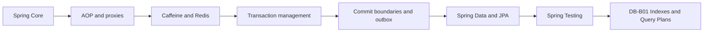

# Spring Map

## Сертификационные маршруты

- [[30_CERTIFICATIONS/Spring/2V0-72.22/Spring Certification Card System]]
- [[30_CERTIFICATIONS/Spring/2V0-72.22/Spring Core Card Roadmap]]
- [[30_CERTIFICATIONS/Spring/2V0-72.22/Spring AOP and Cache Roadmap]]
- [[30_CERTIFICATIONS/Spring/2V0-72.22/Spring Transaction Management Roadmap]]
- [[30_CERTIFICATIONS/Spring/2V0-72.22/Spring Data JPA Roadmap]]
- [[30_CERTIFICATIONS/Spring/2V0-72.22/Spring Testing Roadmap]]
- [[00_HOME/Review Dashboard]]

## Visual learning entry points

- [[01_MAPS/Spring Visual Learning Atlas.canvas]]
- [[01_MAPS/Spring AOP and Cache Visual Atlas.canvas]]
- [[90_TEMPLATES/Pedagogical Visual Standard]]
- [[99_AUDITS/Pedagogical Visual Enrichment Pass]]

```text
AOP Visual Deep Dive          20 diagrams
Cache Visual Deep Dive        27 diagrams
Transactions Visual Deep Dive 20 diagrams
Data JPA Visual Deep Dive     31 diagrams
Testing Visual Deep Dive      24 diagrams
Standard example               1 diagram
Canvas atlases                 2 maps
-----------------------------------------
Total new visual elements    125
```



# Spring Core — completed

| Batch | Cards | Focus |
|---|---:|---|
| [[30_CERTIFICATIONS/Spring/2V0-72.22/CORE-B01/CORE-B01 Cards|CORE-B01]] | 20 | IoC, beans, registration, injection |
| [[30_CERTIFICATIONS/Spring/2V0-72.22/CORE-B02/CORE-B02 Cards|CORE-B02]] | 24 | candidate resolution and optionality |
| [[30_CERTIFICATIONS/Spring/2V0-72.22/CORE-B03/CORE-B03 Cards|CORE-B03]] | 24 | lifecycle, initialization and destruction |
| [[30_CERTIFICATIONS/Spring/2V0-72.22/CORE-B04/CORE-B04 Cards|CORE-B04]] | 24 | extension points and early references |
| [[30_CERTIFICATIONS/Spring/2V0-72.22/CORE-B05/CORE-B05 Cards|CORE-B05]] | 24 | configuration, profiles and properties |
| [[30_CERTIFICATIONS/Spring/2V0-72.22/CORE-B06/CORE-B06 Cards|CORE-B06]] | 24 | scopes, FactoryBean, cycles and hierarchy |

```text
Spring Core total: 140 cards
```

## Core visual maps

- [[01_MAPS/Spring Core Foundation Map.canvas]]
- [[01_MAPS/Spring Dependency Resolution Map.canvas]]
- [[01_MAPS/Spring Bean Lifecycle Map.canvas]]
- [[01_MAPS/Spring Container Extension Points Map.canvas]]
- [[01_MAPS/Spring Configuration and Profiles Map.canvas]]
- [[01_MAPS/Spring Advanced Core Map.canvas]]

# AOP and Proxies — published, normalized and visually enriched

- [[10_CONCEPTS/Spring/AOP/Spring AOP Proxy Mechanics]]
- [[10_CONCEPTS/Spring/AOP/Spring AOP Visual Deep Dive]]
- [[01_MAPS/Spring AOP and Caching Map.canvas]]
- [[01_MAPS/Spring AOP and Cache Visual Atlas.canvas]]
- [[30_CERTIFICATIONS/Spring/2V0-72.22/AOP-B01/AOP-B01 Cards|AOP-B01 — 24 cards]]
- [[50_LABS/Spring/AOP-B01/README]]
- [[40_PRODUCTION_CASES/Spring/AOP and Cache Production Cases]]

Coverage:

- aspect, join point, pointcut, advice and advisor;
- JDK dynamic proxy and CGLIB;
- proxy selection;
- self-invocation;
- final/private method boundaries;
- advisor ordering and exception propagation;
- runtime diagnostics;
- `@Transactional`, `@Async`, security and cache proxy boundaries;
- 20 visual models including sequence, class, failure and diagnostic diagrams.

# Spring Cache — published, normalized and visually enriched

- [[10_CONCEPTS/Spring/Cache/Spring Cache with Caffeine and Redis]]
- [[10_CONCEPTS/Spring/Cache/Spring Cache Visual Deep Dive]]
- [[30_CERTIFICATIONS/Spring/2V0-72.22/CACHE-B01/CACHE-B01 Cards|CACHE-B01 — 20 cards]]
- [[50_LABS/Spring/CACHE-B01/README]]
- [[50_LABS/Spring/CACHE-B01/compose.yaml|Redis Docker Compose]]
- [[98_SOURCES/Spring AOP and Cache Sources]]

Coverage:

- Spring Cache abstraction;
- `@Cacheable`, `@CachePut`, `@CacheEvict`;
- cache keys and tenant isolation;
- stampede and `sync=true` boundaries;
- Caffeine local cache;
- Redis TTL, prefix and serialization;
- Redis outage policy;
- Caffeine L1 + Redis L2 invalidation;
- 27 visual models including topology, timeline, stampede and diagnostic diagrams.

```text
AOP-B01    24 cards
CACHE-B01  20 cards
TOTAL      44 cards
```

# Transaction Management — published and visually enriched

- [[10_CONCEPTS/Spring/Transactions/Spring Transaction Management Deep Dive]]
- [[10_CONCEPTS/Spring/Transactions/Spring Transaction Management Visual Deep Dive]]
- [[10_CONCEPTS/Spring/Transactions/Transactional Outbox and Commit Boundaries]]
- [[01_MAPS/Spring Transaction Management Map.canvas]]
- [[30_CERTIFICATIONS/Spring/2V0-72.22/TX-B01/TX-B01 Cards|TX-B01 — 32 cards]]
- [[40_PRODUCTION_CASES/Spring/Transaction Management Production Cases]]
- [[50_LABS/Spring/TX-B01/README]]
- [[98_SOURCES/Spring Transaction Management Sources]]

Coverage:

- logical vs physical transactions;
- all propagation modes;
- rollback-only and `UnexpectedRollbackException`;
- isolation and locking boundaries;
- checked/runtime rollback rules;
- `TransactionTemplate`;
- multiple managers;
- callbacks and transactional events;
- cache/database ordering;
- async/thread boundaries;
- Transactional Outbox and idempotency;
- 20 visual models including propagation timelines, savepoints, pool pressure and outbox.

# Spring Data and JPA — published and visually enriched

- [[10_CONCEPTS/Spring/Data/Spring Data JPA Persistence Context and Entity Lifecycle]]
- [[10_CONCEPTS/Spring/Data/Spring Data Repositories Queries and Fetching]]
- [[10_CONCEPTS/Spring/Data/Spring Data JPA Visual Deep Dive]]
- [[01_MAPS/Spring Data JPA Map.canvas]]
- [[30_CERTIFICATIONS/Spring/2V0-72.22/DATA-B01/DATA-B01 Cards|DATA-B01 — 36 cards]]
- [[40_PRODUCTION_CASES/Spring/Spring Data JPA Production Cases]]
- [[50_LABS/Spring/DATA-B01/README]]
- [[98_SOURCES/Spring Data JPA Sources]]

Coverage:

- persistence context and identity map;
- transient, managed, detached and removed entities;
- dirty checking and write-behind;
- flush vs commit;
- `persist()` vs `merge()`;
- repository proxy and `SimpleJpaRepository`;
- derived queries and `@Query`;
- `@Modifying` and stale persistence context;
- Specifications and dynamic query;
- projections;
- `Page` vs `Slice`;
- N+1;
- fetch joins and `@EntityGraph`;
- optimistic and pessimistic locking;
- service transaction boundaries around repositories;
- 31 visual models including entity state machine, SQL timelines, fetch plans and pagination.

# Spring Testing — published and visually enriched

- [[10_CONCEPTS/Spring/Testing/Spring TestContext and Test Slices]]
- [[10_CONCEPTS/Spring/Testing/Spring Data JPA Testing with Testcontainers]]
- [[10_CONCEPTS/Spring/Testing/Spring Testing Visual Deep Dive]]
- [[01_MAPS/Spring Testing Map.canvas]]
- [[30_CERTIFICATIONS/Spring/2V0-72.22/TEST-B01/TEST-B01 Cards|TEST-B01 — 36 cards]]
- [[40_PRODUCTION_CASES/Spring/Spring Testing Production Cases]]
- [[50_LABS/Spring/TEST-B01/README]]
- [[98_SOURCES/Spring Testing Sources]]

Coverage:

- Spring TestContext lifecycle;
- `TestContextManager` and `TestExecutionListener`;
- context caching and `@DirtiesContext`;
- unit vs slice vs full-context tests;
- `@DataJpaTest` and `TestEntityManager`;
- test-managed transaction and default rollback;
- `@Commit`, `@Rollback`, `TestTransaction`;
- flush/clear database proof;
- preemptive timeout thread boundary;
- PostgreSQL Testcontainers;
- dynamic datasource properties;
- real-dialect native query tests;
- N+1 and SQL-count regression tests;
- service transaction tests without test-level transaction;
- 24 visual models including context lifecycle, transaction topology and container boundaries.

```text
Spring Core               140
AOP and Cache               44
Transaction Management      32
Spring Data and JPA          36
Spring Testing               36
-------------------------------
TOTAL                       288 cards
```

# Backend next route — DB-B01

- B-tree structure and page access;
- selectivity and cardinality;
- composite-index ordering;
- index-only and bitmap scans;
- PostgreSQL `EXPLAIN (ANALYZE, BUFFERS)`;
- estimation errors and stale statistics;
- cases where indexes stop helping;
- visual standard: tree, page, plan, scan, timeline and diagnostic diagrams.

# Future Spring routes

- Spring Boot internals and auto-configuration;
- Spring MVC and WebFlux;
- validation and exception handling;
- Spring Security;
- API testing.
