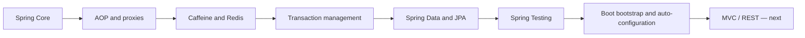

# Spring Map

# Certification entry points

- [[00_HOME/Certification 99 Percent Readiness Dashboard]]
- [[30_CERTIFICATIONS/Spring/2V0-72.22/Spring 99 Percent Master Roadmap]]
- [[30_CERTIFICATIONS/Spring/2V0-72.22/Spring Certification Card System]]
- [[30_CERTIFICATIONS/Spring/2V0-72.22/Spring Core Card Roadmap]]
- [[30_CERTIFICATIONS/Spring/2V0-72.22/Spring AOP and Cache Roadmap]]
- [[30_CERTIFICATIONS/Spring/2V0-72.22/Spring Transaction Management Roadmap]]
- [[30_CERTIFICATIONS/Spring/2V0-72.22/Spring Data JPA Roadmap]]
- [[30_CERTIFICATIONS/Spring/2V0-72.22/Spring Testing Roadmap]]
- [[30_CERTIFICATIONS/Spring/2V0-72.22/SPRING-BOOT-B01/SPRING-BOOT-B01 Roadmap]]
- [[00_HOME/Review Dashboard]]

# Visual learning entry points

- [[01_MAPS/Spring Visual Learning Atlas.canvas]]
- [[01_MAPS/Spring Core Visual Atlas.canvas]]
- [[01_MAPS/Spring AOP and Cache Visual Atlas.canvas]]
- [[01_MAPS/Spring Boot Auto-configuration Map.canvas]]
- [[90_TEMPLATES/Pedagogical Visual Standard]]

```text
Spring Core Visual Deep Dive       26 diagrams
AOP Visual Deep Dive               20 diagrams
Cache Visual Deep Dive             27 diagrams
Transactions Visual Deep Dive      20 diagrams
Data JPA Visual Deep Dive          31 diagrams
Testing Visual Deep Dive           24 diagrams
Boot Auto-configuration Visual     31 diagrams
Standard example                    1 diagram
Canvas atlases                      4 maps
---------------------------------------------
Spring visual elements            184
```



# Spring Core — published and visually enriched

- [[10_CONCEPTS/Spring/Core/Spring Core Visual Deep Dive]]
- [[01_MAPS/Spring Core Visual Atlas.canvas]]
- [[30_CERTIFICATIONS/Spring/2V0-72.22/Spring Core Card Roadmap]]

```text
CORE-B01  20
CORE-B02  24
CORE-B03  24
CORE-B04  24
CORE-B05  24
CORE-B06  24
----------------
TOTAL    140 cards
```

# AOP and Cache — published and normalized

- [[30_CERTIFICATIONS/Spring/2V0-72.22/Spring AOP and Cache Roadmap]]
- [[10_CONCEPTS/Spring/AOP/Spring AOP Visual Deep Dive]]
- [[10_CONCEPTS/Spring/Cache/Spring Cache Visual Deep Dive]]
- [[30_CERTIFICATIONS/Spring/2V0-72.22/AOP-B01/AOP-B01 Cards|AOP-B01 — 24 cards]]
- [[30_CERTIFICATIONS/Spring/2V0-72.22/CACHE-B01/CACHE-B01 Cards|CACHE-B01 — 20 cards]]
- [[40_PRODUCTION_CASES/Spring/AOP and Cache Production Cases]]
- [[50_LABS/Spring/AOP-B01/README]]
- [[50_LABS/Spring/CACHE-B01/README]]

# Transaction Management — published

- [[30_CERTIFICATIONS/Spring/2V0-72.22/Spring Transaction Management Roadmap]]
- [[10_CONCEPTS/Spring/Transactions/Spring Transaction Management Deep Dive]]
- [[10_CONCEPTS/Spring/Transactions/Spring Transaction Management Visual Deep Dive]]
- [[10_CONCEPTS/Spring/Transactions/Transactional Outbox and Commit Boundaries]]
- [[30_CERTIFICATIONS/Spring/2V0-72.22/TX-B01/TX-B01 Cards|TX-B01 — 32 cards]]
- [[40_PRODUCTION_CASES/Spring/Transaction Management Production Cases]]
- [[50_LABS/Spring/TX-B01/README]]

# Spring Data and JPA — published

- [[30_CERTIFICATIONS/Spring/2V0-72.22/Spring Data JPA Roadmap]]
- [[10_CONCEPTS/Spring/Data/Spring Data JPA Persistence Context and Entity Lifecycle]]
- [[10_CONCEPTS/Spring/Data/Spring Data Repositories Queries and Fetching]]
- [[10_CONCEPTS/Spring/Data/Spring Data JPA Visual Deep Dive]]
- [[30_CERTIFICATIONS/Spring/2V0-72.22/DATA-B01/DATA-B01 Cards|DATA-B01 — 36 cards]]
- [[40_PRODUCTION_CASES/Spring/Spring Data JPA Production Cases]]
- [[50_LABS/Spring/DATA-B01/README]]

# Spring Testing — published

- [[30_CERTIFICATIONS/Spring/2V0-72.22/Spring Testing Roadmap]]
- [[10_CONCEPTS/Spring/Testing/Spring TestContext and Test Slices]]
- [[10_CONCEPTS/Spring/Testing/Spring Data JPA Testing with Testcontainers]]
- [[10_CONCEPTS/Spring/Testing/Spring Testing Visual Deep Dive]]
- [[30_CERTIFICATIONS/Spring/2V0-72.22/TEST-B01/TEST-B01 Cards|TEST-B01 — 36 cards]]
- [[40_PRODUCTION_CASES/Spring/Spring Testing Production Cases]]
- [[50_LABS/Spring/TEST-B01/README]]

# Spring Boot — first P0 route published

## SPRING-BOOT-B01 — Bootstrap and Auto-configuration

- [[30_CERTIFICATIONS/Spring/2V0-72.22/SPRING-BOOT-B01/SPRING-BOOT-B01 Roadmap]]
- [[10_CONCEPTS/Spring/Boot/Spring Boot Bootstrap and Auto-configuration]]
- [[10_CONCEPTS/Spring/Boot/Spring Boot Auto-configuration Visual Deep Dive]]
- [[30_CERTIFICATIONS/Spring/2V0-72.22/SPRING-BOOT-B01/SPRING-BOOT-B01 Cards|30 cards]]
- [[40_PRODUCTION_CASES/Spring/Spring Boot Auto-configuration Production Cases|15 production cases]]
- [[50_LABS/Spring/SPRING-BOOT-B01/README|Boot 2.5 ApplicationContextRunner lab]]
- [[01_MAPS/Spring Boot Auto-configuration Map.canvas]]
- [[98_SOURCES/Spring Boot Auto-configuration Sources]]

Coverage:

```text
@SpringBootApplication composition
SpringApplication bootstrap phases
Environment and WebApplicationType
@EnableAutoConfiguration
AutoConfigurationImportSelector
conditions and back-off
exclusions and Condition Evaluation Report
starters and dependency management
Boot 2.x spring.factories
current AutoConfiguration.imports delta
ApplicationContextRunner
failure analyzers, events and runners
```

# Published Spring totals

```text
Spring Core                    140
AOP and Cache                   44
Transaction Management          32
Spring Data and JPA              36
Spring Testing                   36
Spring Boot B01                  30
-----------------------------------
TOTAL                           318 cards
```

# Next Spring routes for 99% readiness

```text
SPRING-BOOT-B02     Configuration Properties
SPRING-MVC-B01      DispatcherServlet pipeline
SPRING-MVC-B02      REST and RestTemplate baseline
SPRING-SEC-B01      Authentication and Authorization
SPRING-ACT-B01      Actuator, Health and Metrics
SPRING-JDBC-B01     JdbcTemplate
SPRING-WEBTEST-B01  MockMvc
SPRING-SPEL-B01     SpEL
```

# Backend continuation

- [[30_CERTIFICATIONS/Databases/DB-B01/DB-B01 Roadmap|DB-B01 — Indexes and Query Plans]]
- [[01_MAPS/Database Indexes and Query Plans Map.canvas]]
