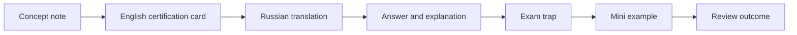

# Spring Map

## Сертификационный маршрут

- [[30_CERTIFICATIONS/Spring/2V0-72.22/Spring Certification Card System|Spring Certification Card System]]
- [[30_CERTIFICATIONS/Spring/2V0-72.22/Spring Core Card Roadmap|Spring Core Card Roadmap]]

## Spring Core

- IoC container
- BeanFactory and ApplicationContext
- Dependency injection
- Component scanning
- Java configuration
- Bean scopes
- Bean lifecycle
- Profiles and properties

### Приоритетные contrast topics

- Bean vs Component
- Qualifier vs Primary
- BeanPostProcessor vs BeanFactoryPostProcessor
- Full vs lite configuration
- FactoryBean vs BeanFactory

## AOP и proxies

- Join point, pointcut and advice
- JDK dynamic proxy
- CGLIB proxy
- Self-invocation
- Proxy limitations
- Aspect ordering

## Transactions

- @Transactional
- Propagation
- Isolation
- Rollback rules
- Read-only transactions
- Transaction managers
- Programmatic transactions

## Data access

- Spring JDBC
- Spring Data repositories
- JPA lifecycle
- Query derivation
- Specifications
- Pagination and projections

## Web

- Spring MVC
- Request lifecycle
- Validation
- Exception handling
- REST
- WebFlux and reactive streams

## Spring Boot и эксплуатация

- Auto-configuration
- Configuration properties
- Actuator
- Logging
- Caching
- Testing
- Security
