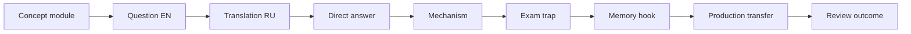

# Spring Map

## Сертификационный маршрут

- [[30_CERTIFICATIONS/Spring/2V0-72.22/Spring Certification Card System]]
- [[30_CERTIFICATIONS/Spring/2V0-72.22/Spring Core Card Roadmap]]
- [[30_CERTIFICATIONS/Spring/2V0-72.22/CORE-B01/CORE-B01 Cards|CORE-B01 — 20 cards]]
- [[30_CERTIFICATIONS/Spring/2V0-72.22/CORE-B02/CORE-B02 Cards|CORE-B02 — 24 cards]]
- [[00_HOME/Review Dashboard]]

## Spring Core — published foundation

### CORE-B01: container and registration

- [[10_CONCEPTS/Spring/Core/Spring Core Foundations]]
- [[01_MAPS/Spring Core Foundation Map.canvas]]
- [[30_CERTIFICATIONS/Spring/2V0-72.22/CORE-B01/CORE-B01 Cards]]

Покрытие:

- IoC vs DI;
- Spring bean;
- BeanDefinition;
- BeanFactory vs ApplicationContext;
- component scanning and stereotypes;
- `@Bean` vs `@Component`;
- `@Configuration`;
- constructor, setter and field injection.

### CORE-B02: dependency resolution

- [[10_CONCEPTS/Spring/Core/Dependency Resolution and Optional Injection]]
- [[01_MAPS/Spring Dependency Resolution Map.canvas]]
- [[30_CERTIFICATIONS/Spring/2V0-72.22/CORE-B02/CORE-B02 Cards]]
- [[40_PRODUCTION_CASES/Spring/Dependency Resolution Production Cases]]
- [[50_LABS/Spring/Core-B02/README]]

Покрытие:

- candidate resolution;
- `@Primary`;
- `@Qualifier` and custom qualifiers;
- bean-name fallback;
- collection/map injection;
- strategy ordering;
- optional dependencies;
- `ObjectProvider`;
- constructor resolution;
- generics as qualifiers.

## Next Spring Core batch

`CORE-B03 — Bean Lifecycle`:

- instantiation;
- dependency population;
- aware callbacks;
- before-initialization post-processing;
- init callbacks;
- after-initialization post-processing;
- destruction callbacks;
- prototype lifecycle boundaries.

## AOP and proxies

- join point, pointcut and advice;
- JDK dynamic proxy;
- CGLIB;
- self-invocation;
- proxy limitations;
- aspect ordering.

## Transactions

- `@Transactional`;
- propagation;
- isolation;
- rollback rules;
- read-only;
- transaction managers;
- programmatic transactions.

## Data access

- Spring JDBC;
- Spring Data repositories;
- JPA lifecycle;
- query derivation;
- specifications;
- pagination and projections.

## Web and Boot

- Spring MVC and WebFlux;
- validation and exception handling;
- auto-configuration;
- configuration properties;
- actuator;
- caching;
- testing;
- security.
