# PostgreSQL EXPLAIN and Query Plan Analysis

> [!summary] За 30 секунд
> Query plan — дерево iterators. Каждый parent запрашивает rows у children. `EXPLAIN` показывает estimates, `EXPLAIN ANALYZE` реально выполняет query и показывает actual time/rows/loops. Диагностика начинается не с поиска слова `Index`, а с расхождения estimated/actual rows, multiplicative `loops`, buffer I/O, removed rows, sort/hash spill и доминирующего subtree.

# 1. Planner pipeline

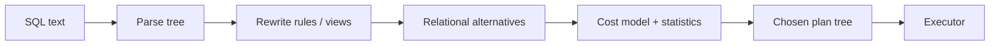

Planner выбирает cheapest estimated plan, а не objectively fastest plan. Ошибочные statistics → ошибочная cardinality → ошибочный join/access choice.

# 2. Plan as tree

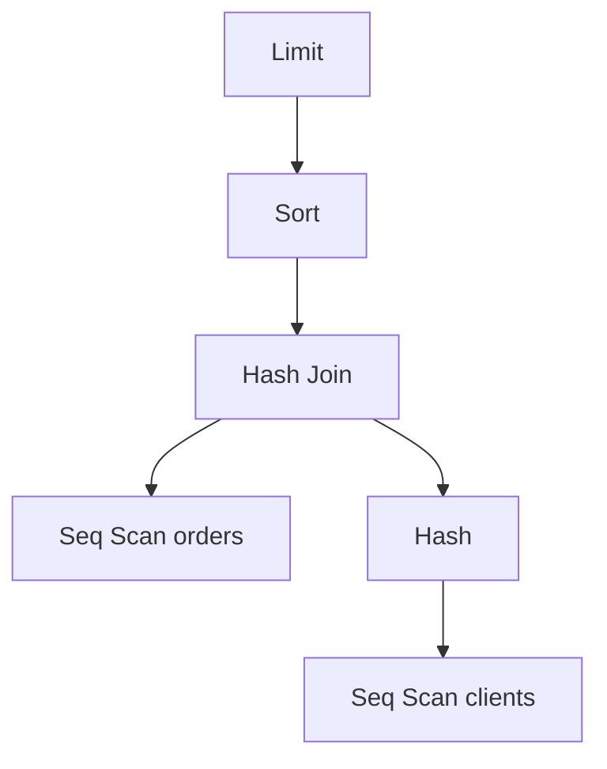

Читать план удобно снизу вверх: children производят rows, parent их преобразует.

# 3. Cost fields

```text
(cost=startup_cost..total_cost rows=estimated_rows width=average_row_bytes)
```

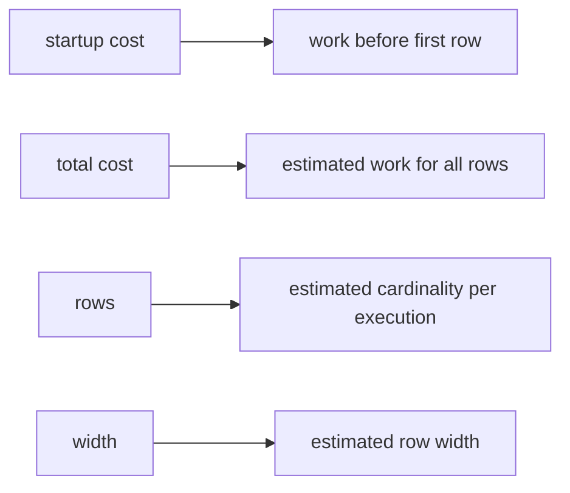

Cost units не milliseconds. Они служат для сравнения alternatives внутри configured cost model.

# 4. Actual fields

```text
(actual time=first_row..last_row rows=actual_rows loops=executions)
```

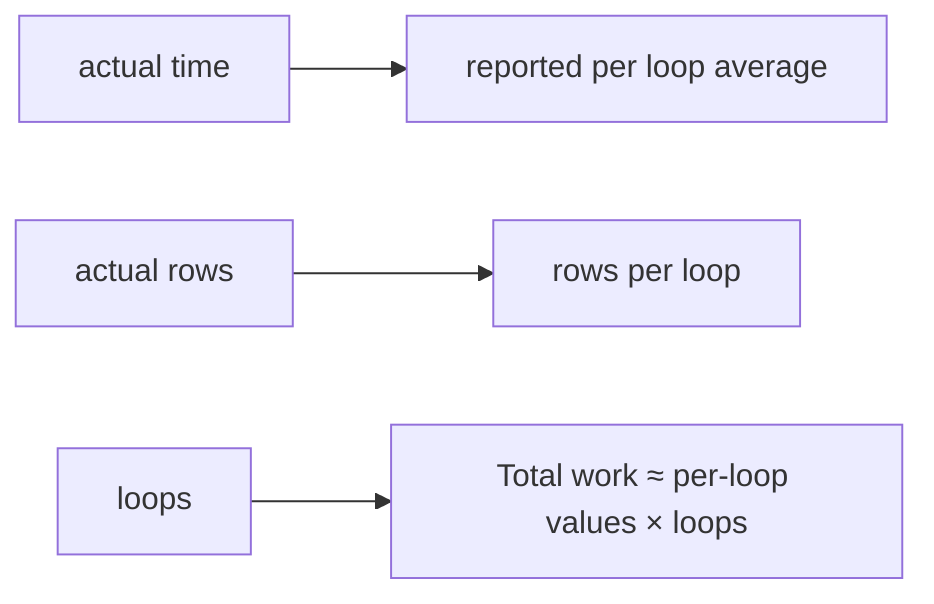

Очень частая ошибка — увидеть `actual time=0.05` и проигнорировать `loops=100000`.

# 5. EXPLAIN versus EXPLAIN ANALYZE

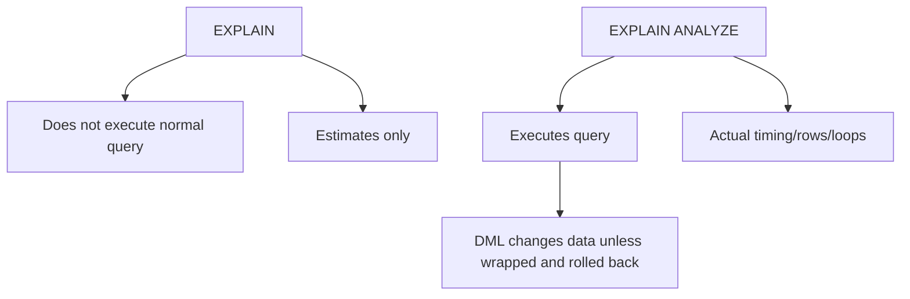

Для `UPDATE/DELETE/INSERT` используй transaction + rollback при диагностике.

# 6. BUFFERS interpretation

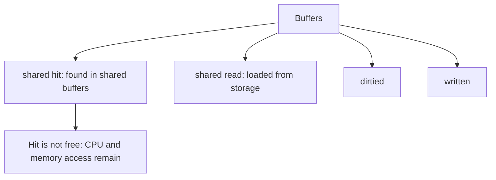

Buffers считаются page accesses, не distinct pages для каждого node aggregation. Сравнивай plans на сходном cache state.

# 7. Sequential scan

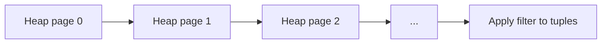

Seq Scan рационален для small table, large result fraction, poor index match или когда sequential I/O дешевле many random heap fetches.

# 8. Index Scan

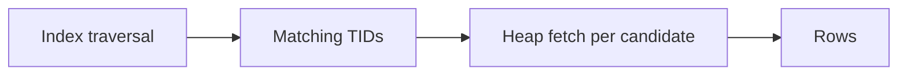

Plan properties:

```text
Index Cond    → condition used to navigate index
Filter        → condition checked after candidate row retrieval
Rows Removed by Filter → wasted candidate work
```

# 9. Index Only Scan

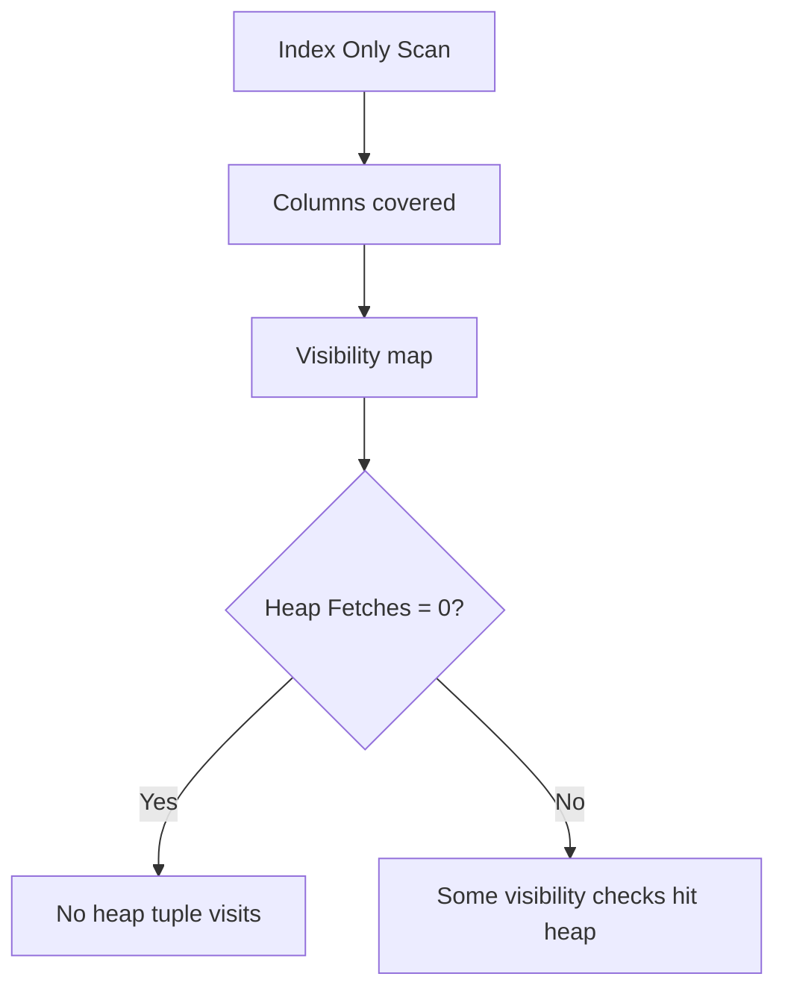

# 10. Bitmap path

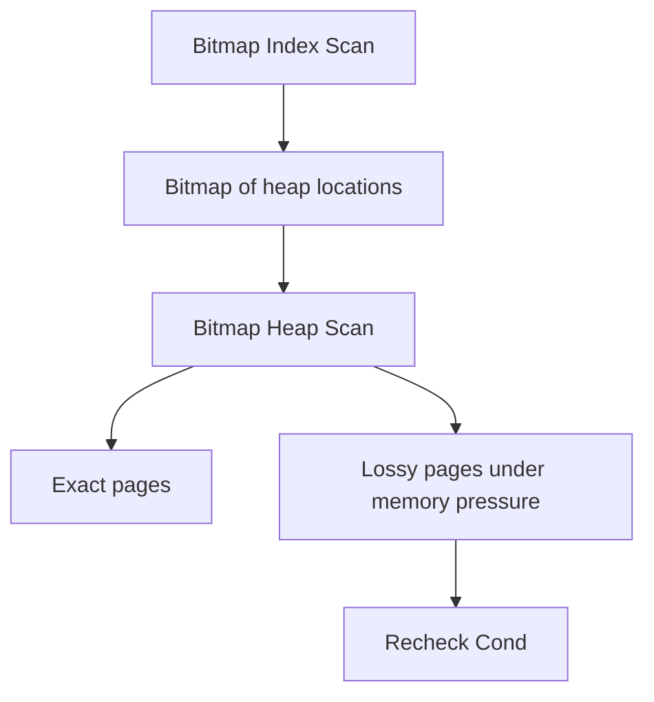

Bitmap path часто выигрывает для moderate result set: он группирует heap accesses по physical pages.

# 11. Filter placement

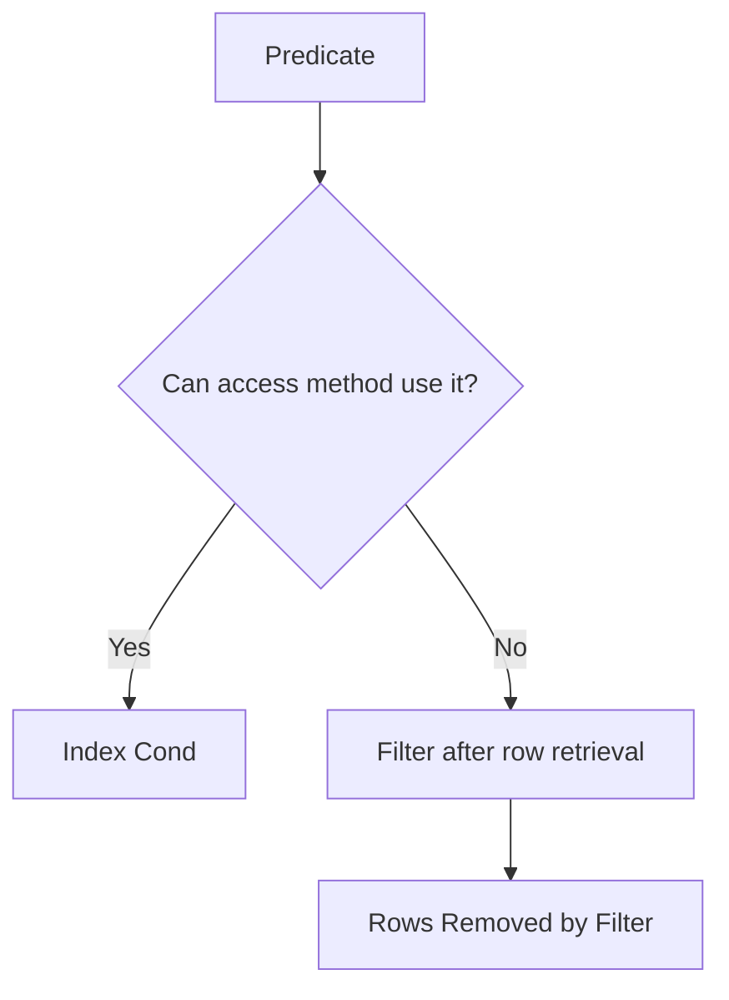

Expression/operator/cast mismatch может переместить условие из `Index Cond` в `Filter`.

# 12. Estimate error ratio

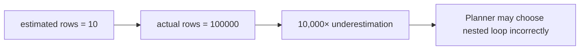

Диагностируй estimate error на earliest node, где divergence становится большой; upstream errors часто являются следствием.

# 13. Single-column statistics

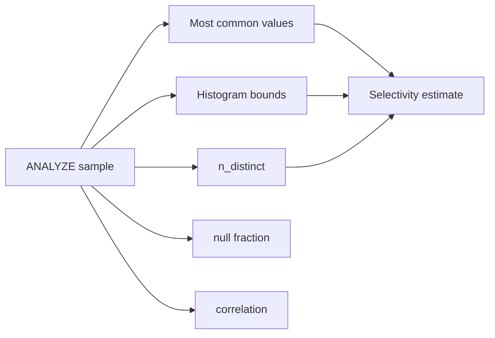

# 14. Correlated columns problem

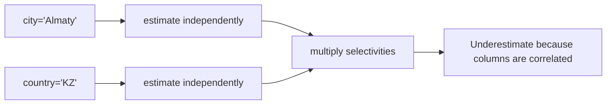

Extended statistics can model dependencies, ndistinct combinations или common combinations.

# 15. Extended statistics

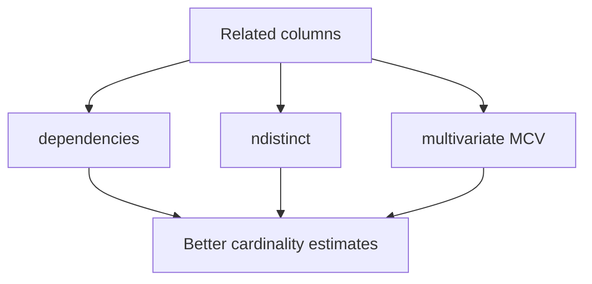

```sql
CREATE STATISTICS clients_city_country_stats
    (dependencies, ndistinct, mcv)
ON city, country
FROM clients;
ANALYZE clients;
```

# 16. Nested Loop

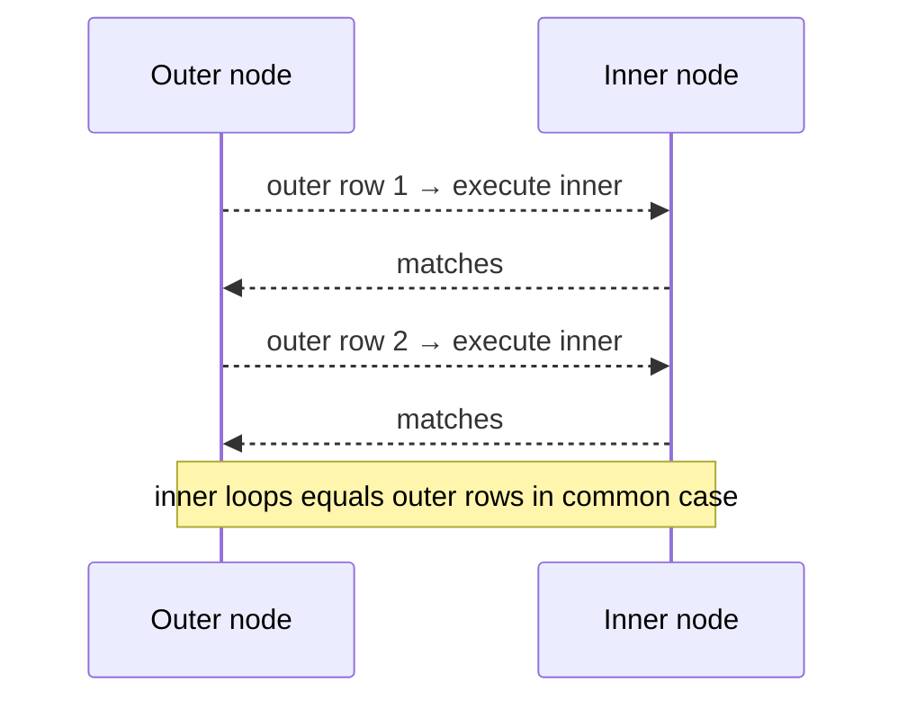

Nested loop excellent when outer small and inner indexed. Catastrophic when outer unexpectedly huge.

# 17. Hash Join

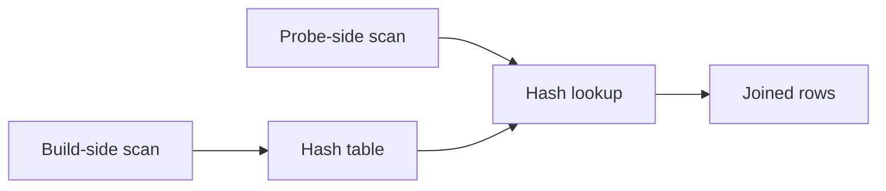

Hash spill indicators: multiple batches, temp read/write, memory limits.

# 18. Merge Join

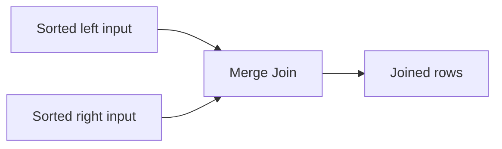

Если inputs уже ordered по indexes, merge join может избежать explicit sort.

# 19. Join-choice diagnostic

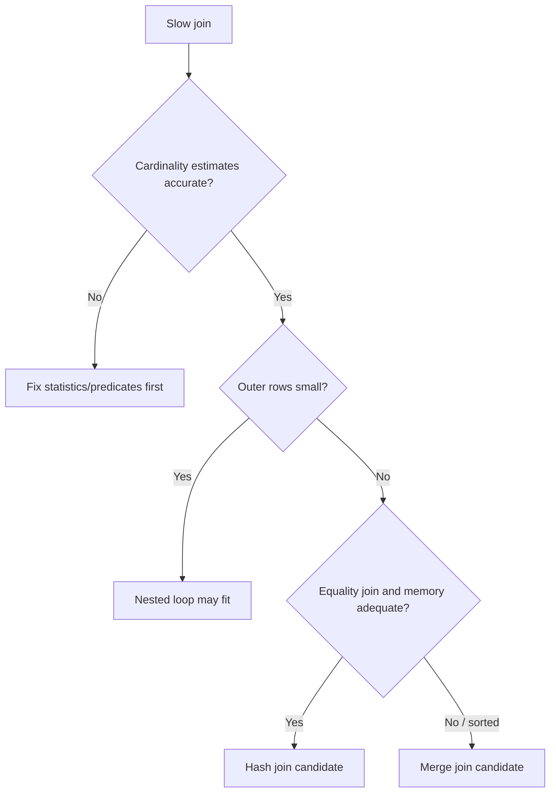

# 20. Sort node

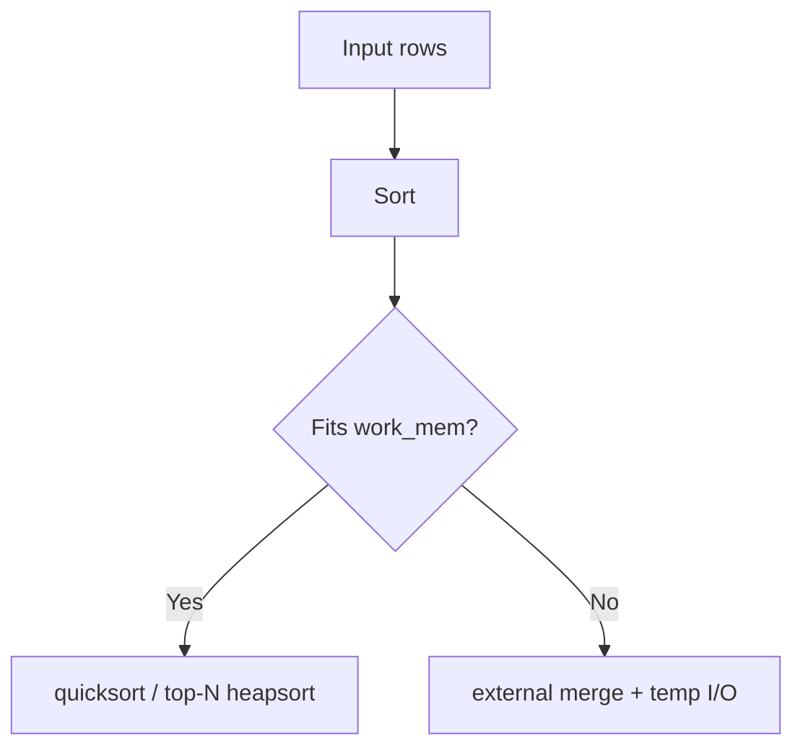

`ORDER BY ... LIMIT` может использовать top-N strategy. Подходящий ordered index иногда устраняет Sort полностью.

# 21. Hash aggregation

```mermaid
flowchart TD
    ROWS["Input rows"] --> HASH["HashAggregate"]
    HASH --> GROUPS["Groups"]
    HASH --> BATCH{"Batches > 1?"}
    BATCH -->|"Yes"| SPILL["Disk spill / temp I/O"]
```

# 22. Parallel plan

```mermaid
flowchart TB
    G["Gather / Gather Merge"] --> W1["Worker partial plan"]
    G --> W2["Worker partial plan"]
    G --> LEADER["Leader participation"]
```

Parallelism имеет startup/coordination cost и не лечит плохую selectivity или неправильный join order.

# 23. LIMIT and early stop

```mermaid
flowchart LR
    IDX["Ordered index scan"] --> ROW1["Row 1"]
    ROW1 --> ROW50["Row 50"]
    ROW50 --> STOP["Limit stops child"]
```

Parent may stop child before it produces its estimated full row count. Поэтому actual rows child может отражать demand parent-а.

# 24. Loops multiplication example

```text
Index Scan on order_lines
(actual time=0.010..0.012 rows=3 loops=50000)
```

```mermaid
flowchart LR
    PER["≈3 rows per loop"] --> MUL["× 50,000 loops"]
    MUL --> TOTAL["≈150,000 rows produced"]
```

# 25. Rows Removed by Filter

```mermaid
flowchart LR
    SCAN["Read 1,000,000 candidates"] --> KEEP["Return 100"]
    SCAN --> REMOVE["Rows Removed by Filter: 999,900"]
    REMOVE --> QUESTION["Can predicate move into index/join condition or earlier node?"]
```

# 26. Planning versus execution time

```mermaid
flowchart TD
    TOTAL["Observed latency"] --> PLAN["Planning time"]
    TOTAL --> EXEC["Execution time"]
    TOTAL --> CLIENT["Network, serialization, pool wait, app code"]
```

`EXPLAIN ANALYZE` execution time не включает всю application latency.

# 27. Cache-state comparison

```mermaid
flowchart LR
    COLD["Cold-ish cache run"] --> READ["shared read high"]
    WARM["Warm cache run"] --> HIT["shared hit high"]
    READ --> COMPARE["Do not compare blindly"]
    HIT --> COMPARE
```

Записывай cache state и повторяй measurements. Не очищай OS cache на production ради теста.

# 28. Safe DML analysis

```sql
BEGIN;
EXPLAIN (ANALYZE, BUFFERS, WAL)
UPDATE accounts
SET status = 'REVIEW'
WHERE risk_score > 900;
ROLLBACK;
```

```mermaid
flowchart LR
    BEGIN["BEGIN"] --> RUN["Execute DML with ANALYZE"]
    RUN --> OBSERVE["Observe plan, buffers, WAL"]
    OBSERVE --> ROLLBACK["ROLLBACK"]
```

Triggers/external side effects могут не откатываться универсально; тестируй в isolated environment.

# 29. Planner toggles — diagnostic only

```mermaid
flowchart TD
    BAD["Suspect plan"] --> TOGGLE["Temporarily disable seqscan/nestloop/etc"]
    TOGGLE --> ALT["Observe alternative plan"]
    ALT --> FASTER{"Actually faster?"}
    FASTER -->|"Yes"| WHY["Investigate cost/statistics mismatch"]
    FASTER -->|"No"| PLANNER["Original plan likely rational"]
```

Не оставляй global planner toggles как permanent index hint replacement.

# 30. EXPLAIN diagnostic sequence

```mermaid
flowchart TD
    START["Slow query"] --> CAPTURE["Capture exact SQL, bind values, schema, data volume"]
    CAPTURE --> PLAN["EXPLAIN ANALYZE BUFFERS"]
    PLAN --> TOP["Find dominant subtree by time/buffers/loops"]
    TOP --> EST{"Large estimate error?"}
    EST -->|"Yes"| STATS["ANALYZE, statistics target, extended stats, predicate review"]
    EST -->|"No"| IO{"I/O or CPU dominant?"}
    IO -->|"I/O"| ACCESS["Access path, heap fetches, selectivity, index design"]
    IO -->|"CPU"| FILTER["Rows processed, expressions, joins, aggregation"]
    ACCESS --> RETEST["Change one variable and re-run"]
    FILTER --> RETEST
```

# 31. Worked example — wrong nested loop

Query joins 100,000 recent operations to clients.

Bad estimate:

```text
Nested Loop
  estimated outer rows: 50
  actual outer rows: 100,000
  inner Index Scan loops: 100,000
```

```mermaid
flowchart LR
    STALE["Stale/correlated statistics"] --> LOW["Outer estimate 50"]
    LOW --> NL["Choose Nested Loop"]
    NL --> LOOPS["100,000 inner index probes"]
    LOOPS --> SLOW["High buffer traffic and latency"]
```

Correction path:

```text
1. Check predicate and bind values.
2. ANALYZE relevant tables.
3. Increase statistics target for skewed column.
4. Add extended statistics for correlated predicates.
5. Re-run plan; do not immediately add random indexes.
```

# 32. Worked example — index exists but Seq Scan wins

```sql
SELECT * FROM events WHERE status = 'PROCESSED';
```

If 92% rows are processed:

```mermaid
flowchart LR
    IDX["status index"] --> MANY["920,000 TIDs"]
    MANY --> HEAP["Most heap pages visited"]
    HEAP --> TWO["Index + heap overhead"]
    SEQ["Seq Scan"] --> ONCE["Read heap once"]
    ONCE --> WIN["Cheaper plan"]
```

Planner not using index can be correct.

# 33. Interview explanation

> Я читаю plan снизу вверх. Сначала нахожу node с dominant actual time, buffers или loops. Затем сравниваю estimated и actual rows. Если estimate сильно ошибочен, исправляю statistics/predicate model до index tuning. Для access path смотрю `Index Cond`, `Filter`, heap fetches, rows removed и result fraction. После изменения повторяю `EXPLAIN (ANALYZE, BUFFERS)` на representative data.

# 34. Exercises

1. Найти estimate error в provided nested-loop plan.
2. Сравнить Seq Scan, Index Scan и Bitmap Heap Scan на разной selectivity.
3. Вызвать disk sort маленьким `work_mem`.
4. Создать extended statistics для correlated columns.
5. Сравнить warm/cold-ish buffer profile.
6. Проверить `Heap Fetches` index-only scan.

## Related materials

- [[PostgreSQL Index Mechanics]]
- [[30_CERTIFICATIONS/Databases/DB-B01/DB-B01 Roadmap]]
- [[30_CERTIFICATIONS/Databases/DB-B01/DB-B01 Cards]]
- [[40_PRODUCTION_CASES/Databases/Indexes and Query Plans Production Cases]]
- [[50_LABS/Databases/DB-B01/README]]
- [[98_SOURCES/PostgreSQL Indexes and Query Plans Sources]]
