# PostgreSQL Index Mechanics

> [!summary] За 30 секунд
> PostgreSQL index — отдельная структура рядом с heap table. B-tree помогает быстро сузить диапазон candidate TIDs, но обычный Index Scan всё равно часто читает heap pages. Польза индекса определяется не фактом его существования, а selectivity, correlation, number of heap visits, ordering requirements, visibility map, write cost и соответствием predicates operator class-у.

# 1. Heap и secondary index

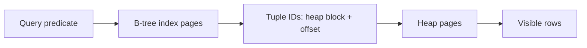

PostgreSQL indexes являются secondary: leaf entry обычно ведёт к heap tuple location. Поэтому «нашёл key в index» не всегда означает «получил всю row без table access».

# 2. B-tree page hierarchy

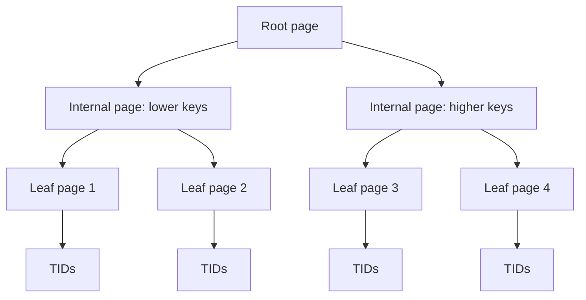

Upper levels направляют поиск; leaf pages содержат ordered keys и tuple references. Tree height обычно невелик, но итоговая стоимость может определяться heap random access.

# 3. Equality lookup path

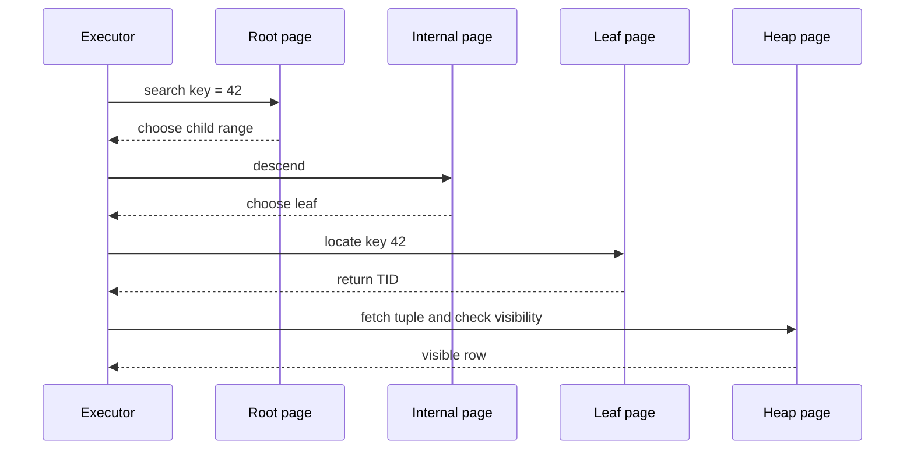

# 4. Range scan

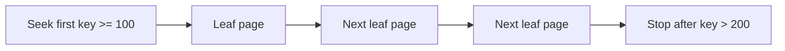

B-tree особенно полезен для ordered ranges и `ORDER BY`, если query order соответствует index order.

# 5. Selectivity

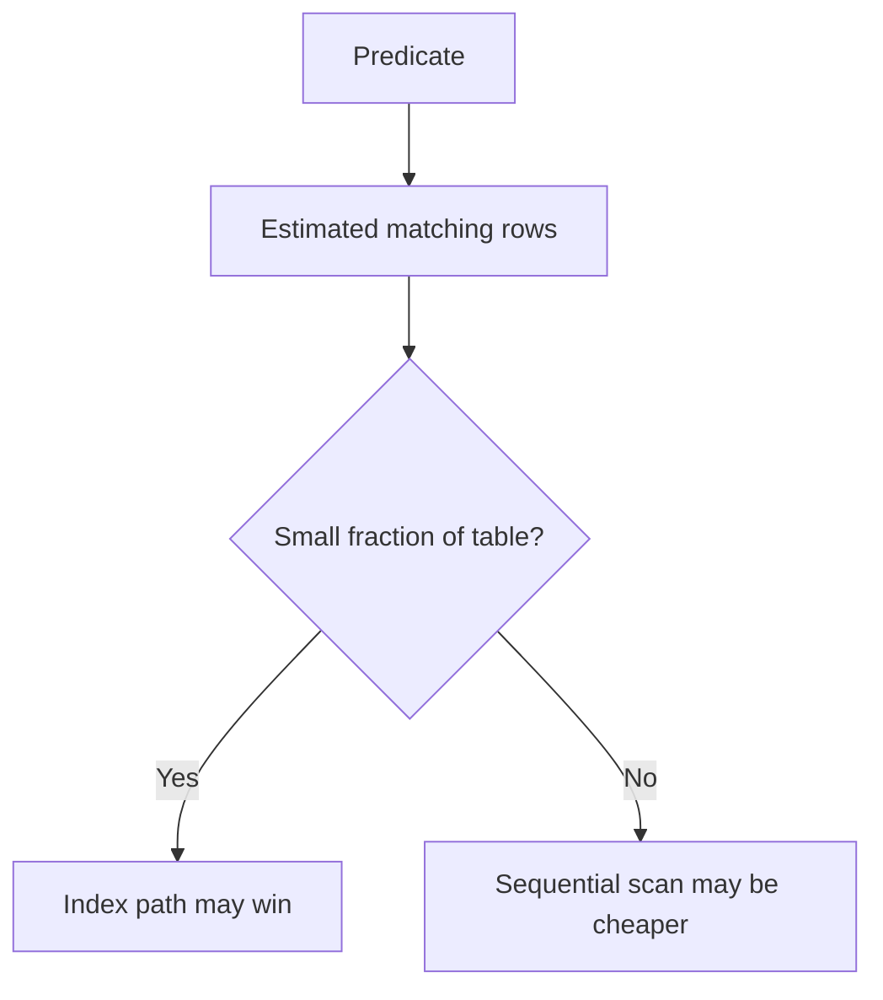

Selectivity ≈ доля rows, прошедших predicate. Низкая selectivity в разговорной практике часто означает «predicate возвращает много rows», хотя термины иногда используют неоднозначно; лучше говорить exact fraction.

# 6. Why index may lose on many rows

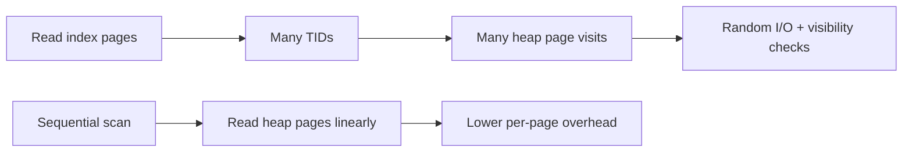

Если query возвращает значительную часть table, sequential access может быть дешевле двухступенчатого index→heap path.

# 7. Cardinality and distinct values

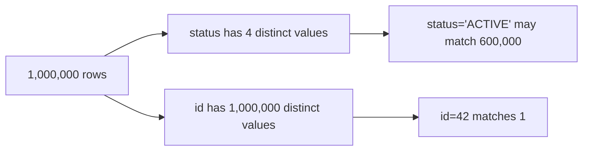

Index на low-cardinality column не бесполезен всегда, но isolated equality predicate часто возвращает слишком большую fraction. Partial index или composite index может изменить economics.

# 8. Composite B-tree ordering

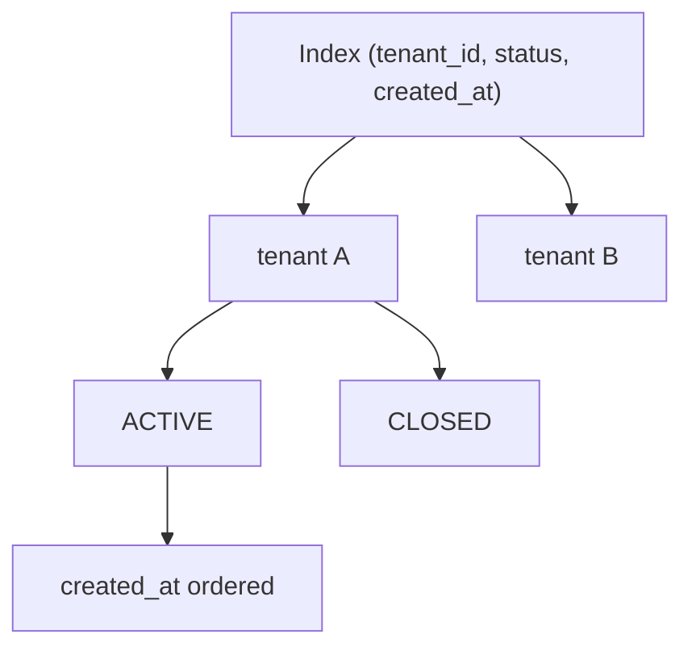

Index order группирует сначала leading key, затем следующий внутри equal prefix.

# 9. Leftmost-prefix reasoning

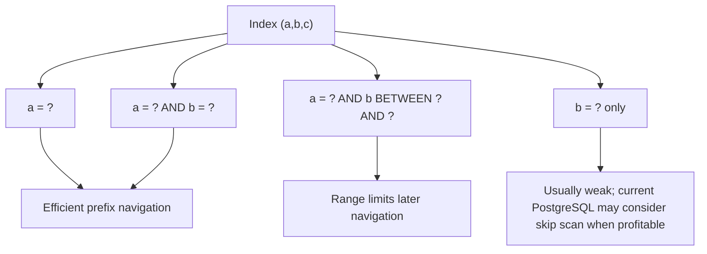

Equality constraints on leading columns plus inequality on first non-equality column most directly limit scan range. PostgreSQL 18 documents B-tree skip scan, but it is cost-based and not a reason to ignore index order design.

# 10. Equality, range, order rule

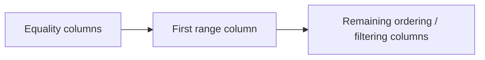

Практическое начало дизайна composite index: leading equality predicates, затем range/order requirements. Реальное решение подтверждается workload и plan-ом.

# 11. Index and ORDER BY

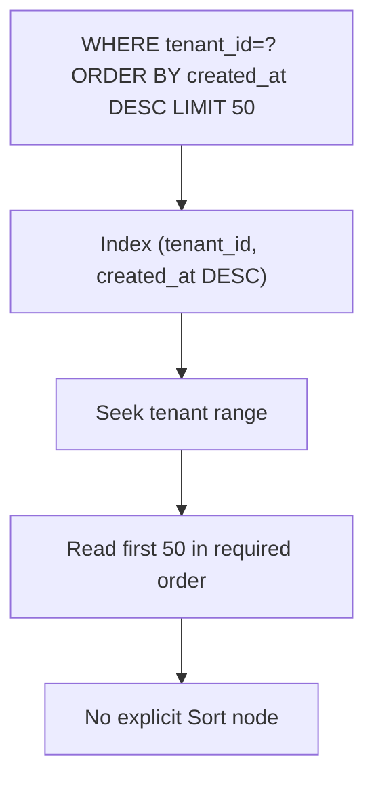

Index может быть полезен даже когда predicate не супер-selective, если позволяет early stop для `LIMIT` и устраняет sort.

# 12. Ordinary Index Scan

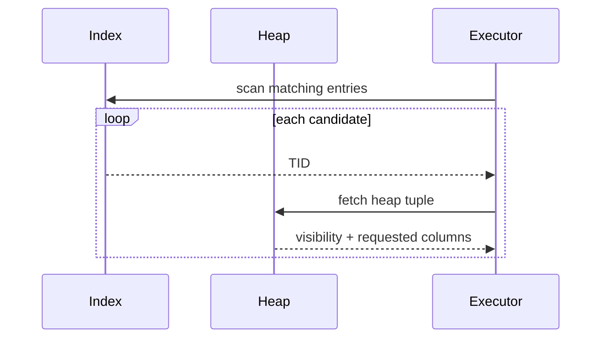

# 13. Index-only scan prerequisites

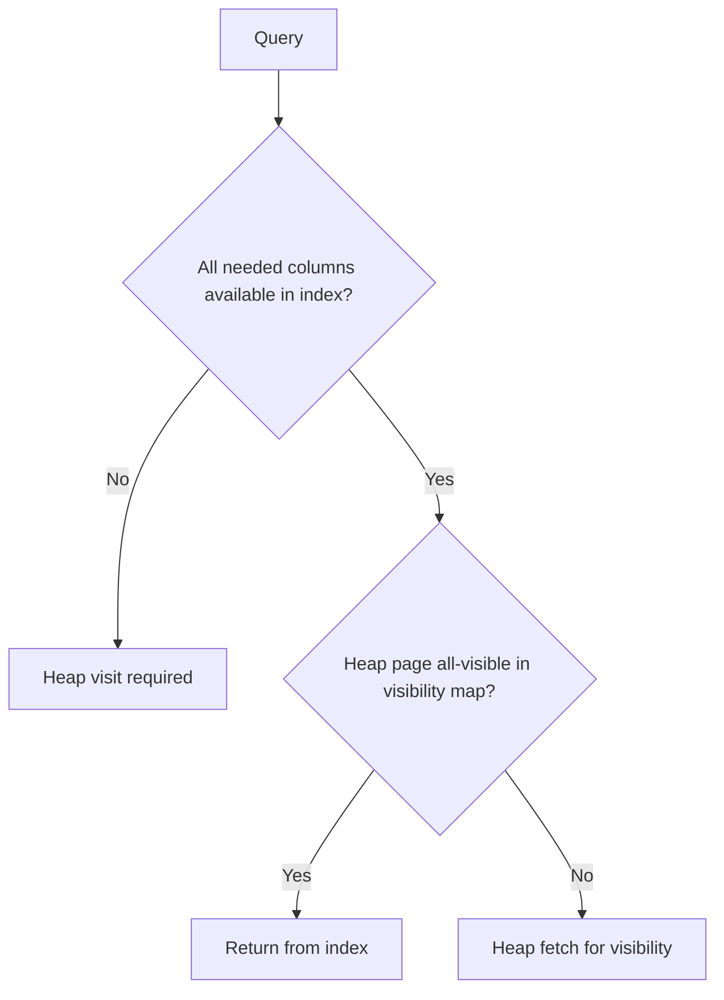

`Index Only Scan` node может показывать `Heap Fetches > 0`; название plan node не гарантирует нулевой heap access.

# 14. INCLUDE covering index

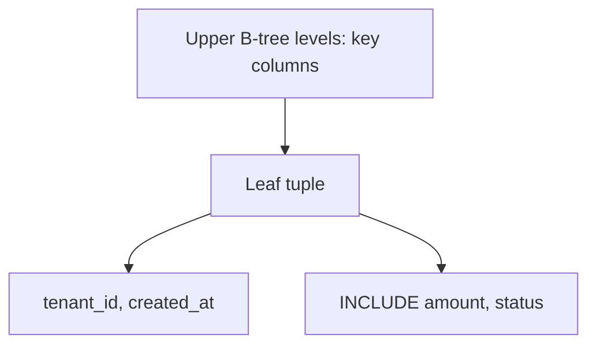

`INCLUDE` columns — payload: они доступны для index-only result, но не участвуют в navigation/search ordering. Они увеличивают index size и write cost.

```sql
CREATE INDEX orders_tenant_created_cover_idx
    ON orders (tenant_id, created_at DESC)
    INCLUDE (amount, status);
```

# 15. Visibility map effect

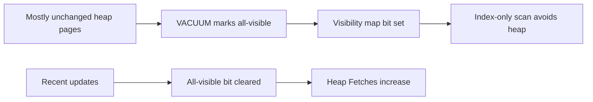

Read-mostly tables обычно получают больше пользы от covering indexes, чем frequently updated tables.

# 16. Partial index

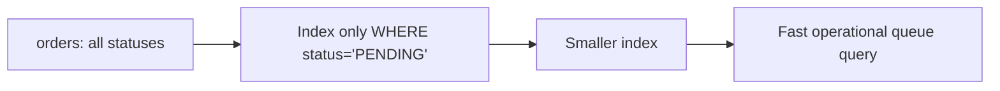

```sql
CREATE INDEX orders_pending_created_idx
    ON orders (created_at)
    WHERE status = 'PENDING';
```

Planner должен доказать, что query predicate подразумевает partial-index predicate. Параметризованные/generalized predicates могут мешать такому доказательству.

# 17. Expression index

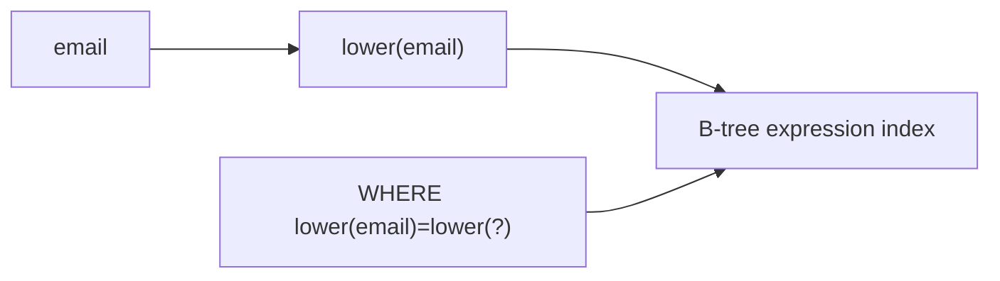

```sql
CREATE INDEX users_email_lower_idx ON users (lower(email));
```

Query expression должен семантически совпадать с indexed expression и подходящим operator class.

# 18. Bitmap scan composition

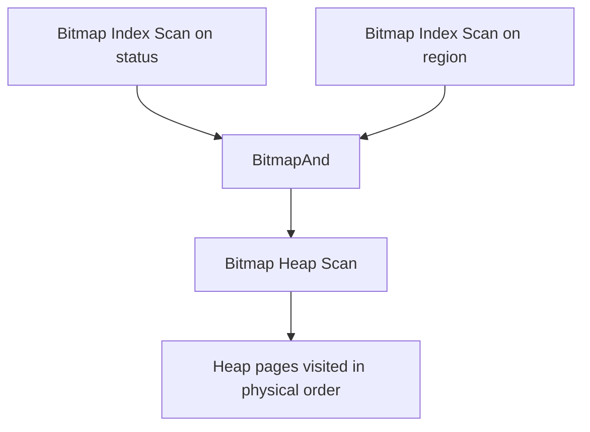

Bitmap strategy amortizes heap access and может комбинировать indexes, но теряет index ordering, поэтому `ORDER BY` может потребовать Sort.

# 19. Bitmap versus plain index scan

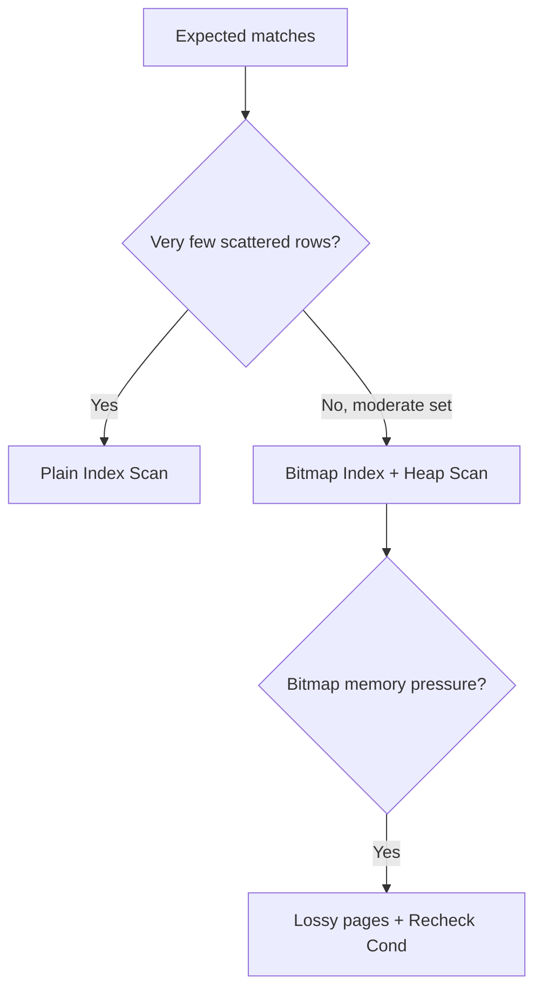

# 20. Unique index

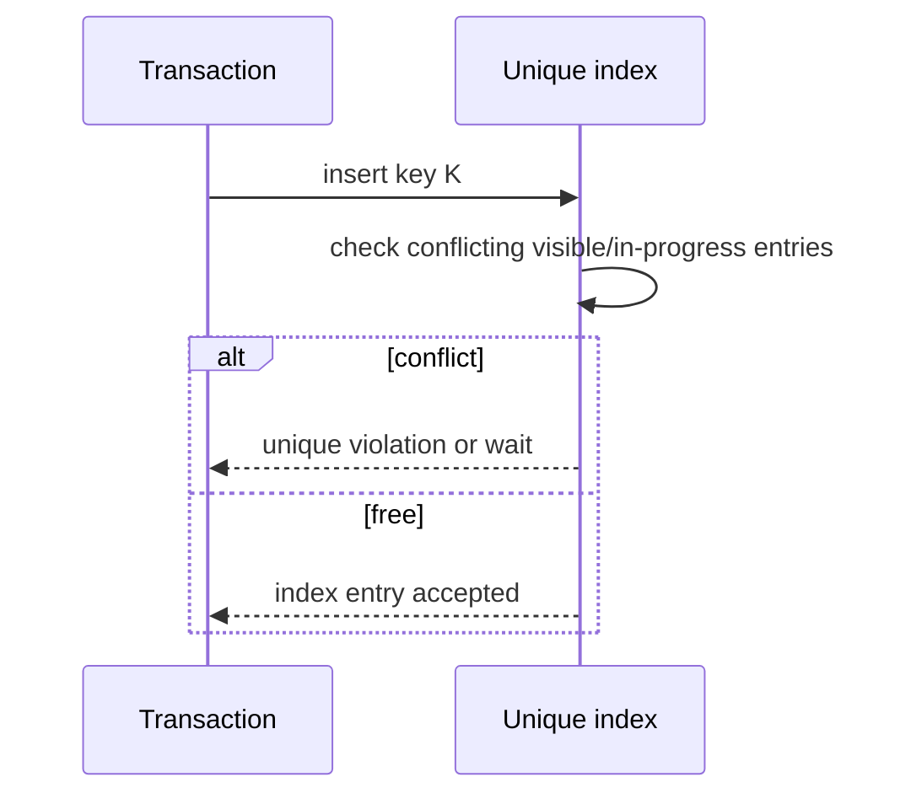

Unique constraint — correctness mechanism, не только performance feature.

# 21. Write amplification

```mermaid
flowchart LR
    INSERT["INSERT row"] --> HEAP["Heap write"]
    INSERT --> I1["Index 1 write"]
    INSERT --> I2["Index 2 write"]
    INSERT --> I3["Index 3 write"]
    UPDATE["UPDATE indexed column"] --> NEW["New heap tuple + index updates"]
```

Каждый дополнительный index увеличивает storage, WAL, vacuum work и modification latency.

# 22. HOT update boundary

```mermaid
flowchart TD
    UPDATE["UPDATE row"] --> IDXCOL{"Indexed column changed?"}
    IDXCOL -->|"Yes"| INDEXWRITE["New index entries required"]
    IDXCOL -->|"No"| SPACE{"Space on same heap page and conditions allow?"}
    SPACE -->|"Yes"| HOT["HOT chain may avoid index update"]
    SPACE -->|"No"| INDEXWRITE
```

Наличие лишних indexes на frequently changed columns уменьшает HOT opportunities.

# 23. Correlation and heap locality

```mermaid
flowchart LR
    IDX["Index key order"] --> CORR{"Correlated with heap physical order?"}
    CORR -->|"High"| LOCAL["Fewer random heap jumps"]
    CORR -->|"Low"| RANDOM["Scattered heap pages"]
```

Planner statistics учитывают correlation при cost estimation.

# 24. BRIN versus B-tree intuition

```mermaid
flowchart TD
    TABLE["Very large append-ordered table"] --> CORR{"Column correlated with physical order?"}
    CORR -->|"Yes"| BRIN["BRIN summarizes page ranges"]
    CORR -->|"No / precise lookup"| BTREE["B-tree"]
```

DB-B01 сфокусирован на B-tree, но на огромных time-series tables компактный BRIN иногда рациональнее ещё одного большого B-tree.

# 25. Index design decision tree

```mermaid
flowchart TD
    Q["Slow query"] --> FILTER["List predicates, joins, order, limit, selected columns"]
    FILTER --> PLAN["Run EXPLAIN ANALYZE BUFFERS"]
    PLAN --> EST{"Estimate error?"}
    EST -->|"Yes"| STATS["Fix statistics/data correlation first"]
    EST -->|"No"| ACCESS{"Dominant access cost?"}
    ACCESS -->|"Large table scan"| SELECT["Assess selectivity and useful prefix"]
    ACCESS -->|"Sort"| ORDER["Consider index order + LIMIT"]
    ACCESS -->|"Heap fetches"| COVER["Assess covering index and visibility"]
    SELECT --> WRITE["Check write/storage cost"]
    ORDER --> WRITE
    COVER --> WRITE
    WRITE --> TEST["Re-run plan with realistic data"]
```

# 26. Worked example — client operation feed

Query:

```sql
SELECT id, amount, status, created_at
FROM operations
WHERE client_id = :clientId
  AND status = 'SUCCESS'
ORDER BY created_at DESC
LIMIT 50;
```

Naive indexes:

```sql
CREATE INDEX operations_client_idx ON operations(client_id);
CREATE INDEX operations_status_idx ON operations(status);
CREATE INDEX operations_created_idx ON operations(created_at);
```

Potential workload-aligned index:

```sql
CREATE INDEX operations_client_status_created_idx
    ON operations(client_id, status, created_at DESC)
    INCLUDE (amount);
```

```mermaid
flowchart LR
    CLIENT["client_id equality"] --> STATUS["status equality"]
    STATUS --> DATE["created_at DESC order"]
    DATE --> LIMIT["Stop after 50"]
    LIMIT --> PAYLOAD["amount from INCLUDE when index-only conditions hold"]
```

Это не универсальная рекомендация. Нужно проверить:

```text
actual rows and loops
Buffers: shared hit/read
Sort node absence/presence
Heap Fetches
write rate and index size
alternative partial index for SUCCESS/PENDING workload
```

# 27. Interview explanation

> B-tree не делает query быстрым сам по себе. Я сначала определяю query shape: equality, range, order, limit и selected columns. Затем проверяю selectivity и composite prefix. После этого смотрю physical path: plain index scan, bitmap, heap visits или index-only scan. Решение подтверждаю `EXPLAIN (ANALYZE, BUFFERS)`, а затем оцениваю write amplification и production workload.

# 28. Exercises

1. Для index `(tenant_id, status, created_at)` оценить пять разных predicates.
2. Сравнить three single-column indexes с composite index.
3. Создать covering index и наблюдать `Heap Fetches` до/после `VACUUM`.
4. Создать partial index для operational queue.
5. Измерить INSERT throughput до и после добавления пяти indexes.

## Related materials

- [[PostgreSQL EXPLAIN and Query Plan Analysis]]
- [[30_CERTIFICATIONS/Databases/DB-B01/DB-B01 Roadmap]]
- [[30_CERTIFICATIONS/Databases/DB-B01/DB-B01 Cards]]
- [[40_PRODUCTION_CASES/Databases/Indexes and Query Plans Production Cases]]
- [[50_LABS/Databases/DB-B01/README]]
- [[98_SOURCES/PostgreSQL Indexes and Query Plans Sources]]
