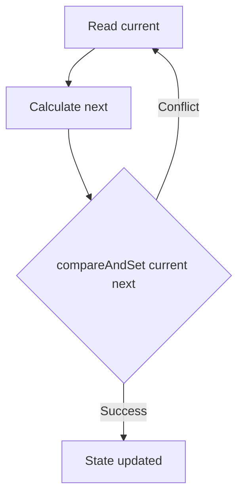
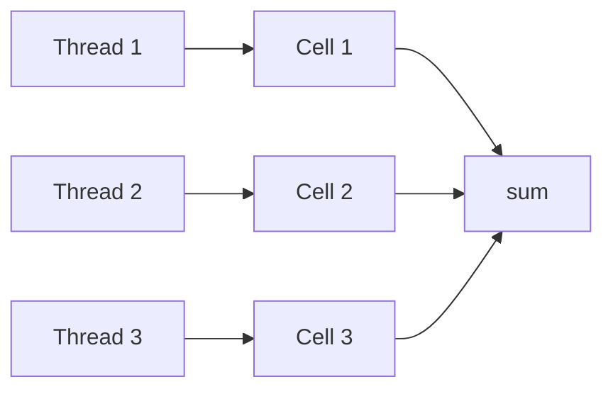
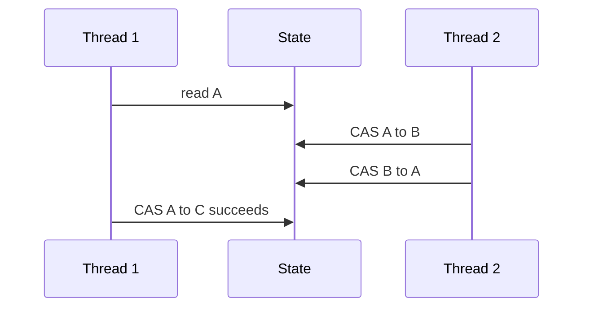
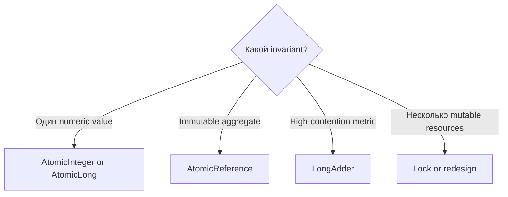

# Atomic CAS and Counters

> [!summary] За 30 секунд
> Atomic classes выполняют отдельные read-modify-write операции над одной переменной без внешнего lock. Центральный механизм — compare-and-set: изменить значение только если оно всё ещё равно ожидаемому.

## 1. Интуиция CAS: версия документа

Ты прочитал документ версии `7`, подготовил изменение и отправляешь условную команду:

> «Запиши новую версию, только если текущая всё ещё `7`».

Если другой поток уже изменил документ, операция возвращает `false`. Поток перечитывает состояние и повторяет расчёт.



## 2. CAS loop

```java
private final AtomicInteger balance = new AtomicInteger(100);

boolean withdraw(int amount) {
    while (true) {
        int current = balance.get();
        if (current < amount) {
            return false;
        }
        int next = current - amount;
        if (balance.compareAndSet(current, next)) {
            return true;
        }
    }
}
```

CAS объединяет **проверку ожидаемого значения и запись нового** в одну атомарную операцию. Но чтение и расчёт вокруг неё могут повторяться.

> [!danger] Side-effect trap
> Функция внутри CAS loop, `updateAndGet` или `getAndUpdate` может выполниться несколько раз. Она должна быть чистой или безопасной для повторного вызова.

## 3. Lock-free не означает wait-free

- **Lock-free:** система в целом продолжает продвигаться, но конкретный поток может много раз проиграть CAS.
- **Wait-free:** каждая операция завершается за ограниченное количество собственных шагов.

Обычный CAS retry loop может быть lock-free, но не wait-free.

## 4. AtomicInteger

```java
private final AtomicInteger sequence = new AtomicInteger();

int nextId() {
    return sequence.incrementAndGet();
}
```

Различие методов:

```text
getAndIncrement() -> вернуть старое, затем увеличить
incrementAndGet() -> увеличить, затем вернуть новое
```

Хорошие применения:

- sequence number;
- независимый counter;
- state flag;
- атомарный transition одного значения.

## 5. AtomicReference и immutable state

`AtomicReference<T>` атомарно заменяет ссылку. Он особенно полезен, если ссылка указывает на immutable aggregate.

```java
final class State {
    final int available;
    final int reserved;

    State(int available, int reserved) {
        this.available = available;
        this.reserved = reserved;
    }
}

private final AtomicReference<State> state =
        new AtomicReference<>(new State(10, 0));
```

```java
boolean reserve() {
    while (true) {
        State current = state.get();
        if (current.available == 0) {
            return false;
        }
        State next = new State(
                current.available - 1,
                current.reserved + 1
        );
        if (state.compareAndSet(current, next)) {
            return true;
        }
    }
}
```

Invariant сохраняется внутри одного snapshot.

> [!warning]
> `AtomicReference<List<T>>` не делает mutable list потокобезопасным. AtomicReference защищает замену ссылки, а не внутренние mutation объекта.

## 6. Почему не несколько отдельных atomics

```java
AtomicInteger available;
AtomicInteger reserved;
```

Каждое поле атомарно отдельно, но пара обновлений не становится транзакцией. Reader может увидеть промежуточное состояние. Если поля образуют единый invariant, используй immutable aggregate + AtomicReference или lock.

## 7. AtomicLong против LongAdder

### AtomicLong

- одно атомарно обновляемое значение;
- поддерживает CAS;
- подходит для sequence и coordination;
- под высоким contention становится общей горячей точкой.

### LongAdder

- распределяет updates по внутренним cells;
- уменьшает contention;
- хорош для metrics и statistics;
- `sum()` не является одной глобальной atomic snapshot-операцией относительно concurrent updates;
- не подходит для уникальной последовательности.



> [!note] Diagram precision
> Схема иллюстрирует striped contention reduction, а не постоянное владение cell конкретным thread. Implementation выбирает probe/cell и может повторять update или использовать другую cell при contention.

> [!tip] Memory Hook
> **AtomicLong coordinates; LongAdder measures.**

## 8. ABA problem

CAS сравнивает текущее значение с ожидаемым. Если состояние прошло путь `A → B → A`, простой CAS может не заметить промежуточную историю.



Если истории изменения важны, используют version/stamp, например `AtomicStampedReference`, либо другой design.

## 9. CAS против synchronized

| Требование | Atomic/CAS | synchronized |
|---|---:|---:|
| Одна переменная | отлично | возможно |
| Несколько mutable объектов | сложно | естественно |
| Blocking | нет | возможно |
| Retry под contention | да | нет пользовательского CAS loop |
| Fairness | не гарантируется | не гарантируется |
| Простота reasoning | средняя/сложная | часто проще |

## 10. Решение выбора



## Interview Answer

> CAS атомарно сравнивает текущее значение с ожидаемым и записывает новое только при совпадении. Atomic classes удобны для одной переменной или immutable snapshot reference. При contention возможны повторные попытки и starvation, а для multi-object invariant lock часто проще и безопаснее.

## Проверка понимания

> [!question] Почему `updateAndGet` callback не должен отправлять письмо?

> [!answer]- Ответ
> Callback может быть повторно вызван после CAS conflict. Необратимый side effect может выполниться несколько раз.

> [!question] Почему LongAdder плох для генерации ID?

> [!answer]- Ответ
> Его aggregate sum предназначен для statistics, а не для линейризуемой выдачи уникального следующего значения.

## Sources

- [[98_SOURCES/Java Concurrency Sources]]
