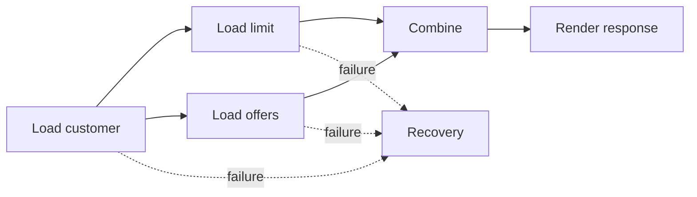

# CompletableFuture

> [!summary] За 30 секунд
> `CompletableFuture` описывает pipeline зависимых и независимых асинхронных stages. Главная сложность — правильно различать transformation, composition, combination, error recovery и executor selection.

## Интуиция: производственный конвейер

Есть заказ:

1. загрузить клиента;
2. получить его лимит;
3. параллельно получить предложения;
4. объединить результаты;
5. обработать ошибку.

`CompletableFuture` позволяет описать не ручное ожидание потоков, а **граф зависимостей вычислений**.



## Создание

```java
CompletableFuture<Customer> customerFuture =
        CompletableFuture.supplyAsync(() -> customerClient.load(id), executor);
```

Для side effect без результата:

```java
CompletableFuture<Void> auditFuture =
        CompletableFuture.runAsync(() -> audit(id), executor);
```

## `thenApply`: T → R

Используй, когда callback возвращает обычное значение.

```java
CompletableFuture<String> nameFuture =
        customerFuture.thenApply(Customer::name);
```

Тип:

```text
CompletableFuture<Customer>
        thenApply(Customer -> String)
CompletableFuture<String>
```

## `thenCompose`: T → CompletableFuture<R>

Используй, когда следующий шаг сам асинхронный.

```java
CompletableFuture<Limit> limitFuture =
        customerFuture.thenCompose(customer ->
                loadLimitAsync(customer.id())
        );
```

Без compose получилось бы:

```text
CompletableFuture<CompletableFuture<Limit>>
```

> [!tip] Memory Hook
> `map`-подобное преобразование — `thenApply`; `flatMap`-подобная цепочка — `thenCompose`.

## `thenCombine`: независимые ветки

```java
CompletableFuture<Response> responseFuture =
        limitFuture.thenCombine(
                offersFuture,
                Response::new
        );
```

Обе futures могут выполняться независимо, затем результаты объединяются.

## Ошибки

### exceptionally

Преобразует failure в fallback value:

```java
future.exceptionally(error -> fallback());
```

### handle

Получает и result, и error:

```java
future.handle((result, error) ->
        error == null ? result : fallback()
);
```

### whenComplete

Подходит для observation/cleanup, не обязательно для recovery:

```java
future.whenComplete((result, error) -> metrics.record(error));
```

## Sync vs Async variants

```java
thenApply(...)
thenApplyAsync(...)
```

Без `Async` continuation может выполниться потоком, завершившим предыдущий stage, либо вызывающим потоком, если stage уже завершён.

`Async` обычно использует default asynchronous execution facility, если custom executor не передан.

Для production лучше явно контролировать executor там, где workload и isolation важны:

```java
thenApplyAsync(this::transform, cpuExecutor)
```

## Common pool trap

`supplyAsync()` без executor использует common pool. Если туда поместить долгий blocking I/O, можно ухудшить работу других unrelated pipelines, которые используют тот же shared pool.

## Blocking trap

```java
CompletableFuture<A> a = loadA();
CompletableFuture<B> b = loadB();

return a.thenApply(valueA ->
        combine(valueA, b.join())
);
```

Здесь stage блокируется на `b.join()`. Если futures независимы, выразительнее:

```java
return a.thenCombine(b, this::combine);
```

## Exception wrapping

- `get()` бросает checked exceptions, включая `ExecutionException`;
- `join()` бросает unchecked `CompletionException`.

Оба ожидают completion и могут блокировать вызывающий thread.

## Interview Answer

> CompletableFuture моделирует dependency graph асинхронных stages. `thenApply` преобразует обычное значение, `thenCompose` flatten-ит следующий asynchronous stage, `thenCombine` объединяет независимые futures. Для production нужно контролировать executor, blocking calls и error propagation, а не просто добавлять `Async` к каждому методу.

## Memory Hook

> **Apply transforms. Compose chains. Combine joins branches.**

## Sources

- [[98_SOURCES/Java Concurrency Sources|Primary Java Concurrency Sources]]
