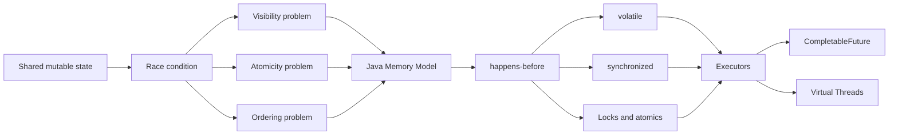
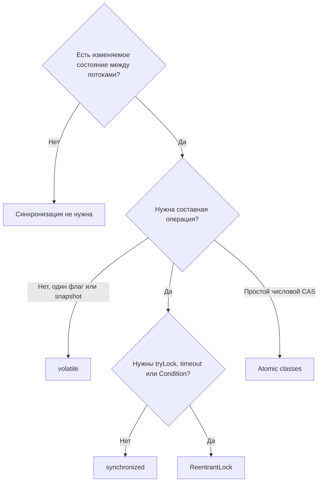

# Java Concurrency Learning Path

> [!summary] Цель маршрута
> Научиться не перечислять классы из `java.util.concurrent`, а **объяснять, какую проблему конкурентности решает каждый инструмент, какие гарантии он даёт и чего он не гарантирует**.

## Главная идея

Конкурентность становится понятной, когда мы идём не от API, а от проблем:

## Педагогический цикл каждой темы

1. **Интуиция** — бытовая модель без терминов.
2. **Точная модель** — формальные гарантии Java.
3. **Плохой пример** — код, который выглядит правдоподобно, но ошибочен.
4. **Исправление** — минимально подходящий инструмент.
5. **Граница применимости** — когда инструмент уже не подходит.
6. **Вопрос интервьюера** — проверка объяснения вслух.
7. **Лаборатория** — наблюдение поведения своими глазами.

## Уровень 1. Почему многопоточность сложна

Изучить по порядку:

1. [[Visibility Atomicity Ordering]]
2. [[Race Condition]]
3. [[Java Memory Model]]
4. [[Happens-Before]]

### Контрольная точка

После уровня ты должен уметь ответить:

- Почему два потока могут видеть разные состояния одной переменной?
- Почему `counter++` не является одной операцией?
- Почему фактический порядок выполнения нельзя выводить только из порядка строк исходного кода?
- Что именно доказывает отношение happens-before?

## Уровень 2. Базовые средства координации

1. [[volatile]]
2. [[synchronized]]
3. [[ReentrantLock]]
4. Atomic classes и CAS
5. Immutable objects и safe publication

### Ментальная карта выбора

## Уровень 3. Выполнение задач

1. [[ExecutorService]]
2. Thread pools
3. `Future`
4. `ScheduledExecutorService`
5. Lifecycle и graceful shutdown

> [!important] Ключевой переход
> Начиная с executors, мы перестаём управлять отдельными потоками и начинаем управлять **задачами, очередями, пропускной способностью и жизненным циклом ресурсов**.

## Уровень 4. Асинхронные вычислительные цепочки

1. [[CompletableFuture]]
2. `thenApply` против `thenCompose`
3. Combining independent stages
4. Error handling
5. Custom executors
6. Blocking внутри async pipeline

## Уровень 5. Современная модель Java 21

1. [[Virtual Threads]]
2. Thread-per-request
3. Ограничение внешнего ресурса вместо ограничения количества virtual threads
4. ThreadLocal cost
5. Pinning в Java 21
6. Structured concurrency как отдельная эволюционная тема

## Как повторять маршрут

### Повторение за 10 минут

- открыть summary каждого concept note;
- проговорить главное ограничение каждого инструмента;
- ответить на вопросы без раскрытия callout `Answer`;
- запустить один плохой и один исправленный пример.

### Повторение перед Senior-интервью

Для каждой темы объяснить:

1. Какую production-проблему решает?
2. Какие гарантии даёт?
3. Чего не гарантирует?
4. Как диагностировать неправильное использование?
5. Какой trade-off появляется после исправления?

## Практика

- [[50_LABS/Java/Concurrency/README|Java Concurrency Labs]]
- [[20_QUESTIONS/Interview/Java/Concurrency/Why volatile does not make increment atomic]]
- [[20_QUESTIONS/Interview/Java/Concurrency/What does happens-before actually guarantee]]
- [[20_QUESTIONS/Interview/Java/Concurrency/execute vs submit]]
- [[20_QUESTIONS/Interview/Java/Concurrency/thenApply vs thenCompose]]
- [[20_QUESTIONS/Interview/Java/Concurrency/Are virtual threads faster]]

## Sources

- [[98_SOURCES/Java Concurrency Sources|Primary Java Concurrency Sources]]
