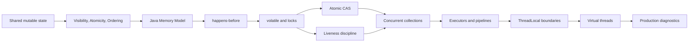
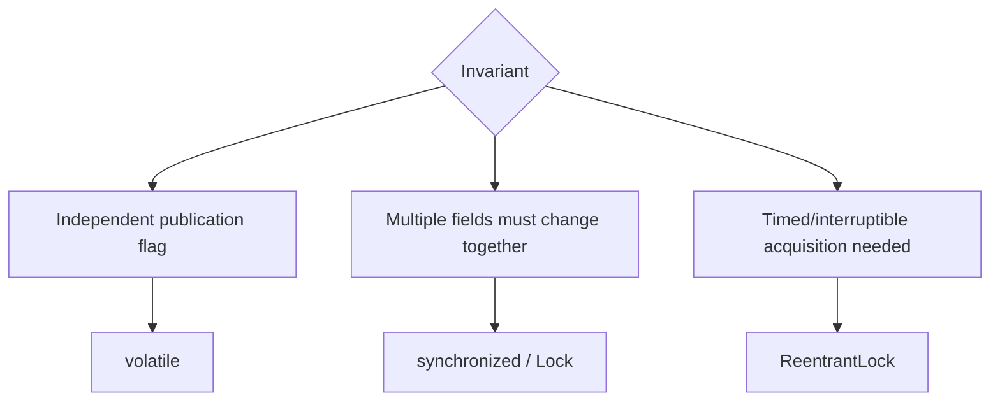
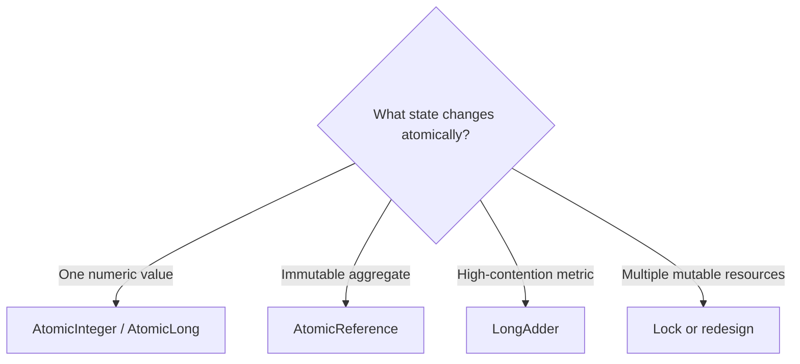

# Java Concurrency Learning Path

> [!summary] Цель маршрута
> Научиться не перечислять classes, а объяснять проблему, guarantee, boundary и production failure mode каждого concurrency mechanism.

## Route navigation

- **Registry:** [[00_HOME/Knowledge Route Registry]]
- **Domain map:** [[01_MAPS/Java Map]]
- **Visual deep dive:** [[10_CONCEPTS/Java/Concurrency/Java Concurrency Visual Deep Dive]]
- **Visual atlas:** [[01_MAPS/Java Concurrency Visual Atlas.canvas]]
- **Recall:** [[20_QUESTIONS/Interview/Java/Concurrency/Advanced Concurrency Recall]]
- **Lab:** [[50_LABS/Java/Concurrency/README]]
- **Sources:** [[98_SOURCES/Java Concurrency Sources]]
- **Advanced sources:** [[98_SOURCES/Advanced Concurrency Sources]]

## Общая карта



## Педагогический цикл каждой темы

1. Интуиция.
2. Формальная guarantee.
3. Ошибочный code shape.
4. Минимальное исправление.
5. Boundary и trade-off.
6. Interview recall.
7. Runnable experiment.
8. Production evidence.

# Уровень 1 — Threads and memory model

1. [[10_CONCEPTS/Java/Concurrency/Threads]]
2. [[10_CONCEPTS/Java/Concurrency/Visibility Atomicity Ordering]]
3. [[10_CONCEPTS/Java/Concurrency/Race Condition]]
4. [[10_CONCEPTS/Java/Concurrency/Java Memory Model]]
5. [[10_CONCEPTS/Java/Concurrency/Happens-Before]]

Checkpoint:

```text
Can I name the exact happens-before edge?
Can I separate visibility from atomicity?
Can I explain why program order is not enough across threads?
```

# Уровень 2 — Blocking coordination

1. [[10_CONCEPTS/Java/Concurrency/volatile]]
2. [[10_CONCEPTS/Java/Concurrency/synchronized]]
3. [[10_CONCEPTS/Java/Concurrency/ReentrantLock]]
4. [[10_CONCEPTS/Java/Concurrency/Deadlock Livelock and Lock Ordering]]

Decision model:



# Уровень 3 — Non-blocking updates

1. [[10_CONCEPTS/Java/Concurrency/Atomic CAS and Counters]]
2. `AtomicInteger` and `AtomicLong`.
3. `AtomicReference` for immutable aggregate state.
4. `LongAdder` for high-contention metrics.
5. ABA and retry-loop boundaries.



# Уровень 4 — Concurrent collections and backpressure

1. [[10_CONCEPTS/Java/Concurrency/Concurrent Collections and Backpressure]]
2. `ConcurrentHashMap` compound methods.
3. Copy-on-write snapshot semantics.
4. `BlockingQueue` and overload control.

> [!important]
> Thread-safe methods не делают произвольную комбинацию calls atomic. Ищи compound operation в API: `compute`, `merge`, `putIfAbsent`, `put/take`.

# Уровень 5 — Task execution

1. [[10_CONCEPTS/Java/Concurrency/ExecutorService]]
2. [[10_CONCEPTS/Java/Concurrency/Future]]
3. [[10_CONCEPTS/Java/Concurrency/ForkJoinPool]]
4. [[10_CONCEPTS/Java/Concurrency/CompletableFuture]]
5. [[10_CONCEPTS/Java/Concurrency/ThreadLocal]]
6. [[10_CONCEPTS/Java/Concurrency/Virtual Threads]]

Execution questions:

```text
Who owns the task?
Which executor runs it?
Is the queue bounded?
How is saturation handled?
How are failure and cancellation observed?
Which context crosses the thread boundary?
Which downstream resource remains limited?
```

# Visual maps

- [[01_MAPS/Java Concurrency Visual Atlas.canvas]]
- [[01_MAPS/Java Concurrency Map.canvas]]
- [[01_MAPS/Java Advanced Concurrency Map.canvas]]

# Active recall

- [[20_QUESTIONS/Interview/Java/Concurrency/Advanced Concurrency Recall]]
- [[20_QUESTIONS/Interview/Java/Concurrency/Why volatile does not make increment atomic]]
- [[20_QUESTIONS/Interview/Java/Concurrency/What does happens-before actually guarantee]]
- [[20_QUESTIONS/Interview/Java/Concurrency/execute vs submit]]
- [[20_QUESTIONS/Interview/Java/Concurrency/thenApply vs thenCompose]]
- [[20_QUESTIONS/Interview/Java/Concurrency/Are virtual threads faster]]
- [[20_QUESTIONS/Interview/Java/Why can ThreadLocal leak in a thread pool]]

# Labs

```bash
cd 50_LABS/Java/Concurrency
javac --release 8 java8/AdvancedConcurrencyLab.java
java -cp java8 AdvancedConcurrencyLab all
```

- [[50_LABS/Java/Concurrency/README|Java Concurrency Labs]]
- [[50_LABS/Java/Concurrency/java8/AdvancedConcurrencyLab.java]]
- [[50_LABS/Java/Concurrency/java21/VirtualThreadDemo.java]]

# Senior checkpoint

Для каждого mechanism объясни:

1. Какой invariant он защищает?
2. Какую JMM guarantee использует?
3. Что произойдёт под contention?
4. Как выглядит failure в thread dump, JFR или metrics?
5. Какой simpler alternative существует?
6. Какой lab доказывает ответ?

# Adjacent routes

Previous prerequisite domains:

- Java object model — planned;
- Collections fundamentals — planned.

Next:

- JVM diagnostics — planned;
- Spring thread and proxy boundaries: [[10_CONCEPTS/Spring/AOP/Spring AOP Visual Deep Dive]];
- database concurrency: DB-B02 — planned.
